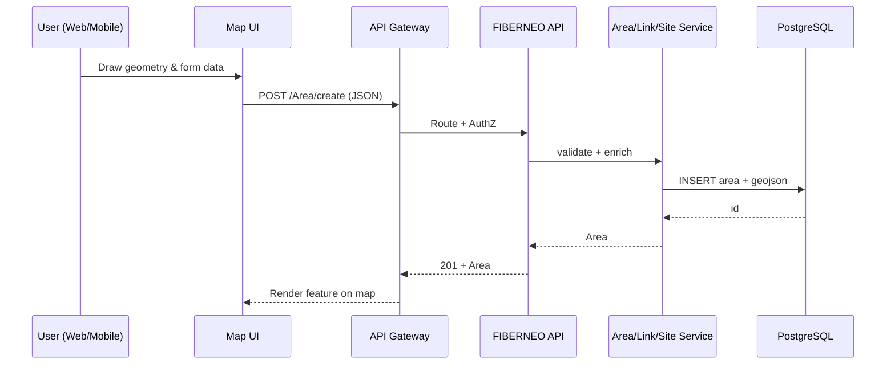
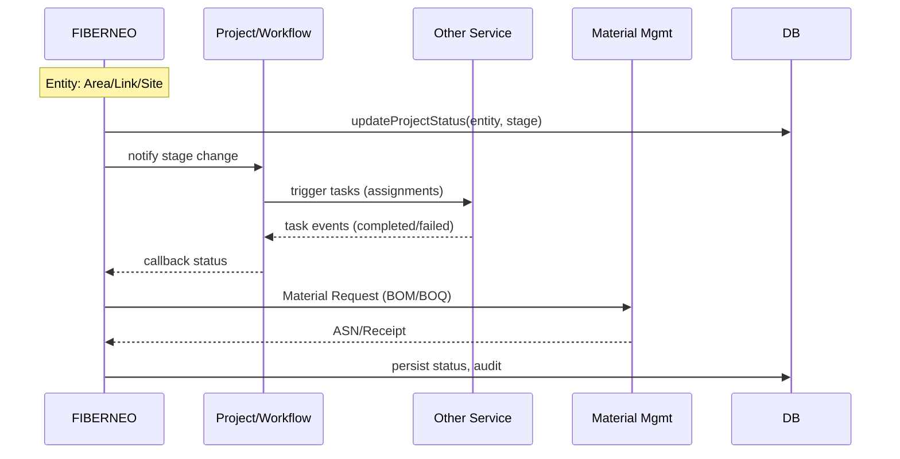
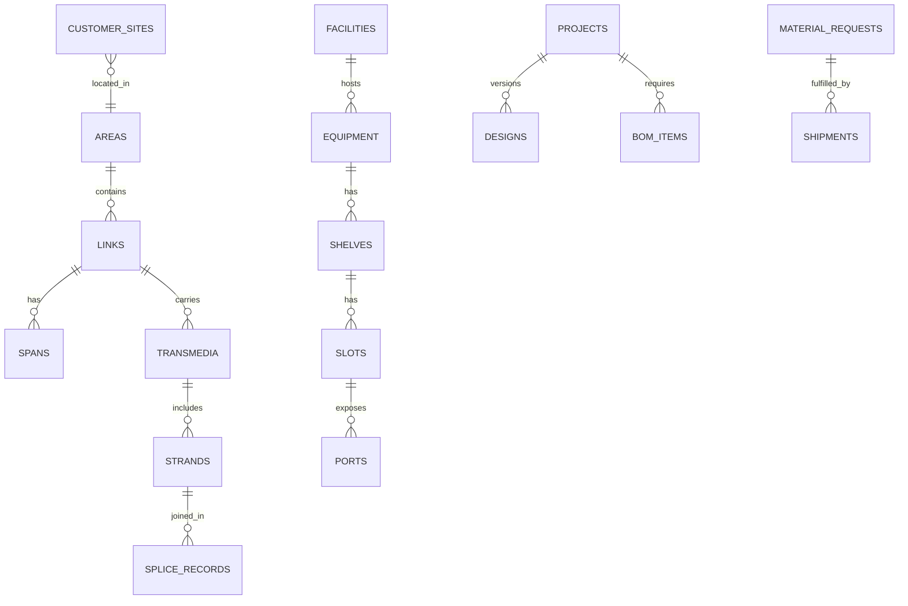

## 1. Introduction

### 1.1 Objective and Scope

- **Objective**: Design the FIBERNEO Supply Chain Management microservice for Fiberneo Roll Out Service to manage planning, survey, construction, testing, HOTO, and in-service management across Area, Link, and Site entities. Responsibilities include: Create/Update Area, Link, CustomerSite (Site); manage Projects and stage transitions; perform Planning, Survey, Construction, Testing, Review, BOM/BOQ, Material Request/Receipt; Splicing and Port management; and orchestrated workflow status updates.
- **Scope owned by FIBERNEO**: Domain entities and operations for Area, Link, CustomerSite, Span, Conduit, Transmedia, Facility, Equipment, Structure, Obstacles, ReferencePoint; workflow status tracking; spatial map operations; splicing/ports/strands; inventory view for projects; data export/import; CDC to data lake; API and RBAC.
- **Out of scope / owned by external systems**:
  - **Other Service (Task Orchestrator/Workflow)**: triggers tasks/flows, approvals, SLA timers, complex BPMN.
  - **Material Management/ERP**: Material master, purchase orders, invoices, vendor settlement, ASN, warehouse ledger.
  - **Builder/Vendor Management**: Contractor onboarding, vendor scoring, agreements.
  - **SLA**: End-to-end SLA policy definition and enforcement engine.

### Assumptions & Constraints

- Primary DB: PostgreSQL 14+; PostGIS for spatial operations where applicable.
- Message broker: Kafka for async events and CDC sinks.
- CDC via Debezium (Kafka Connect) or logical replication to data lake/warehouse.
- API gateway provides authentication (OIDC/JWT) and rate limiting.
- Mobile/Web use same REST APIs; pagination and filtering via RSQL-like filters.
- Secrets via Vault/KMS; TLS everywhere; PII/geo data classified and protected.
- Infrastructure: containerized (Kubernetes); horizontal scaling; read replicas for reporting.
- Constraints: Some modules read-only mirrors of master data from ERP; eventual consistency for cross-service views; heavy GIS operations batched/asynchronous.

## 2. Solution Design

### 2.1 Architecture Diagram

```mermaid
graph TD
  subgraph Clients
    W[Web UI]
    M[Mobile App]
  end

  subgraph API_GW[API Gateway / Swagger]
    GW[AuthN/Z, Routing, Rate-limit]
  end

  W --> GW
  M --> GW

  subgraph MS[Microservices]
    FN[FIBERNEO Microservice]
    PRJ[Project/Workflow Service]
    MAT[Material Mgmt Service]
    BLD[Builder/Vendor Service]
    SLA[SLA Service]
    NOTIF[Notification Service]
  end

  GW --> FN
  FN <--> PRJ
  FN <--> MAT
  FN <--> BLD
  FN <--> SLA
  FN --> NOTIF

  subgraph Data
    DB[(PostgreSQL + PostGIS)]
    CACHE[(Redis Cache)]
    OBJ[(Object Storage)]
    MQ[[Kafka]]
    DWH[(Data Lake/Warehouse)]
  end

  FN <--> DB
  FN <--> CACHE
  FN --> MQ
  MQ --> DWH
  FN --> OBJ

  subgraph External
    OSV[Other Service (Task Trigger)]
    ERP[ERP/Finance]
    LOGI[Logistics Provider]
    VEND[Vendor APIs]
  end

  PRJ <--> OSV
  MAT <--> ERP
  MAT <--> VEND
  MAT <--> LOGI
```

[PLACEHOLDER: ARCHITECTURE_DIAGRAM_PNG_URL]

### 2.2 Component Diagram

```mermaid
flowchart LR
  A[API Layer (Spring Controllers/Feign)] --> B[Business Services]
  B --> C[Area/Link/Site Modules]
  B --> D[Survey & Planning]
  B --> E[Construction & Testing]
  B --> F[Splicing Manager (Strands/Ports)]
  B --> G[Warehouse Integration]
  B --> H[Data Sync / CDC]
  B --> I[Export/Import]
  C --> P[Persistence (JPA/Repositories)]
  P --> DB[(PostgreSQL/PostGIS)]
  B --> K[Cache (Redis)]
  B --> Q[Events (Kafka)]
  B --> R[Object Storage]
```

Component interactions:
- API Layer exposes REST. Business Services enforce rules, call repositories, publish Kafka events, and call Feign clients toward external services. CDC tailing via Debezium streams to DWH.

### 2.3 Application Flow - Sequence Diagrams

#### Create Area, Link and Site on UI on Map



#### Project Flows (high-level)



#### Specific Project Flows (Area/Link/Site)

Use the following as canonical workflows; each transition updates `project_stage`, emits `stage.changed` event, and may call Other Service.

- **Area Planning Survey / Link Planning Survey**: Planning -> Review planning -> Ready for survey -> Assign For Survey -> Perform Survey -> Review Survey -> Survey completed -> Perform Detail Design -> Design Review -> Design Completed -> Generate BOM -> BOQ/BOM finalisation -> Material Request -> Permission received
- **Area Installation and Construction**: Upload material delivery receipt -> Ready for construction -> As-Built capture -> Construction completed -> Assign for Testing -> Testing -> Review Testing -> Testing Completed -> Ready for Service -> Work Completion Certificate -> Ready for HOTO
- **FiberLink HOTO**: Document Submission -> Verification -> Final Handover and Sign-Off -> Ready for service
- **Area Construction Pack**: Assign trenching and ducting -> Trenching and Ducting -> Assign access chamber installation -> Access chamber installation -> Assign cable blowing -> Cable Blowing -> Assign equipment installation -> EQUIPMENT INSTALLATION -> Assign splicing task -> SPLICING -> Assign RoW -> RoW
- **Perform Area Of Interest**: Assign for AOI Survey -> AOI Survey -> AOI Review
- **OLT Installation and Commissioning (Site)**: Assign for Site Readiness -> Site Readiness -> Review -> Site Readiness Completed -> Assign for Installation -> OLT Installation -> Review Installation -> Installation Completed -> Acceptance Test Procedure -> Review Test Report -> Test Report Completed -> HOTO -> HOTO Completed -> Ready for Service -> View In Service
- **Survey and Acquisition (Site)**: Assign for Site Survey -> Site Survey -> Review -> Survey completed -> Acquisition -> Leasing -> Legal Approval -> Financial Approval -> Ready for Construction
- **Site Design and Construction (Site)**: Assign Site Design -> Site Design -> Review Design -> Design Complete -> Building Design -> Building Design Review -> BOM Preparation -> Material Request -> Material Receipt -> Ready for Construction -> Site Inspection -> Ready for Commissioning -> Earth Pits -> Shelter and Fencing -> Foundation -> Electric Construction

[PLACEHOLDER: WORKFLOW_DIAGRAMS_PNG_BUNDLE]

## 3. Solution Features and User Interface

- **Area/Link/Site Management**: Create/Edit geometry on map, attribute forms, stage transitions.
  - Primary actions: Create, Search (RSQL), Import/Export, Stage update, View counts.
  - Success: Entities persisted, visible on map, correct status and counts updated.
  - [PLACEHOLDER: GUI SCREENSHOT – AREA/LINK/SITE]

- **Span/Conduit/Transmedia Survey UI**: Draw spans, conduits; view transmedia overlays.
  - Actions: Add spans, calculate lengths, deviations; viewport queries.
  - Success: Correct topological consistency and persistence.
  - [PLACEHOLDER: GUI SCREENSHOT – SURVEY UI]

- **Structure & Equipment placement UI**: Place facilities, structures, network equipment; view port/slot details.
  - Actions: Add facility, assign equipment, update ports.
  - Success: Equipment relationships valid; hierarchy graph loads.
  - [PLACEHOLDER: GUI SCREENSHOT – EQUIPMENT]

- **Splicing & Port management UI**: Manage strands, ports, splices; visualize splice matrix.
  - Actions: Splice create/update, port assignment, loss budget.
  - Success: Loss budget within threshold; conflicts prevented.
  - [PLACEHOLDER: GUI SCREENSHOT – SPLICING]

## 4. Integration Details

- **Other Service (task orchestrator)**
  - Events: `stage.changed`, `task.completed`, `task.failed`.
  - Webhooks: `/integration/osv/callback` (POST) with `{ entityType, entityId, stage, status, timestamp }`.
  - Topics: `fiberneo.stage.events` (Kafka).

- **ERP/Finance**
  - Flows: PO creation, invoice posting, GRN. Format: JSON over REST; optional XML for batch.
  - Endpoints: `POST /erp/po`, `POST /erp/invoice`, `POST /erp/grn`.

- **Logistics Provider**
  - Shipment creation: `POST /logistics/shipments`.
  - Tracking webhook: `POST /integration/logistics/tracking` with `{ shipmentId, status, eta }`.

- **Vendor APIs**
  - ASN: `POST /vendors/{id}/asn`.
  - Ack: `POST /vendors/{id}/ack`.

- **Inventory sync**
  - Pattern: CDC from `material_request`, `material_receipt`, `warehouse_stock` to ERP; event-based cache invalidation.

Recommended patterns: synchronous REST for lookup/read; async Kafka for create/update side effects and cross-domain propagation.

Sample message schema (Kafka `fiberneo.stage.events`):
```json
{
  "eventId": "uuid",
  "entityType": "Area|Link|CustomerSite",
  "entityId": 123,
  "previousStage": "Planning",
  "newStage": "Review planning",
  "actor": "user@org",
  "occurredAt": "2025-09-11T10:00:00Z",
  "correlationId": "uuid",
  "metadata": {"projectId": 456}
}
```

## 5. Database Schema Design

### 5.1 ER Diagram and Module-wise Tables (>40 tables)

Note: Names align to domain; keys abbreviated. Sample indexes suggested; actual DDL from schema file may vary.

- **A. Project & Survey**
  - `projects` (pk id, name, type, owner_id, status, created_at, updated_at) idx: (type), (status)
  - `project_versions` (pk id, project_id fk, version_no, notes, created_at)
  - `areas` (pk id, name, code, entity_type, status, geom, priority, deployment_type, created_at, updated_at)
  - `links` (pk id, name, code, status, deployment_type, length_m, geom, created_at)
  - `customer_sites` (pk id, name, site_code, status, site_type, location point, address, created_at)
  - `surveys` (pk id, entity_type, entity_id, stage, assigned_to, started_at, completed_at, status)
  - `survey_segments` (pk id, survey_id fk, segment_type, geom, notes)
  - `designs` (pk id, entity_type, entity_id, version, status, file_url)
  - `bom_items` (pk id, entity_type, entity_id, material_code, qty, uom, status)
  - `boq_items` (pk id, entity_type, entity_id, service_code, qty, uom, rate)

- **B. Network Model**
  - `facilities` (pk id, facility_type, name, status, location point, area_id fk)
  - `structures` (pk id, structure_type, status, geom, area_id fk)
  - `equipment` (pk id, facility_id fk, equipment_type_id fk, name, status, serial_no)
  - `equipment_types` (pk id, code, name, vendor, specs_json)
  - `shelves` (pk id, equipment_id fk, name, order_no)
  - `slots` (pk id, shelf_id fk, slot_no, status)
  - `ports` (pk id, slot_id fk, port_no, media_type, status)
  - `strands` (pk id, transmedia_id fk, strand_no, color, status)
  - `splices` (pk id, location_id fk facility/structure, status, loss_db)
  - `splice_records` (pk id, splice_id fk, a_strand_id fk, b_strand_id fk, loss_db, notes)
  - `transmedia` (pk id, link_id fk, media_type, fiber_count, status, geom)
  - `spans` (pk id, link_id fk, span_type, length_m, geom, status)
  - `conduits` (pk id, span_id fk, size_mm, status, capacity)
  - `reference_points` (pk id, name, type, location point, notes)
  - `obstacles` (pk id, area_id fk, type, severity, geom, notes)

- **C. Warehouse & Material (integration-facing)**
  - `material_requests` (pk id, entity_type, entity_id, bom_version, status, requested_by, requested_at)
  - `material_receipts` (pk id, request_id fk, asn_no, received_at, received_by, status)
  - `warehouse_stock` (pk id, material_code, warehouse_id, qty_on_hand, qty_reserved, updated_at)
  - `shipments` (pk id, request_id fk, provider, tracking_no, status, eta)

- **D. Workflow & Status**
  - `entity_status_history` (pk id, entity_type, entity_id, from_stage, to_stage, actor, at)
  - `assignments` (pk id, entity_type, entity_id, task, assignee, status, due_at)

- **E. GIS Support**
  - `geo_layers` (pk id, entity_type, entity_id, layer_type, geojson jsonb, created_at)
  - `deviations` (pk id, entity_type, entity_id, deviation_type, details jsonb, created_at)

- **F. Import/Export**
  - `imports` (pk id, entity_type, file_name, format, status, created_by, created_at)
  - `exports` (pk id, entity_type, format, filter, status, requested_by, requested_at)

- **G. Users & RBAC**
  - `users` (pk id, username, email, phone, status, region)
  - `roles` (pk id, code, name)
  - `permissions` (pk id, code, name)
  - `role_permissions` (pk role_id fk, permission_id fk)
  - `user_roles` (pk user_id fk, role_id fk)
  - `access_tokens` (pk id, user_id fk, token_hash, created_at, expires_at)

- **H. Audit & Events**
  - `audit_logs` (pk id, actor, action, entity_type, entity_id, payload jsonb, at)
  - `change_history` (pk id, table_name, pk_value, before jsonb, after jsonb, at)
  - `cdc_metadata` (pk id, source_table, last_lsn, updated_at)
  - `event_store` (pk id, type, payload jsonb, status, published_at)

- **I. Config & Lookup**
  - `config_items` (pk id, scope, key, value, updated_at)
  - `lookup_values` (pk id, type, code, value, active)
  - `region_zones` (pk id, region, state, city, zone)

- **J. Integration**
  - `integrations` (pk id, name, type, config jsonb, active)
  - `integration_mappings` (pk id, domain, source_code, target_code)
  - `webhook_subscriptions` (pk id, subscriber, topic, callback_url, secret, active)

ER Diagram (Mermaid excerpt):


[PLACEHOLDER: ER_DIAGRAM_PNG_URL]

### 5.2 CDC Configuration

- Strategy: Debezium PostgreSQL connector capturing changes from operational tables into Kafka topics; downstream sink to data lake/DWH; selective replication for heavy GIS fields (geojson truncated or stored by reference).
- Template (examples):

| source_table | primary_key | target_table | fields_to_replicate | frequency | transform_rules | retention |
| --- | --- | --- | --- | --- | --- | --- |
| areas | id | dwh.areas | id,name,code,status,priority,deployment_type,geom | real-time | mask(name?) | 7y |
| links | id | dwh.links | id,name,status,deployment_type,length_m,geom | real-time | none | 7y |
| customer_sites | id | dwh.customer_sites | id,name,site_code,status,location | real-time | none | 7y |
| material_requests | id | dwh.material_requests | all non-PII | real-time | none | 7y |
| entity_status_history | id | dwh.entity_status_history | all | real-time | none | 7y |

Debezium connector snippet (placeholder):
```json
{
  "name": "fiberneo-pg-connector",
  "config": {
    "connector.class": "io.debezium.connector.postgresql.PostgresConnector",
    "database.hostname": "${PG_HOST}",
    "database.port": "5432",
    "database.user": "${PG_USER}",
    "database.password": "${PG_PASSWORD}",
    "database.dbname": "fiberneo",
    "plugin.name": "pgoutput",
    "slot.name": "fiberneo_slot",
    "publication.autocreate.mode": "filtered",
    "table.include.list": "public.areas,public.links,public.customer_sites,public.material_requests,public.entity_status_history",
    "tombstones.on.delete": "false",
    "topic.prefix": "fiberneo",
    "heartbeat.interval.ms": "10000"
  }
}
```

SQL trigger example to append to a `cdc_outbox` table (alternative to Debezium):
```sql
CREATE TABLE IF NOT EXISTS cdc_outbox (
  id uuid PRIMARY KEY DEFAULT gen_random_uuid(),
  table_name text NOT NULL,
  pk_value text NOT NULL,
  op char(1) NOT NULL,
  payload jsonb NOT NULL,
  occurred_at timestamptz NOT NULL DEFAULT now(),
  processed boolean NOT NULL DEFAULT false
);

CREATE OR REPLACE FUNCTION cdc_capture() RETURNS trigger AS $$
DECLARE v_payload jsonb;
BEGIN
  IF (TG_OP = 'INSERT') THEN v_payload = to_jsonb(NEW);
  ELSIF (TG_OP = 'UPDATE') THEN v_payload = jsonb_build_object('before', to_jsonb(OLD), 'after', to_jsonb(NEW));
  ELSE v_payload = to_jsonb(OLD); END IF;
  INSERT INTO cdc_outbox(table_name, pk_value, op, payload)
  VALUES (TG_TABLE_NAME, COALESCE(NEW.id::text, OLD.id::text), substr(TG_OP,1,1), v_payload);
  RETURN NEW;
END; $$ LANGUAGE plpgsql;

CREATE TRIGGER trg_cdc_areas AFTER INSERT OR UPDATE OR DELETE ON areas
FOR EACH ROW EXECUTE FUNCTION cdc_capture();
```

[PLACEHOLDER: DEBEZIUM_CONNECTOR_YAML]

## 6. API Details

Link to Swagger: [PLACEHOLDER: SWAGGER_JSON_LINK]

Guidelines: Version APIs under `/api/v1`; use pagination (`offset`, `size`), filtering via `query` (RSQL), rate limit write-heavy endpoints.

Representative APIs (from code):

- **Area** (`/Area`)
  - `POST /Area/create`: Create Area
  - `GET /Area/count`: Count with RSQL filter
  - `GET /Area/search`: List with pagination/sort
  - `POST /Area/update`: Update
  - `GET /Area/deleteById`: Delete
  - `GET /Area/softDelete`: Soft delete
  - `GET /Area/findById`: Get by id
  - `GET /Area/findAllById`: Bulk get
  - `GET /Area/getLayer`, `GET /Area/getLayerByBbox`
  - `GET /Area/getBuildingLayer`, `GET /Area/getBuildingLayerByBbox`
  - `GET /Area/getAreaPoles`, `GET /Area/getAreaPolesByBbox`
  - `GET /Area/getAreaDropTrench`, `GET /Area/getAreaDropTrenchByBbox`
  - `GET /Area/getPolesOnArea`, `GET /Area/getDropTrenchOnArea`
  - `GET /Area/getAreaCountsByStatus`, `GET /Area/getAreaCountsByCity`
  - `POST /Area/updateProjectStatus`, `POST /Area/updateDeploymentType`
  - `GET /Area/getPriorityCountByDeploymentType`, `GET /Area/getBoundaryJsonFromArea`, `GET /Area/getAreaTrends`
  - `GET /Area/getAreaByViewPort`, `GET /Area/getAreaCountByViewPort`
  - `GET /Area/getAreaByROWDetails`, `GET /Area/getAreaCountsByROWDetails`, `GET /Area/getServiceImpactedArea`, `GET /Area/getDataForAudit`
  - `POST /Area/importData` (multipart), `GET /Area/export`, `POST /Area/importFile`, `GET /Area/downloadTemplate`

- **Link** (`/Link`)
  - `POST /Link/create`, `POST /Link/createByMap`
  - `GET /Link/count`, `GET /Link/search`
  - `POST /Link/update`, `GET /Link/deleteById`, `GET /Link/softDelete`
  - `GET /Link/findById`, `GET /Link/findAllById`
  - `GET /Link/getLinkCountsByStatus`, `GET /Link/getLinkCountsByCity`
  - `POST /Link/updateProjectStatus`, `GET /Link/getEntityTypeCountsByStatus`, `POST /Link/updateDeploymentType`, `GET /Link/getPriorityCountByDeploymentType`
  - `GET /Link/getBoundaryJsonFromLink`, `GET /Link/getLinkTrends`
  - `GET /Link/getLinkByViewPort`, `GET /Link/getLinkCountByViewPort`
  - `GET /Link/getLinkByROWDetails`, `GET /Link/getLinkCountsByROWDetails`
  - `GET /Link/lossBudgetByLinkId/{linkId}`, `GET /Link/getDataForAudit`
  - `POST /Link/importData`, `GET /Link/export`, `POST /Link/importFile`, `GET /Link/downloadTemplate`
  - `GET /Link/getLinkDetailsByCircuitId`

- **CustomerSite (Site)** (`/CustomerSite`)
  - `POST /CustomerSite/create`
  - `GET /CustomerSite/count`, `GET /CustomerSite/search`
  - `POST /CustomerSite/update`, `GET /CustomerSite/deleteById`, `GET /CustomerSite/softDelete`
  - `GET /CustomerSite/findById`, `GET /CustomerSite/findAllById`
  - `POST /CustomerSite/updateProjectStatus`
  - `GET /CustomerSite/notifyAfterIC`
  - `GET /CustomerSite/siteInventoryAvailable`

- **Facility** (`/Facility`) and Equipment/NetworkEquipment (similar CRUD/search/export/import; viewport and circuit-based queries; bulkUpdate)

Sample request/response (Area create):
```json
POST /Area/create
{
  "name": "Sector 21",
  "code": "A-21",
  "entityType": "Residential",
  "deploymentType": "underground",
  "geom": {"type":"Polygon","coordinates":[...]}
}
```
```json
201
{
  "id": 101,
  "name": "Sector 21",
  "status": "Planning",
  "deploymentType": "underground"
}
```

Error model:
```json
{
  "timestamp": "2025-09-11T10:00:00Z",
  "status": 400,
  "error": "Bad Request",
  "message": "Validation failed",
  "path": "/Area/create"
}
```

Recommendations: Version as `/api/v1`; cursor-based pagination for large map queries; caching for lookup endpoints; 429 on burst writes.

## 7. RBAC & ABAC

### 7.1 Permission Groups

- **FIBERNEO_Admin**: Full access to all modules.
- **Planner**: Create/Update Areas/Links/Sites; view facility/equipment; generate BOM/BOQ.
- **Surveyor**: Perform survey endpoints; upload results; no destructive deletes.
- **Constructor**: Construction pack tasks; material receipt upload.
- **Tester**: Testing and review endpoints; loss budget reads.
- **Operator**: Ready for Service operations; HOTO reads; monitoring.
- **WarehouseUser**: Material request/receipt views; export.
- **Viewer**: Read-only search/count/viewports.
- **trial.user**: Limited demo read access.

API-to-permission mapping (examples):
- `/Area/create` -> FIBERNEO_AREA_CREATE
- `/Area/search` -> FIBERNEO_AREA_VIEW
- `/Link/create` -> FIBERNEO_LINK_CREATE
- `/CustomerSite/updateProjectStatus` -> FIBERNEO_CUSTOMER_SITE_CREATE
- `/Facility/bulkUpdate` -> FIBERNEO_FACILITY_CONFIGURATOR

### 7.2 Profile Template (JSON)

```json
{
  "userId": 123,
  "roles": ["Planner", "Surveyor"],
  "permissions": ["FIBERNEO_AREA_CREATE","FIBERNEO_LINK_VIEW"],
  "abac": {
    "region": ["North","West"],
    "vendor": ["VendorA","VendorB"],
    "warehouse": [101, 102],
    "areaIds": [1,2,3],
    "siteTypes": ["OLT","POP"]
  },
  "scope": {"read": "region", "write": "areaIds"}
}
```

[PLACEHOLDER: PERMISSION_GROUP_FILES]

## 8. Monitoring & Alerting

- Metrics: API latency/5xx; DB replication lag; inventory negative balance; PO aging; shipment exceptions; provisioning failures; CDC backlog; viewport query duration.
- Example alert rules (Prometheus):
```
ALERT InventoryNegativeBalance IF sum(warehouse_stock_qty_on_hand < 0) BY (warehouse) > 0 FOR 5m LABELS {severity="critical"}
ALERT POAging IF avg_over_time(po_age_days[24h]) > 7 LABELS {severity="warning"}
ALERT ReplicationLag IF pg_replication_lag_seconds > 30 LABELS {severity="critical"}
```

[PLACEHOLDER: DASHBOARD_SCREENSHOTS]

## 9. Performance and Scaling

- Scale: 300–1000 concurrent API calls; 50–200 shipments/min; 200–1000 inventory updates/sec; heavy map queries.
- Patterns: read replicas for reporting; partition hot tables (`entity_status_history` by month); Redis cache for lookups; async queues for heavy writes (import/export, GIS generation); shard by region for areas/links if needed.
- Capacity: start with 4 vCPU/8GB pods x 3 replicas for FN; PostgreSQL 4 vCPU/16GB with NVMe; Redis 2 vCPU/4GB; Kafka 3-broker small cluster.

[PLACEHOLDER: STRESS_TEST_RESULTS_DOCS]

## 10. Operation Runbook

### 10.1 Common Issues & Debugging

- Inventory mismatch:
  - Query: `SELECT * FROM audit_logs WHERE entity_type='warehouse' AND at>now()-interval '24h';`
  - Check `warehouse_stock` vs `material_receipts`; re-run reconciliation job.
  - [PLACEHOLDER: SCREENSHOT – INVENTORY]

- PO not acknowledged:
  - Check `integration_mappings`, vendor ack logs, webhook retries.
  - cURL: `curl -sS -XGET $BASE/integrations/status?po=...`
  - [PLACEHOLDER: SCREENSHOT – PO]

- Splice/port allocation conflict:
  - Check locks: `SELECT * FROM ports WHERE status='reserved';`
  - Release via admin endpoint if stale; review `splice_records`.
  - [PLACEHOLDER: SCREENSHOT – SPLICING]

Logs & locations:
- App logs: `/var/log/fiberneo/*.log`; K8s: `kubectl logs deploy/fiberneo`.
- Integration logs: topic `fiberneo.integration.*`.

### 10.2 Performance Tuning Guide

- DB: create composite indexes on `(entity_type, status)`; GIST on `geom`; analyze/vacuum schedule.
- Batch sizes: 500–2000 rows for import; JDBC fetch size 500.
- Connection pools: 50–200 per instance; backoff on saturation.
- JVM: -Xms1g -Xmx4g; G1GC; thread pools sized to CPU.
- Query optimization: avoid ST_Intersects on unindexed; pre-filter via bbox.

[PLACEHOLDER: TUNING_CHECKLIST]

## 11. Appendices

- Glossary:
  - **Area**: Geographic polygon where rollout occurs.
  - **Link**: Network path connecting facilities; has spans/transmedia.
  - **CustomerSite (Site)**: Customer/service site (OLT/POP/Building).
  - **Span**: Segment of a link between two structures.
  - **Conduit**: Physical duct capacity unit along spans.
  - **Transmedia**: Cable/fiber along a link.
  - **Facility**: Site node hosting equipment.
  - **Equipment**: Network device within facility; has shelves/slots/ports.
  - **Structure**: Physical structure (pole/chamber).
  - **Obstacles**: Geo-hazards impacting routing.
  - **ReferencePoint**: Survey marker.

- Data retention & compliance: retain audit/CDC 7 years; purge PII on request; geo data under regional regulations.
- Security: TLS in transit; AES-256 at rest; secrets via Vault; OWASP Top 10; authN via OIDC/JWT; fine-grained RBAC/ABAC.
- Links to related docs: [PLACEHOLDER: OPERATIONS_GUIDE_LINK], [PLACEHOLDER: DEPLOYMENT_GUIDE_LINK], [PLACEHOLDER: UML_DIAGRAMS_LINK]


