# Fiberneo Service - Low Level Design (LLD)

## Table of Contents

1. [Introduction](#1-introduction)
   - 1.1 [Objective and Scope](#11-objective-and-scope)

2. [Solution Design](#2-solution-design)
   - 2.1 [Architecture Diagram](#21-architecture-diagram)
   - 2.2 [Application Flow - Sequence Diagrams](#22-application-flow---sequence-diagrams)
     - 2.2.1 [Entity Creation Flow](#221-entity-creation-flow)
     - 2.2.2 [Project Stage Transition Flow](#222-project-stage-transition-flow)
     - 2.2.3 [Area Project Flow](#223-area-project-flow)
     - 2.2.4 [Link Project Task](#224-link-project-task)
   

3. [Solution Features and User Interface](#3-solution-features-and-user-interface)
   - 3.1 [Area/Link/Site Management](#31-arealinksite-management)
   - 3.2 [Survey and Planning](#32-survey-and-planning)
   - 3.3 [Construction and Testing](#33-construction-and-testing)
   - 3.4 [Splicing and Ports](#34-splicing-and-port-management-ui)

4. [Integration Details](#4-integration-details)

5. [Database Schema Design](#5-database-schema-design)
   - 5.1 [ER Diagram and Tables](#51-er-diagram-and-tables)
   - 5.2 [CDC Configuration](#52-cdc-configuration)

6. [API Details](#6-api-details)

7. [RBAC & ABAC](#7-rbac--abac)
   - 7.1 [Permission Groups](#71-permission-groups)
   - 7.2 [Profile Template](#72-profile-template)

8. [Monitoring & Alerting](#8-monitoring--alerting)

9. [Performance and Scaling](#9-performance-and-scaling)

10. [Operation Runbook](#10-operation-runbook)
    - 10.1 [Common Issues & Debugging](#101-common-issues--debugging)
    - 10.2 [Performance Tuning Guide](#102-performance-tuning-guide)

11. [Appendices](#11-appendices)
    - 11.1 [Technology Stack](#111-technology-stack)
    - 11.2 [Security Features](#112-security-features)

## 1. Introduction

### 1.1 Objective and Scope

- **Objective**: Design the Fiberneo core microservice for Roll Out to manage planning, survey, construction, testing, HOTO, and in-service management across Area, Link, and Site entities. Responsibilities include: Create/Update Area, Link, CustomerSite (Site); manage projects and stage transitions; perform Planning, Survey, Construction, Testing, Review; Splicing and Port management; and orchestrated workflow status updates.
- **Scope owned by Fiberneo**: Domain entities and operations for Area, Link, CustomerSite, Span, Conduit, Transmedia, Facility, Equipment, Structure, Obstacles, ReferencePoint; workflow status tracking; spatial map operations; splicing/ports/strands; read-only inventory views where needed; data export/import; API.
- **Out of scope / owned by external systems**:
  - **Other Service (Project Service/Material management)**: triggers tasks/flows, approvals, Material Provider.
  - **SLA**: End-to-end SLA policy definition and enforcement engine.

### Assumptions & Constraints

- Primary DB: MYSQL 14+ 
- Message broker: CDC sinks.
- API gateway provides authentication (OIDC/JWT) and rate limiting.
- Mobile/Web use same REST APIs; pagination and filtering.
- Secrets via Vault/KMS; TLS everywhere; PII/geo data classified and protected.
- Infrastructure: containerized (Kubernetes); horizontal scaling; read replicas for reporting.

## 2. Solution Design

### 2.1 Architecture Diagram


### 2.2 Application Flow - Sequence Diagrams

### 2.2.1 Entity Creation Flow

#### Create Area, Link and Site on UI on Map


### 2.2.2 Project Stage Transition Flow

#### Project Flows (high-level)


### 2.2.3 Area Project Flow

#### (a) Perform Area Of Interest (AOI) 


#### (b) Area Planning Survey

```mermaid
sequenceDiagram
  autonumber
  participant U as User
  participant UI as Web UI
  participant GW as API Gateway
  participant PG as Project MicroService
  participant BD as Builder MicroService
  participant FN as Fiberneo MicroService
  participant MM as Material Management MicroService

  U->>UI: Initiate Planning
  UI->>GW: POST projectServiceURL/task
  GW->>PG: planning
  PG->>BD: Associate Form or Task
  BD->>FN: Update Data

  U->>UI: Review Planning
  UI->>GW: POST projectServiceURL/task
  GW->>PG: review planning
  PG->>BD: Associate Form or Task

  U->>UI: Ready for Survey
  UI->>GW: POST projectServiceURL/task
  GW->>PG: approve for Survey
  PG->>BD: Associate Form or Task

  U->>UI: Assign for Survey
  UI->>GW: POST projectServiceURL/task
  GW->>PG: assign
  PG->>BD: Assign to User

  U->>UI: Perform Survey
  UI->>GW: POST projectServiceURL/task
  GW->>PG: perform
  PG->>BD: User performs task → create child entities (Span, Conduit, Facility, Equipment, Structure, Obstacle, ReferencePoint)
  BD->>FN: Create Child Entity

  U->>UI: Review Survey
  UI->>GW: POST projectServiceURL/task
  GW->>PG: review survey
  PG->>BD: Associate Form or Task

  U->>UI: Survey Completed
  UI->>GW: POST projectServiceURL/task
  GW->>PG: complete survey
  PG->>BD: Associate Form or Task

  U->>UI: Perform Detail Design
  UI->>GW: POST projectServiceURL/task
  GW->>PG: perform design
  PG->>BD: Associate Form or Task

  U->>UI: Review Design
  UI->>GW: POST projectServiceURL/task
  GW->>PG: review design
  PG->>BD: Associate Form or Task

  U->>UI: Design Completed
  UI->>GW: POST projectServiceURL/task
  GW->>PG: complete design
  PG->>BD: Associate Form or Task

  U->>UI: Generate BOM
  UI->>GW: POST projectServiceURL/task
  GW->>PG: generate bom
  PG->>BD: Associate Form or Task
  BD->>MM: Generate Bill of Material

  U->>UI: BOQ/BOM Finalisation
  UI->>GW: POST projectServiceURL/task
  GW->>PG: finalize bom
  PG->>BD: Associate Form or Task

  U->>UI: Material Request
  UI->>GW: POST projectServiceURL/task
  GW->>PG: request material
  PG->>BD: Associate Form or Task
  BD->>MM: Material Request

  U->>UI: Permission Received
  UI->>GW: POST projectServiceURL/task
  GW->>PG: receive permission
  PG->>BD: Associate Form or Task
```



### (c) Area Installation and Construction


### 2.2.4 Link Project Task

#### (a) Link Planning and Survey

The Link Planning and Survey process follows the exact same workflow and structure as the Area Planning and Survey module.

This includes:

- **Survey Initiation**: Defining the start and end points of the link.
- **Route Planning**: Mapping the link path using available base maps, network layers, and route constraints.
- **Feasibility Study**: Identifying physical and environmental challenges (e.g., road crossings, water bodies, or private land).
- **Field Survey & Data Collection**: Capturing accurate GIS data, alignment details, and site photographs.
- **Validation & Approval**: Reviewing collected data, verifying technical feasibility, and approving the survey for the next phase.

👉 **Essentially, all task stages, data flow, and approval checkpoints mirror the existing Area Planning and Survey workflow, ensuring consistency and standardization.**

#### (b) Link Installation and Construction

The Link Installation and Construction process is aligned with the Area Installation and Construction workflow.

This includes:

- **Work Order Creation**: Generating BOQs, assigning contractors, and setting execution timelines.
- **Material Planning & Dispatch**: Identifying required materials (e.g., fiber cables, conduits) and coordinating logistics.
- **Execution on Ground**: Implementing trenching, ducting, cable laying, jointing, and other link-related civil and fiber works.
- **Quality & Safety Checks**: Ensuring construction meets technical standards and safety guidelines.
- **Testing & Commissioning**: Conducting OTDR testing, link validation, and final acceptance.
- **Documentation & Handover**: Capturing as-built data, uploading test reports, and closing the task with approvals.

### (c) FiberLink HOTO


### (d) OLT Installation and Commissioning (Site)


### (e) Survey and Acquisition


### (f) Site Design and Construction


## 3. Solution Features and User Interface

### 3.1 Area/Link/Site Management

- **Area Management**: Create/Edit Area geometry on map, attribute forms, stage transitions.
  - Primary actions: Create, Import/Export, Stage update, View counts.
  - Success: Entities persisted, visible on map, correct status and counts updated.

  - (a) Area List

   <div align="Center">
    <image src="../Image/LLD_Images/AreaList.png" alt="User Login Request Flow" height="300" 
    style="background: transparent; margin: 20px 0;">
    </div>

  - (b) Area Creation

    | Before Create | Create Form | After Create |
    |---------------|-------------|--------------|
    |  |  |  |

  - (c) Area of Interest 

    Area Prioritization Process:**
    
    (i). **Select and Trigger Project:** Choose the area to prioritize and trigger the project as shown below:
    
    <div align="Center">
      <image src="../Image/LLD_Images/AOI_Project.png" alt="Area of Interest Project" height="300" 
      style="background: transparent; margin: 20px 0;">
      </div>

    (ii). **Complete Workflow:** Fill out the prioritization form with all required details and approve the project to mark the area as prioritized:
    
    <div align="Center">
      <image src="../Image/LLD_Images/AreaofInterest.png" alt="Area of Interest" height="300" 
      style="background: transparent; margin: 20px 0;">
      </div>

  - (d) Area View

    The Area View provides a comprehensive dashboard for managing and monitoring all aspects of a specific area within the network infrastructure. This centralized interface offers multiple perspectives and tools for effective area management.

    #### **Key Features Available in Area View:**

    - **📄 Documents** - Access and manage all documentation related to the area
    - **📋 Projects** - View and track all projects associated with this area
    - **📦 Material Assets** - Monitor material inventory and asset allocation
    - **🏗️ WBS (Work Breakdown Structure)** - Display all child entities created within this area including:
      - Spans
      - Conduits
      - Transmedia
      - Structures
      - Equipment
    - **🗺️ Overview Map** - Interactive map view accessible via the top-right button


    <div align="center">
      
    </div>

    #### **Overview Map Features**

    The Overview Map provides a comprehensive visual representation of all entities within the area, offering multiple viewing modes:

    - **📍 Entity Layer View** - Display all network entities on the map
    - **📊 Deviation View** - Show planned vs. actual entity positions
    - **🎯 Actual Entity View** - Real-time positioning of installed infrastructure
    - **🔍 Layer Toggle** - Switch between different visualization layers
    Interactive map view accessible via the top-right button

    <div align="center">
      
    </div>

  
- **Link Management**: Create/Edit Link geometry on map, attribute forms, stage transitions.
  - Primary actions: Create, Import/Export, Stage update, View counts.
  - Success: Entities persisted, visible on map, correct status and counts updated.


  - (a) Link List

   <div align="Center">
    <image src="../Image/LLD_Images/LinkList.png" alt="User Login Request Flow" height="300" 
    style="background: transparent; margin: 20px 0;">
    </div>

- (b) Link Creation 

    | Before Create | Create Form | After Create |
    |---------------|-------------|--------------|
    |  |  |  |

  - (c) Link create By Auto Rule 

    The Auto Rule feature allows for automated creation of network links with predefined configurations. This streamlines the link creation process by automatically generating associated entities based on configured rules.

    #### **Step 1: Select Source and Destination**
    
    Begin by selecting the source and destination points for your link in the Link Creation interface.

    <div align="center">
      
    </div>

    #### **Step 2: Generate Path**
    
    Click on the **"Get Path"** button to automatically calculate the optimal route between the selected source and destination points.

    <div align="center">
      
    </div>

    #### **Step 3: Apply Auto Rules**
    
    After the system generates the sorted path, you can apply automated rules by clicking the **"Configure Rule"** button.

    <div align="center">
      
    </div>

    #### **Step 4: Select and Apply Rules**
    
    Choose from the available rule list to automatically create the respective entities for the link. The Auto Rule system can generate:
    - **Spans** - Physical connections between points
    - **Conduits** - Protective pathways for cables
    - **Transmedia** - Media conversion points
    - **Structures** - Physical infrastructure elements
    - **Equipment** - Network devices and hardware

    <div align="center">
      
    </div>

    #### **Step 5: Review Generated Entities**
    
    Once the rules are applied, the system automatically creates all associated entities for the link, providing a complete network infrastructure setup.

    <div align="center">
      
    </div>

- **Site Creation**: You can create or edit a Site during the Perform Survey process, as well as edit from the dedicated Site Page. Both workflows allow full access to site configuration and updates.
  
  - (a) Site List

 <div align="Center">
    <image src="../Image/LLD_Images/SitePage.png" alt="User Login Request Flow" height="300" 
    style="background: transparent; margin: 20px 0;">
    </div>

  - (b) Site Project

 <div align="Center">
    <image src="../Image/LLD_Images/SiteProject.png" alt="User Login Request Flow" height="300" 
    style="background: transparent; margin: 20px 0;">
    </div>

  - (c) Site Create 

   <div align="Center">
    <image src="../Image/LLD_Images/SiteCreate.png" alt="User Login Request Flow" height="300" 
    style="background: transparent; margin: 20px 0;">
    </div>

### 3.2 Survey and Planning

- **Perform Survey**: Performing roll-out task creating Span, Conduit, Transmedia, Facilities on Area or Link.
  - Actions: Add span, conduit, transmedia, facilities, structures, equipment, obstacles, reference-point.
  - Success: All the Child Entity Created on that particular Area, Link.

  - (a) Project Trigger Page - Survey Project Overview


  <div align="Center">
    <image src="../Image/LLD_Images/ProjectTrigger.png" alt="Project Trigger - Survey Project Page" height="400" 
    style="background: transparent; margin: 20px 0;">
  </div>


  - (b) Survey Map Interface - Area/Link Survey with Entity Creation Tools


  <div align="Center">
    <image src="../Image/LLD_Images/PerformSurvey.png" alt="Survey Map Interface - Area Survey" height="300" 
    style="background: transparent; margin: 20px 0;">
  </div>

  **Survey Process Details:**
  - **Map Interface**: Interactive map showing the survey area where users can perform survey tasks
  - **Side Panel**: Provides icons and tools to create respective entities during survey
  - **Entity Creation Hierarchy**: 
    - **Span Creation**: First step - draw span on the map
    - **Conduit Creation**: Hover over existing span to add conduit within the span
    - **Transmedia Creation**: Add transmedia after conduit creation
    - **Additional Entities**: Create facilities, structures, equipment, obstacles, and reference points as needed

  - (c) Conduit Creation Process

  <div align="Center">
    <image src="../Image/LLD_Images/ConduitHover.png" alt="Conduit Creation Process" height="200" 
    style="background: transparent; margin: 20px 0;">
  </div>

  **Survey Workflow:**
  1. **Project Selection**: Select Area/Link Choose survey project from Project Trigger Option
  2. **Area Selection**: Select specific area/link for survey on the map
  3. **Entity Creation**: Use side panel tools to create network infrastructure entities
  4. **Hierarchical Creation**: Follow the proper sequence for entity creation:
   - **Primary Sequence**: Facility → Span → Structure → Conduit → Equipment → Transmedia
   - **Flexible Creation**: Obstacle and ReferencePoint can be created at any time after Structure creation
  5. **Data Validation**: Ensure all required entities are properly created and linked
  6. **Survey Completion**: Submit survey data for review and approval

### 3.3 Construction and Testing

- **Permit Dashboard**:  
  A centralized system for managing and tracking permissions required for survey entities. Span is usually the first physical entity created; during its creation, users must indicate whether a Right of Way (ROW) is needed by selecting the appropriate checkbox (as shown below). Afterward, during the survey phase, project tasks related to ROW can be managed directly from the Permit Dashboard—allowing project managers or relevant authorities to review, approve, or reject permission requests as necessary.

  <div align="center">
    <image src="../Image/LLD_Images/SpanCreate.png" alt="Permit Dashboard - Permission Management" height="400" 
    style="background: transparent; margin: 20px 0;">
  </div>

  The BI Dashboard provides a comprehensive view of permission statuses across Area, Link, and Site entities, allowing users to monitor authorization progress and access various important insights in one place.

  <div align="center">
    <image src="../Image/LLD_Images/PermitDashBoard.png" alt="Permit Dashboard - Permission Management" height="400" 
    style="background: transparent; margin: 20px 0;">
  </div>

  **Permit Dashboard Features:**
  - **Permission Tracking**: Monitor permission status for Area, Link, and Site entities
  - **Authority Integration**: Check with local government authorities for installation permissions
  - **Progress Monitoring**: Track permission application progress and approval status
  - **Compliance Management**: Ensure all physical entities have proper authorization before installation

- **Area Prioritization**: Strategic area selection and prioritization system.

  <div align="center">
    <image src="../Image/LLD_Images/AreaPriotization.png" alt="Area Prioritization - Strategic Selection" height="400" 
    style="background: transparent; margin: 20px 0;">
  </div>

  **Area Prioritization Features:**
  - **Profitability Analysis**: Evaluate areas based on customer density and revenue potential
  - **Deployment Feasibility**: Assess ease of fiber roll-out and infrastructure requirements
  - **Demand Assessment**: Identify high-demand areas for priority deployment
  - **Strategic Planning**: Optimize resource allocation across multiple areas in a region or city

- **Customer Service Monitoring**: Real-time monitoring and maintenance system for deployed infrastructure.

  <div align="center">
    <image src="../Image/LLD_Images/CustomerServiceMonitoring.png" alt="Customer Service Monitoring - Device Management" height="400" 
    style="background: transparent; margin: 20px 0;">
  </div>

  **Customer Service Monitoring Features:**
  - **Device Performance**: Monitor deployed devices for load, speed, and operational status
  - **Alert System**: Real-time notifications for device failures, outages, or damage
  - **Maintenance Tracking**: Schedule and track maintenance activities for network equipment
  - **Service Quality**: Ensure optimal performance and customer satisfaction

- **Build Decision**: Provides comprehensive analytics to support strategic fiber rollout decisions and future planning

  <div align="center">
    <image src="../Image/LLD_Images/BuildDecision.png" alt="Build Decision Analytics" height="400" 
    style="background: transparent; margin: 20px 0;">
  </div>

  **Key Features:**
  - Competitor analysis and market insights
  - Area size and demographic data
  - Income calculation and revenue projections
  - Small and large business counts
  - Optimization tools for fiber business strategy and rollout planning

- **ILD (International Line Drawing)**: Central hub management system for international fiber connections and data center operations

   <div align="center">
    <image src="../Image/LLD_Images/ILD.png" alt="International Line Drawing" height="400" 
    style="background: transparent; margin: 20px 0;">
  </div>

  **Link Connection Details:** The system displays comprehensive information about how specific fiber links are connected internationally:

  <div align="center">
    <image src="../Image/LLD_Images/ILD_Detail.png" alt="ILD Link Details" height="400" 
    style="background: transparent; margin: 20px 0;">
  </div>

- **Circuit Management**: A circuit represents the complete end-to-end connection between source and destination points in the fiber network. It consists of multiple structures and sites interconnected through transmission media, forming a comprehensive network path.

  **Single Line Diagram (SLD) View**: The system provides a visual representation of how circuits are connected across the network infrastructure, as shown in the image below:

  <div align="center">
    <image src="../Image/LLD_Images/SLD_View.png" alt="Single Line Diagram View" height="400" 
    style="background: transparent; margin: 20px 0;">
  </div>

  **Circuit List View**: Comprehensive listing of all circuits with their status, connections, and operational details:

  <div align="center">
    <image src="../Image/LLD_Images/Circuit_View.png" alt="Circuit List View" height="400" 
    style="background: transparent; margin: 20px 0;">
  </div>

- **Reporting and Analytics**: The reporting system provides comprehensive analytics and reporting capabilities on a monthly and yearly basis. Users can generate custom reports using the Analytics Service for various entities based on specific conditions and requirements.

  **Report Module Interface**: Access to various reporting functions through the Fiberneo Home Page Module, as shown below:

  <div align="center">
    <image src="../Image/LLD_Images/Report_Module_View.png" alt="Report Module Interface" height="400" 
    style="background: transparent; margin: 20px 0;">
  </div>

  **Report Dashboard**: Business Intelligence (BI) representation of overall report data with interactive dashboards and visualizations:

  <div align="center">
    <image src="../Image/LLD_Images/Report_Dashboard.png" alt="Report Dashboard" height="400" 
    style="background: transparent; margin: 20px 0;">
  </div>

- **GIS Playground**: A comprehensive testing and demonstration environment for exploring and experimenting with Geographic Information System (GIS) data. This module allows users to:
  - Visualize interactive maps with multiple data layers
  - Import and export data in various required formats
  - Perform spatial analysis and data manipulation
  - Test GIS functionality in a controlled environment

  <div align="center">
    <image src="../Image/LLD_Images/GIS_View.png" alt="GIS Playground Interface" height="400" 
    style="background: transparent; margin: 20px 0;">
  </div>

## 4. Integration Details

### 4.1 Internal Service Integrations

- **Fiber-Model Service**
  - **Purpose**: Advanced analytics and data modeling for fiber network optimization
  - **Capabilities**:
    - Area analysis and installation rate optimization
    - Competitor data analysis for strategic planning
    - Fiber roll-out prioritization algorithms
    - Network efficiency modeling and recommendations

### 4.2 External Service Integrations

- **File Storage Service**: Document and attachment management for project files, designs, and reports
- **Analytics Service**: Business intelligence, reporting, and data visualization
- **Project Management Service**: Project lifecycle management, task orchestration, and workflow coordination
- **Builder Service**: Provide their Form, Page, and List Support
- **SLA Service**: Service level agreement monitoring, compliance tracking, and performance metrics
- **Field Force Management Service**: Field technician management, work order dispatch, and real-time tracking
- **Notification Service**: Real-time notifications and alerting for system events, user actions, and workflow status updates

### 4.3 Data Synchronization
- **Event-Driven Architecture**: Synchronous communication between services
- **Database Replication**: Multi-region data synchronization
- **Search Index Updates**: Elasticsearch synchronization

## 5. Database Schema Design

### 5.1 ER Diagram and Tables

## Core Geographic Tables

### `PRIMARY_GEO_L1`
- **PK**: `ID` (int UNSIGNED)
- **Key Attributes**: `NAME`, `CODE`
- **Description**: Primary geographic level 1 (Country/Region)

### `PRIMARY_GEO_L2`
- **PK**: `ID` (int UNSIGNED)
- **FK**: `PRIMARY_GEO_L1_ID_FK` → `PRIMARY_GEO_L1(ID)`
- **Key Attributes**: `NAME`, `CODE`
- **Description**: Primary geographic level 2 (State/Province)

### `PRIMARY_GEO_L3`
- **PK**: `ID` (int UNSIGNED)
- **FK**: `PRIMARY_GEO_L2_ID_FK` → `PRIMARY_GEO_L2(ID)`
- **Key Attributes**: `NAME`, `CODE`
- **Description**: Primary geographic level 3 (City/District)

### `PRIMARY_GEO_L4`
- **PK**: `ID` (int UNSIGNED)
- **FK**: `PRIMARY_GEO_L3_ID_FK` → `PRIMARY_GEO_L3(ID)`
- **Key Attributes**: `NAME`, `CODE`
- **Description**: Primary geographic level 4 (Area/District)

---

## Network Infrastructure Tables

### `AREA`
- **PK**: `ID` (Varchar (36))
- **FK**: 
  - `PRIMARY_GEO_L1_FK` → `PRIMARY_GEO_L1(ID)`
  - `PRIMARY_GEO_L2_FK` → `PRIMARY_GEO_L2(ID)`
  - `PRIMARY_GEO_L3_FK` → `PRIMARY_GEO_L3(ID)`
  - `PRIMARY_GEO_L4_FK` → `PRIMARY_GEO_L4(ID)`
  - `AOI_ID` → `AREA_OF_INTEREST(Varchar (36))`
  - `CIRCUIT_ID` → `CIRCUIT(Varchar (36))`
  - `CREATOR` → `USER(Varchar (36))`
  - `LAST_MODIFIER` → `USER(Varchar (36))`
- **Key Attributes**: `CODE`, `NAME`, `SIZE`, `BOUNDARY_JSON`, `LATITUDE`, `LONGITUDE`
- **Description**: Geographic areas for network planning and management

### `LINK`
- **PK**: `ID` (Varchar (36))
- **FK**: 
  - `PRIMARY_GEO_L1_FK` → `PRIMARY_GEO_L1(ID)`
  - `PRIMARY_GEO_L2_FK` → `PRIMARY_GEO_L2(ID)`
  - `PRIMARY_GEO_L3_FK` → `PRIMARY_GEO_L3(ID)`
  - `PRIMARY_GEO_L4_FK` → `PRIMARY_GEO_L4(ID)`
  - `AOI_ID` → `AREA_OF_INTEREST(Varchar (36))`
  - `CIRCUIT_ID` → `CIRCUIT(Varchar (36))`
  - `CREATOR` → `USER(Varchar (36))`
  - `LAST_MODIFIER` → `USER(Varchar (36))`
- **Key Attributes**: `CODE`, `NAME`, `DISTANCE_COVERED`, `BOUNDARY_JSON`, `START_LAT`, `START_LONG`, `END_LAT`, `END_LONG`
- **Description**: Network links connecting different points

### `FACILITY`
- **PK**: `id` (Varchar (36))
- **FK**: 
  - `PRIMARY_GEO_L1_FK` → `PRIMARY_GEO_L1(ID)`
  - `PRIMARY_GEO_L2_FK` → `PRIMARY_GEO_L2(ID)`
  - `PRIMARY_GEO_L3_FK` → `PRIMARY_GEO_L3(ID)`
  - `PRIMARY_GEO_L4_FK` → `PRIMARY_GEO_L4(ID)`
  - `LINK_ID` → `LINK(Varchar (36))`
  - `CIRCUIT_ID` → `CIRCUIT(Varchar (36))`
  - `CREATOR` → `USER(Varchar (36))`
  - `LAST_MODIFIER` → `USER(Varchar (36))`
- **Key Attributes**: `NAME`, `CODE`, `ADDRESS`, `LATITUDE`, `LONGITUDE`, `TYPE`
- **Description**: Physical facilitiess in the network

---

## Physical Infrastructure Tables

### `STRUCTURE`
- **PK**: `ID` (Varchar (36))
- **FK**: 
  - `AREA_ID` → `AREA(Varchar (36))`
  - `CONDUIT_ID` → `CONDUIT(Varchar (36))`
  - `PRIMARY_GEO_L1_FK` → `PRIMARY_GEO_L1(ID)`
  - `PRIMARY_GEO_L2_FK` → `PRIMARY_GEO_L2(ID)`
  - `PRIMARY_GEO_L3_FK` → `PRIMARY_GEO_L3(ID)`
  - `PRIMARY_GEO_L4_FK` → `PRIMARY_GEO_L4(ID)`
  - `VENDOR` → `VENDOR(Varchar (36))`
  - `CREATOR` → `USER(Varchar (36))`
  - `LAST_MODIFIER` → `USER(Varchar (36))`
- **Key Attributes**: `NAME`, `CODE`, `LATITUDE`, `LONGITUDE`
- **Description**: Physical structures supporting network infrastructure

### `CONDUIT`
- **PK**: `ID` (Varchar (36))
- **FK**: 
  - `AREA_ID` → `AREA(Varchar (36))`
  - `LINK_ID` → `LINK(Varchar (36))`
  - `SPAN_ID` → `SPAN(Varchar (36))`
  - `VENDOR` → `VENDOR(Varchar (36))`
  - `CREATOR` → `USER(Varchar (36))`
  - `LAST_MODIFIER` → `USER(Varchar (36))`
- **Key Attributes**: `CODE`, `NAME`, `START_LAT`, `START_LONG`, `END_LAT`, `END_LONG`
- **Description**: Conduits for cable installation

### `SPAN`
- **PK**: `ID` (Varchar (36))
- **FK**: 
  - `AREA_ID` → `AREA(Varchar (36))`
  - `PRIMARY_GEO_L1_FK` → `PRIMARY_GEO_L1(ID)`
  - `PRIMARY_GEO_L2_FK` → `PRIMARY_GEO_L2(ID)`
  - `PRIMARY_GEO_L3_FK` → `PRIMARY_GEO_L3(ID)`
  - `PRIMARY_GEO_L4_FK` → `PRIMARY_GEO_L4(ID)`
  - `VENDOR` → `VENDOR(Varchar (36))`
  - `CREATOR` → `USER(Varchar (36))`
  - `LAST_MODIFIER` → `USER(Varchar (36))`
- **Key Attributes**: `CODE`, `NAME`
- **Description**: Network spans between points

### `TRANSMEDIA`
- **PK**: `ID` (Varchar (36))
- **FK**: 
  - `AREA_ID` → `AREA(Varchar (36))`
  - `LINK_ID` → `LINK(Varchar (36))`
  - `CONDUIT_ID` → `CONDUIT(Varchar (36))`
  - `SEGMENT_ID` → `SEGMENT(Varchar (36))`
  - `PRIMARY_GEO_L1_FK` → `PRIMARY_GEO_L1(ID)`
  - `PRIMARY_GEO_L2_FK` → `PRIMARY_GEO_L2(ID)`
  - `PRIMARY_GEO_L3_FK` → `PRIMARY_GEO_L3(ID)`
  - `PRIMARY_GEO_L4_FK` → `PRIMARY_GEO_L4(ID)`
  - `VENDOR` → `VENDOR(Varchar (36))`
  - `CREATOR` → `USER(Varchar (36))`
  - `LAST_MODIFIER` → `USER(Varchar (36))`
- **Key Attributes**: `CODE`, `NAME`
- **Description**: Transmission media (cables, fibers)

### `REFERENCE_POINT`
- **PK**: `ID` (Varchar (36))
- **FK**: 
  - `STRUCTURE_ID` → `STRUCTURE(Varchar (36))`
  - `PRIMARY_GEO_L1_FK` → `PRIMARY_GEO_L1(ID)`
  - `PRIMARY_GEO_L2_FK` → `PRIMARY_GEO_L2(ID)`
  - `PRIMARY_GEO_L3_FK` → `PRIMARY_GEO_L3(ID)`
  - `PRIMARY_GEO_L4_FK` → `PRIMARY_GEO_L4(ID)`
  - `CREATOR` → `USER(Varchar (36))`
  - `LAST_MODIFIER` → `USER(Varchar (36))`
- **Key Attributes**: `NAME`, `LATITUDE`, `LONGITUDE`, `TYPE`
- **Description**: Reference points for navigation

### `OBSTACLE`
- **PK**: `ID` (Varchar (36))
- **FK**: 
  - `AREA_ID` → `AREA(Varchar (36))`
  - `PRIMARY_GEO_L1_FK` → `PRIMARY_GEO_L1(ID)`
  - `PRIMARY_GEO_L2_FK` → `PRIMARY_GEO_L2(ID)`
  - `PRIMARY_GEO_L3_FK` → `PRIMARY_GEO_L3(ID)`
  - `PRIMARY_GEO_L4_FK` → `PRIMARY_GEO_L4(ID)`
  - `CREATOR` → `USER(Varchar (36))`
  - `LAST_MODIFIER` → `USER(Varchar (36))`
- **Key Attributes**: `NAME`, `LATITUDE`, `LONGITUDE`, `TYPE`
- **Description**: Obstacles in network deployment

### `EQUIPMENT`
- **PK**: `ID` (Varchar (36))
- **FK**: 
  - `FACILITY_ID` → `FACILITY(Varchar (36))`
  - `AREA_ID` → `AREA(Varchar (36))`
  - `LINK_ID` → `LINK(Varchar (36))`
  - `SHELF_ID` → `SHELF(Varchar (36))`
  - `PRIMARY_GEO_L1_FK` → `PRIMARY_GEO_L1(ID)`
  - `PRIMARY_GEO_L2_FK` → `PRIMARY_GEO_L2(ID)`
  - `PRIMARY_GEO_L3_FK` → `PRIMARY_GEO_L3(ID)`
  - `PRIMARY_GEO_L4_FK` → `PRIMARY_GEO_L4(ID)`
  - `VENDOR` → `VENDOR(Varchar (36))`
  - `CREATOR` → `USER(Varchar (36))`
  - `LAST_MODIFIER` → `USER(Varchar (36))`
- **Key Attributes**: `CODE`, `NAME`, `TYPE`, `LATITUDE`, `LONGITUDE`
- **Description**: Network equipment and devices

---

## Equipment Related Tables

### `PORT`
- **PK**: `ID` (Varchar (36))
- **FK**: 
  - `FACILITY_ID` → `FACILITY(Varchar (36))`
  - `EQUIPMENT_ID` → `EQUIPMENT(Varchar (36))`
  - `STRAND_ID` → `STRAND(Varchar (36))`
  - `TRANSMEDIA_ID` → `TRANSMEDIA(Varchar (36))`
- **Key Attributes**: `NAME`
- **Description**: Equipment ports for connections

### `STRAND`
- **PK**: `ID` (Varchar (36))
- **FK**: 
  - `EQUIPMENT_ID` → `EQUIPMENT(Varchar (36))`
  - `TRANSMEDIA_ID` → `TRANSMEDIA(Varchar (36))`
  - `CREATOR` → `USER(Varchar (36))`
  - `LAST_MODIFIER` → `USER(Varchar (36))`
- **Key Attributes**: `NAME`
- **Description**: Individual fiber strands

### `FLOOR`
- **PK**: `ID` (Varchar (36))
- **FK**: 
  - `FACILITY_ID` → `FACILITY(Varchar (36))`
  - `CREATOR` → `USER(Varchar (36))`
  - `LAST_MODIFIER` → `USER(Varchar (36))`
- **Key Attributes**: `NAME`
- **Description**: Facility floors

### `ROOM`
- **PK**: `ID` (Varchar (36))
- **FK**: 
  - `FLOOR_ID` → `FLOOR(Varchar (36))`
  - `PARENT_ROOM_ID` → `ROOM(Varchar (36))`
  - `CREATOR` → `USER(Varchar (36))`
  - `LAST_MODIFIER` → `USER(Varchar (36))`
- **Key Attributes**: `NAME`
- **Description**: Rooms within facilities

### `RACK`
- **PK**: `ID` (Varchar (36))
- **FK**: 
  - `FACILITY_ID` → `FACILITY(Varchar (36))`
  - `ROOM_ID` → `ROOM(Varchar (36))`
  - `CREATOR` → `USER(Varchar (36))`
  - `LAST_MODIFIER` → `USER(Varchar (36))`
- **Key Attributes**: `NAME`
- **Description**: Equipment racks

### `SHELF`
- **PK**: `ID` (Varchar (36))
- **FK**: 
  - `RACK_ID` → `RACK(Varchar (36))`
  - `CREATOR` → `USER(Varchar (36))`
  - `LAST_MODIFIER` → `USER(Varchar (36))`
- **Key Attributes**: `NAME`
- **Description**: Shelves within racks

---

## Customer Management Tables

### `CUSTOMER_INFO`
- **PK**: `ID` (Varchar (36))
- **FK**: 
  - `CREATOR` → `USER(Varchar (36))`
  - `LAST_MODIFIER` → `USER(Varchar (36))`
- **Key Attributes**: `NAME`, `EMAIL`, `PHONE`
- **Description**: Customer information

### `CUSTOMER_ORDER`
- **PK**: `ID` (Varchar (36))
- **FK**: 
  - `CUSTOMER_ID` → `CUSTOMER_INFO(Varchar (36))`
  - `CREATOR` → `USER(Varchar (36))`
  - `LAST_MODIFIER` → `USER(Varchar (36))`
- **Key Attributes**: `ORDER_NUMBER`
- **Description**: Customer orders

### `CUSTOMER_SITE`
- **PK**: `ID` (Varchar (36))
- **FK**: 
  - `CUSTOMER_ORDER_ID` → `CUSTOMER_ORDER(Varchar (36))`
  - `FACILITY_ID` → `FACILITY(Varchar (36))`
  - `PRIMARY_GEO_L1_FK` → `PRIMARY_GEO_L1(ID)`
  - `PRIMARY_GEO_L2_FK` → `PRIMARY_GEO_L2(ID)`
  - `PRIMARY_GEO_L3_FK` → `PRIMARY_GEO_L3(ID)`
  - `PRIMARY_GEO_L4_FK` → `PRIMARY_GEO_L4(ID)`
  - `CREATOR` → `USER(Varchar (36))`
  - `LAST_MODIFIER` → `USER(Varchar (36))`
- **Key Attributes**: `NAME`, `ADDRESS`, `LATITUDE`, `LONGITUDE`
- **Description**: Customer sites/locations

---

## Circuit Management Tables

### `CIRCUIT`
- **PK**: `ID` (Varchar (36))
- **FK**: 
  - `SPAN_ID` → `SPAN(Varchar (36))`
  - `CREATOR` → `USER(Varchar (36))`
  - `LAST_MODIFIER` → `USER(Varchar (36))`
- **Key Attributes**: `NAME`, `CODE`
- **Description**: Network circuits

### `SEGMENT`
- **PK**: `ID` (Varchar (36))
- **FK**: 
  - `LINK_ID` → `LINK(Varchar (36))`
- **Key Attributes**: `NAME`
- **Description**: Network segments

---

## Actual Implementation Tables

These tables store the final, approved data for each entity after the complete review and planning process. Each table mirrors its corresponding plan entity structure and includes mappings to both the original plan table and any deviation records.

**Key Characteristics:**
- Contain the same columns as their corresponding plan entities
- Include foreign key mappings to both plan tables and deviation tables
- Store the definitive, implementation-ready data
- Example: `ACTUAL_SPAN` contains `SPAN_ID` and `DEVIATION_SPAN_ID` references

**Table List:**
- `ACTUAL_FACILITY` - Final facility implementation data
- `ACTUAL_CONDUIT` - Final conduit implementation data  
- `ACTUAL_EQUIPMENT` - Final equipment implementation data
- `ACTUAL_STRUCTURE` - Final structure implementation data
- `ACTUAL_SPAN` - Final span implementation data
- `ACTUAL_TRANSMEDIA` - Final transmission media implementation data
- `ACTUAL_OBSTACLE` - Final obstacle implementation data
- `ACTUAL_REFERENCE_POINT` - Final reference point implementation data

## Deviation Management Tables

These tables track changes and modifications made to plan entities during the review process. Each deviation table maintains the same structure as its corresponding plan entity and includes references to the original plan data.

**Key Characteristics:**
- Mirror the column structure of their corresponding plan entities
- Include foreign key mappings to the original plan tables
- Store modified data due to various reasons such as:
  - Geometry path deviations
  - Design changes during review
  - Field condition updates
  - Regulatory requirement adjustments

**Table List:**
- `FACILITY_DEVIATION` - Facility modification records
- `CONDUIT_DEVIATION` - Conduit modification records
- `EQUIPMENT_DEVIATION` - Equipment modification records
- `STRUCTURE_DEVIATION` - Structure modification records
- `SPAN_DEVIATION` - Span modification records
- `TRANSMEDIA_DEVIATION` - Transmission media modification records
- `OBSTACLE_DEVIATION` - Obstacle modification records
- `REFERENCE_POINT_DEVIATION` - Reference point modification records

### `USER`
- **PK**: `ID` (Varchar (36))
- **Key Attributes**: `NAME`, `EMAIL`, `USERNAME`
- **Description**: System users

### `VENDOR`
- **PK**: `ID` (Varchar (36))
- **FK**: 
  - `CREATOR` → `USER(Varchar (36))`
  - `LAST_MODIFIER` → `USER(Varchar (36))`
- **Key Attributes**: `NAME`, `CODE`, `CONTACT_INFO`
- **Description**: Vendors and suppliers

### `AREA_OF_INTEREST`
- **PK**: `ID` (Varchar (36))
- **FK**: 
  - `AREA_ID` → `AREA(Varchar (36))`
  - `CREATOR` → `USER(Varchar (36))`
  - `LAST_MODIFIER` → `USER(Varchar (36))`
- **Key Attributes**: `TERRAIN_TYPE`, `ELEVATION_FROM_SEA_LEVEL`, `GEOGRAPHICAL_FEATURES`, `LAND_USE_TYPE`
- **Description**: Areas of interest for network planning

### `ATTRIBUTE`
- **PK**: `ID` (Varchar (36))
- **Key Attributes**: `NAME`, `TYPE`, `VALUE`
- **Description**: Generic attributes for entities

### `NETWORK_EQUIPMENT`
- **PK**: `ID` (Varchar (36))
- **FK**: 
  - `EQUIPMENT_ID` → `EQUIPMENT(Varchar (36))`
  - `ATTRIBUTE_ID` → `ATTRIBUTE(Varchar (36))`
- **Key Attributes**: `NAME`, `TYPE`
- **Description**: Network equipment configurations

### `ALARM_LIBRARY`
- **PK**: `ID` (Varchar (36))
- **Key Attributes**: `NAME`, `DESCRIPTION`, `SEVERITY`
- **Description**: Alarm definitions library

### `ALARM_DETAILS`
- **PK**: `ID` (Varchar (36))
- **FK**: 
  - `ALARM_LIBRARY_ID` → `ALARM_LIBRARY(Varchar (36))`
  - `CREATOR` → `USER(Varchar (36))`
  - `LAST_MODIFIER` → `USER(Varchar (36))`
- **Key Attributes**: `ENTITY_TYPE`
- **Description**: Alarm instances and details

### `RULE_TEMPLATE`
- **PK**: `id` (Varchar (36))
- **FK**: 
  - `CREATOR` → `USER(Varchar (36))`
  - `LAST_MODIFIER` → `USER(Varchar (36))`
- **Key Attributes**: `NAME`, `RULE_DEFINITION`
- **Description**: Business rule templates

---

ER Diagram :

  <div align="center">
    <image src="../Image/LLD_Images/ER_Diagram.png" alt="Permit Dashboard - Permission Management" height="400" 
    style="background: transparent; margin: 20px 0;">
  </div>

### 5.2 CDC Configuration

- User CDC is Done from Platform Database for User of Platform to Fiberneo User Table
- Primary_Geo (L1,L2,L3,L4): Geometry Level Data Entry from Platfrom Data for Country , State , City , District level Data. 

## 6. API Details

API Documentation
Swagger JSON Reference:
- [Fiberneo API Documentation](https://github.com/visionwaves/fiberneo/blob/dev/Fiberneo-Document/API_Doc/FiberNeoSwagger_12Sep.json)

Java Docs
- [Fiberneo JAVA Documentation](https://github.com/BhavikVisionGit/Fiberneo-Documents/tree/main/Fiberneo-Document/Java-Doc/11-09-2025/)

This document summarizes REST endpoints for core entities exposed by the `fiberneo-api` module, formatted as concise tables. All paths are relative to the service base and secured via API Gateway.

### Area (`/Area`)
| Endpoint | Method | Description | Security Scope |
|----------|--------|-------------|----------------|
| `create` | POST | Create Area | FIBERNEO_AREA_CREATE |
| `count` | GET | Counts of Area | FIBERNEO_AREA_VIEW |
| `search` | GET | Search with pagination/sort | FIBERNEO_AREA_VIEW |
| `update` | POST | Update Area | FIBERNEO_AREA_CREATE |
| `getAreaTrends` | GET | Trends | FIBERNEO_AREA_VIEW |
| `getAreaByViewPort` | GET | Areas in viewport | FIBERNEO_AREA_VIEW |
| `getAreaCountByViewPort` | GET | Count in viewport | FIBERNEO_AREA_VIEW |
| `getAreaByROWDetails` | GET | Areas by ROW filter | FIBERNEO_AREA_VIEW |
| `getAreaCountsByROWDetails` | GET | Area counts by ROW | FIBERNEO_AREA_VIEW |
| `getServiceImpactedArea` | GET | Impacted areas by incident | FIBERNEO_AREA_VIEW |
| `getDataForAudit` | GET | Audit data | FIBERNEO_AREA_VIEW |
| `importData` | POST | Import (multipart) | FIBERNEO_AREA_CONFIGURATOR |
| `export` | GET | Export data | FIBERNEO_AREA_CONFIGURATOR |
| `importFile` | POST | Import CSV | FIBERNEO_AREA_CONFIGURATOR |
| `downloadTemplate` | GET | Download import template | FIBERNEO_AREA_VIEW |

### Link (`/Link`)
| Endpoint | Method | Description | Security Scope |
|----------|--------|-------------|----------------|
| `create` | POST | Create Link | FIBERNEO_LINK_CREATE |
| `count` | GET | Count of Link | FIBERNEO_LINK_VIEW |
| `search` | GET | Search with pagination/sort | FIBERNEO_LINK_VIEW |
| `update` | POST | Update Link | FIBERNEO_LINK_CREATE |
| `getLinkCountsByStatus` | GET | Counts by status | FIBERNEO_LINK_VIEW |
| `getLinkCountsByCity` | GET | Counts by city | FIBERNEO_LINK_VIEW |
| `getLinkTrends` | GET | Trends | FIBERNEO_LINK_VIEW |
| `downloadTemplate` | GET | Download import template | FIBERNEO_LINK_CONFIGURATOR |
| `getLinkDetailsByCircuitId` | GET | Links by circuit | FIBERNEO_LINK_VIEW |

### Facility (`/Facility`)
| Endpoint | Method | Description | Security Scope |
|----------|--------|-------------|----------------|
| `create` | POST | Create Facility | FIBERNEO_FACILITY_CREATE |
| `count` | GET | Counts | FIBERNEO_FACILITY_VIEW |
| `search` | GET | Search with pagination/sort | FIBERNEO_FACILITY_VIEW |
| `update` | POST | Update Facility | FIBERNEO_FACILITY_CREATE |
| `getFacitlityTrends` | GET | Trends | FIBERNEO_SITE_VIEW |
| `findShortestPathByGoogleApi` | POST | Shortest path | FIBERNEO_FACILITY_VIEW |
| `bulkUpdate` | POST | Bulk update | FIBERNEO_FACILITY_CONFIGURATOR |
| `getDataForAudit` | GET | Audit data | FIBERNEO_FACILITY_VIEW |
| `importData` | POST | Import (multipart) | FIBERNEO_FACILITY_CONFIGURATOR |

### CustomerSite (`/CustomerSite`)
| Endpoint | Method | Description | Security Scope |
|----------|--------|-------------|----------------|
| `create` | POST | Create Customer Site | FIBERNEO_CUSTOMER_SITE_CREATE |
| `count` | GET | Counts | FIBERNEO_CUSTOMER_SITE_VIEW |
| `search` | GET | Search with pagination/sort | FIBERNEO_CUSTOMER_SITE_VIEW |
| `update` | POST | Update Customer Site | FIBERNEO_CUSTOMER_SITE_CREATE |
| `updateProjectStatus` | POST | Update stage status | FIBERNEO_CUSTOMER_SITE_CREATE |
| `notifyAfterIC` | GET | Notify after I&C | FIBERNEO_CUSTOMER_SITE_VIEW |
| `siteInventoryAvailable` | GET | Check site inventory | FIBERNEO_CUSTOMER_SITE_CREATE |

### Equipment (`/Equipment`)
| Endpoint | Method | Description | Security Scope |
|----------|--------|-------------|----------------|
| `create` | POST | Create Equipment | FIBERNEO_EQUIPMENT_CREATE |
| `count` | GET | Counts | FIBERNEO_EQUIPMENT_VIEW |
| `search` | GET | Search with pagination/sort | FIBERNEO_EQUIPMENT_VIEW |
| `update` | POST | Update Equipment | FIBERNEO_EQUIPMENT_CREATE |
| `getEquipmentByViewPort` | GET | Equipment in viewport | FIBERNEO_EQUIPMENT_VIEW |
| `getEquipmentByCircuitId` | GET | Equipment by circuit | FIBERNEO_EQUIPMENT_VIEW |
| `getEquipmentDetailsByCircuitId` | GET | Equipment details by circuit | FIBERNEO_EQUIPMENT_VIEW |
| `bulkUpdate` | POST | Bulk update | FIBERNEO_EQUIPMENT_CONFIGURATOR |
| `getRouterDetailsByODF` | GET | Router details by ODF | FIBERNEO_EQUIPMENT_VIEW |

### Structure (`/Structure`)
| Endpoint | Method | Description | Security Scope |
|----------|--------|-------------|----------------|
| `create` | POST | Create Structure | FIBERNEO_STRUCTURE_CREATE |
| `count` | GET | Counts | FIBERNEO_STRUCTURE_VIEW |
| `search` | GET | Search with pagination/sort | FIBERNEO_STRUCTURE_VIEW |
| `update` | POST | Update Structure | FIBERNEO_STRUCTURE_CREATE |
| `getStructureHistory` | GET | Structure audit history | FIBERNEO_STRUCTURE_VIEW |
| `softDelete` | GET | Soft delete by ID | FIBERNEO_STRUCTURE_CREATE |

### Span (`/Span`)
| Endpoint | Method | Description | Security Scope |
|----------|--------|-------------|----------------|
| `create` | POST | Create Span | FIBERNEO_SPAN_CREATE |
| `count` | GET | Counts | FIBERNEO_SPAN_VIEW |
| `search` | GET | Search with pagination/sort | FIBERNEO_SPAN_VIEW |
| `update` | POST | Update Span | FIBERNEO_SPAN_CREATE |
| `bulkUpdate` | POST | Bulk update | FIBERNEO_SPAN_CONFIGURATOR |
| `softDelete` | GET | Soft delete by ID | FIBERNEO_SPAN_CREATE |

### Conduit (`/Conduit`)
| Endpoint | Method | Description | Security Scope |
|----------|--------|-------------|----------------|
| `create` | POST | Create Conduit | FIBERNEO_CONDUIT_CREATE |
| `count` | GET | Counts | FIBERNEO_CONDUIT_VIEW |
| `search` | GET | Search with pagination/sort | FIBERNEO_CONDUIT_VIEW |
| `update` | POST | Update Conduit | FIBERNEO_CONDUIT_CREATE |
| `bulkUpdate` | POST | Bulk update | FIBERNEO_CONDUIT_CONFIGURATOR |
| `softDelete` | GET | Soft delete by ID | FIBERNEO_CONDUIT_CREATE |

### Transmedia (`/Transmedia`)
| Endpoint | Method | Description | Security Scope |
|----------|--------|-------------|----------------|
| `create` | POST | Create Transmedia | FIBERNEO_TRANSMEDIA_CREATE |
| `count` | GET | Counts | FIBERNEO_TRANSMEDIA_VIEW |
| `search` | GET | Search with pagination/sort | FIBERNEO_TRANSMEDIA_VIEW |
| `update` | POST | Update Transmedia | FIBERNEO_TRANSMEDIA_CREATE |
| `bulkUpdate` | POST | Bulk update | FIBERNEO_TRANSMEDIA_CONFIGURATOR |
| `softDelete` | GET | Soft delete by ID | FIBERNEO_TRANSMEDIA_CREATE |

### ROW (`/RowDetails`)
| Endpoint | Method | Description | Security Scope |
|----------|--------|-------------|----------------|
| `create` | POST | Create RowDetails | FIBERNEO_ROW_DETAILS_CREATE |
| `count` | GET | Counts | FIBERNEO_ROW_DETAILS_VIEW |
| `search` | GET | Search with pagination/sort | FIBERNEO_ROW_DETAILS_VIEW |
| `update` | POST | Update RowDetails | FIBERNEO_ROW_DETAILS_CREATE |


- **Facility** (`/Facility`) and Equipment/NetworkEquipment (similar CRUD/search/export/import; viewport and circuit-based queries; bulkUpdate)

Sample request/response (Area create):
```json
POST /Area/create
{
  "name": "Sector 21",
  "code": "A-21",
  "entityType": "Residential",
  "deploymentType": "underground",
  "geom": {"type":"Polygon","coordinates":[...]}
}
```
```json
{
  "id": 101,
  "name": "Sector 21",
  "status": "Planning",
  "deploymentType": "underground"
}
```

Error model:
```json
{
  "timestamp": "2025-09-11T10:00:00Z",
  "status": 400,
  "error": "Bad Request",
  "message": "Validation failed",
  "path": "/Area/create"
}
```

## 7. RBAC & ABAC

### 7.1 Permission Groups

**Permission group Reference**:
- [Fiberneo Permission group](https://github.com/visionwaves/fiberneo/blob/dev/Fiberneo-Document/LLD/LLD_DATA/PermissionGroup.csv)
### 7.2 Profile Template
- [Fiberneo Profile template](./FIBERNEO_Profile_Template/)

# Fiberneo Backend Controller Permissions

This document provides a comprehensive mapping of all permission scopes and their associated methods across all Controller classes in the Fiberneo Backend system.

## 8. Monitoring & Alerting

**Monitoring tool URL**:

- [Monitoring URL](https://demo.visionwaves.com/netsingularity/of-monitoring-app/metrices)
- [Logs URL](https://demo.visionwaves.com/netsingularity/of-monitoring-app/logs)
- [APM URL](https://demo.visionwaves.com/APM/)

    *Note* - Above url will be open by respective user credentials

- **Metrics Monitoring**:
<div align="center">

</div>

- **Logs Monitoring**:
<div align="center">

</div>

- **APM Monitoring**:
<div align="center">

</div>

### 8.1 Key Metrics
- **API Response Times**: Track endpoint performance
- **Database Performance**: Query execution times and connection pools
- **Service Health**: Uptime and availability metrics
- **Business Metrics**: Order processing times, inventory levels
- **Error Rates**: Track and alert on error thresholds

### 8.2 Alerting Rules
- **CPU Alert Rate**: Alert when error rate exceeds 5%
- **Slow Response**: Alert when API response time exceeds 2 seconds
- **Database Issues**: Alert on connection pool exhaustion

## 9. Performance and Scaling

### 9.1 Performance Optimizations
- **Database Indexing**: Optimized indexes for frequently queried columns
- **Connection Pooling**: Optimized database connection management
- **Async Processing**: Background processing for heavy operations

### 9.2 Scaling Strategy
- **Horizontal Scaling**: Microservices can be scaled independently
- **Database Sharding**: Customer-based data partitioning
- **Load Balancing**: API Gateway with load balancing
- **CDN Integration**: Static content delivery optimization
- **Auto-scaling**: Kubernetes-based auto-scaling policies

## 10. Operation Runbook

### 10.1 Common Issues & Debugging

**Common Issues:**
1. **Database Connection Issues**: Check connection pool configuration
2. **Workflow Failures**: Verify BPMN engine connectivity
4. **Permission Errors**: Verify RBAC configuration and user roles
5. **Data Synchronization**: Check CDC configuration and event processing

**Debugging Steps:**
1. Check application logs for error details
2. Verify service health endpoints
3. Check database connectivity and performance
4. Validate configuration parameters
5. Review monitoring dashboards for anomalies

### 10.2 Performance Tuning Guide

**Database Tuning:**
- Monitor slow query logs
- Optimize indexes based on query patterns
- Tune connection pool settings
- Configure appropriate buffer sizes

**Application Tuning:**
- Monitor JVM heap usage
- Tune garbage collection settings
- Review and optimize API response times

## 11. Appendices

### 11.1 Technology Stack
- **Backend**: Java 21, Spring Boot 3.x, Spring Cloud
- **Database**: MySQL 8.1
- **Search**: Elasticsearch
- **Container**: Docker, Kubernetes
- **API Gateway**: Spring Cloud Gateway
- **Security**: OAuth2, JWT
- **Monitoring**: Prometheus, Grafana
- **Logging**: ELK Stack

### 11.2 Security Features
- **Authentication**: OAuth2 with JWT tokens
- **Authorization**: Role-based access control (RBAC)
- **Data Encryption**: At-rest and in-transit encryption
- **Audit Logging**: Comprehensive audit trail
- **Input Validation**: Comprehensive input validation and sanitization
- **Rate Limiting**: API rate limiting and throttling
