# Fiberneo Service - Low Level Design (LLD)

## Table of Contents

1. [Introduction](#1-introduction)
   - 1.1 [Objective and Scope](#11-objective-and-scope)

2. [Solution Design](#2-solution-design)
   - 2.1 [Architecture Diagram](#21-architecture-diagram)
   - 2.2 [Component Diagram](#22-component-diagram)
   - 2.3 [Application Flow - Sequence Diagrams](#23-application-flow---sequence-diagrams)
     - 2.3.1 [Entity Creation Flow](#231-entity-creation-flow)
     - 2.3.2 [Project Stage Transition Flow](#232-project-stage-transition-flow)
     - 2.3.3 [Construction and Testing Flow](#233-construction-and-testing-flow)
     - 2.3.4 [Handover (HOTO) and Ready for Service Flow](#234-handover-hoto-and-ready-for-service-flow)

3. [Solution Features and User Interface](#3-solution-features-and-user-interface)
   - 3.1 [Area/Link/Site Management](#area-link-site-management)
   - 3.2 [Survey and Planning](#survey-and-planning)
   - 3.3 [Construction and Testing](#construction-and-testing)
   - 3.4 [Splicing and Ports](#splicing--port-management-ui)

4. [Integration Details](#4-integration-details)

5. [Database Schema Design](#5-database-schema-design)
   - 5.1 [ER Diagram - Module-wise](#51-er-diagram-and-module-wise-tables-40-tables)
     - 5.1.1 [Project & Survey Module](#a-project--survey)
     - 5.1.2 [Network Model Module](#b-network-model)
     - 5.1.3 [Workflow & Status Module](#d-workflow--status)
     - 5.1.4 [Import/Export & GIS Support](#f-importexport)
   - 5.2 [CDC Configuration](#52-cdc-configuration)

6. [API Details](#6-api-details)

7. [RBAC & ABAC](#7-rbac--abac)
   - 7.1 [Permission Groups](#71-permission-groups)
   - 7.2 [Profile Template](#72-profile-template)

8. [Monitoring & Alerting](#8-monitoring--alerting)

9. [Performance and Scaling](#9-performance-and-scaling)

10. [Operation Runbook](#10-operation-runbook)
    - 10.1 [Common Issues & Debugging](#101-common-issues--debugging)
    - 10.2 [Performance Tuning Guide](#102-performance-tuning-guide)

11. [Appendices](#11-appendices)
    - 11.1 [Technology Stack](#111-technology-stack)
    - 11.2 [Database Schema Statistics](#112-database-schema-statistics)
    - 11.3 [API Statistics](#113-api-statistics)
    - 11.4 [Security Features](#114-security-features)

## 1. Introduction

### 1.1 Objective and Scope

- **Objective**: Design the Fiberneo core microservice for Roll Out to manage planning, survey, construction, testing, HOTO, and in-service management across Area, Link, and Site entities. Responsibilities include: Create/Update Area, Link, CustomerSite (Site); manage projects and stage transitions; perform Planning, Survey, Construction, Testing, Review; Splicing and Port management; and orchestrated workflow status updates.
- **Scope owned by FIBERNEO**: Domain entities and operations for Area, Link, CustomerSite, Span, Conduit, Transmedia, Facility, Equipment, Structure, Obstacles, ReferencePoint; workflow status tracking; spatial map operations; splicing/ports/strands; read-only inventory views where needed; data export/import; CDC to data lake; API and RBAC.
- **Out of scope / owned by external systems**:
  - **Other Service (Task Orchestrator/Workflow)**: triggers tasks/flows, approvals, SLA timers, complex BPMN.
  - **Material Management/ERP**: Material master, purchase orders, invoices, vendor settlement, ASN, warehouse ledger.
  - **Builder/Vendor Management**: Contractor onboarding, vendor scoring, agreements.
  - **SLA**: End-to-end SLA policy definition and enforcement engine.

### Assumptions & Constraints

- Primary DB: PostgreSQL 14+; PostGIS for spatial operations where applicable.
- Message broker: Kafka for async events and CDC sinks.
- CDC via Debezium (Kafka Connect) or logical replication to data lake/warehouse.
- API gateway provides authentication (OIDC/JWT) and rate limiting.
- Mobile/Web use same REST APIs; pagination and filtering via RSQL-like filters.
- Secrets via Vault/KMS; TLS everywhere; PII/geo data classified and protected.
- Infrastructure: containerized (Kubernetes); horizontal scaling; read replicas for reporting.
- Constraints: Some modules read-only mirrors of master data from ERP; eventual consistency for cross-service views; heavy GIS operations batched/asynchronous.

## 2. Solution Design

### 2.1 Architecture Diagram


[PLACEHOLDER: ARCHITECTURE_DIAGRAM_PNG_URL]

### 2.2 Component Diagram

```mermaid
flowchart TD
  %% Clients
  subgraph Clients
    direction TB
    Web["💻 Web UI"]
    Mobile["📱 Mobile App"]
  end

  %% Gateway
  subgraph Gateway["API Gateway / Swagger UI"]
    Auth["AuthN/Z, Routing, Rate Limit"]
  end
  Web --> Auth
  Mobile --> Auth

  %% Backend (stacked vertically)
  subgraph Backend["Fiberneo Backend (multi-module)"]
    direction TB

    subgraph API["fiberneo-api"]
      Ctrls["REST Controllers"]
      DTO["DTO Models & Validation"]
      Feign["Feign Clients"]
    end

    subgraph APP["fiberneo-app"]
      Boot["Spring Boot App"]
      Config["Profiles & Config"]
      Sched["Jobs/Schedulers"]
    end

    subgraph SVC["fiberneo-service"]
      BL["Business Services"]
      Dom["Domain Models"]
      Repo["JPA Repositories"]
      Intg["Integrations & Adapters"]
      Outbox["Outbox / CDC Publisher"]
    end
  end

  %% Flow inside backend
  Auth --> Ctrls
  DTO --> Ctrls
  APP --> Ctrls
  Ctrls --> BL
  BL --> Dom
  BL --> Repo
  BL --> Intg
  Intg --> Feign

  %% Functional Domains (VERTICAL)
  subgraph Domains["Managed Components"]
    direction TB
    Area["📍 Area / Link / Site"]
    Survey["📝 Survey & Planning"]
    Constr["🏗️ Construction & Testing"]
    Splice["🔌 Splicing / Ports / Strands"]
    Inv["📦 Inventory View"]
    ExpImp["⬆️⬇️ Export / Import"]
    CDC["🔄 Data Sync / CDC"]
  end
  BL --> Area
  BL --> Survey
  BL --> Constr
  BL --> Splice
  BL --> Inv
  BL --> ExpImp
  BL --> CDC
  CDC --> Outbox

  %% Data Stores & Infra
  subgraph Data["Infra & Data Stores"]
    direction TB
    DB[("🗄️ PostgreSQL / PostGIS")]
    Cache[("⚡ Redis")]
    MQ[["📨 Kafka"]]
    Obj[("🗂️ Object Storage")]
    DWH[("📊 Data Lake / Warehouse")]
  end
  Repo --> DB
  BL --> Cache
  BL --> Obj
  Outbox --> MQ
  MQ --> DWH

  %% External Systems (VERTICAL)
  subgraph External["External Services"]
    direction TB
    PRJ["📂 Project/Workflow Service"]
    MAT["🏭 Material Mgmt / ERP"]
    VEND["🌐 Vendor APIs"]
    NOTIF["🔔 Notification Service"]
  end
  Intg <--> PRJ
  Intg <--> MAT
  Intg <--> VEND
  BL --> NOTIF

```



Component interactions:
- API Layer exposes REST. Business Services enforce rules, call repositories, publish Kafka events, and call Feign clients toward external services. CDC tailing via Debezium streams to DWH.

### 2.3 Application Flow - Sequence Diagrams

#### 2.3.1 Entity Creation Flow

#### Create Area, Link and Site on UI on Map


#### 2.3.2 Project Stage Transition Flow

#### Project Flows (high-level)


### Area Planning Survey (also for Link Planning Survey)

```mermaid
sequenceDiagram
  autonumber
  participant U as User
  participant UI as Web/Mobile UI
  participant GW as API Gateway
  participant PG as Project MicroService
  participant BD as Builder MicroService
  participant FN as Fiberneo MicroService
  participant MM as Material Management MicroService

  U->>UI: Initiate Planning
  UI->>GW: POST projectTemplate/area/planning
  GW->>PG: Route
  PG->>BD: Associate Form or Task
  BD->>FN: Update Data

  U->>UI: Review Planning
  UI->>GW: POST projectTemplate/area/review-planning
  GW->>PG: Route
  PG->>BD: Associate Form or Task

  U->>UI: Ready for Survey
  UI->>GW: POST projectTemplate/area/ready-for-survey
  GW->>PG: Route
  PG->>BD: Associate Form or Task

  U->>UI: Assign for Survey
  UI->>GW: POST projectTemplate/area/assign-for-survey
  GW->>PG: Route
  PG->>BD: Assign to User

  U->>UI: Perform Survey
  UI->>GW: POST projectTemplate/area/perform-survey
  GW->>PG: Route
  PG->>BD: User performs task → create child entities (Span, Conduit, Facility, Equipment, Structure, Obstacle, ReferencePoint)
  BD->>FN: Create Child Entity

  U->>UI: Review Survey
  UI->>GW: POST projectTemplate/area/review-survey
  GW->>PG: Route
  PG->>BD: Associate Form or Task

  U->>UI: Survey Completed
  UI->>GW: POST projectTemplate/area/survey-completed
  GW->>PG: Route
  PG->>BD: Associate Form or Task

  U->>UI: Perform Detail Design
  UI->>GW: POST projectTemplate/area/perform-detail-design
  GW->>PG: Route
  PG->>BD: Associate Form or Task

  U->>UI: Review Design
  UI->>GW: POST projectTemplate/area/design-review
  GW->>PG: Route
  PG->>BD: Associate Form or Task

  U->>UI: Design Completed
  UI->>GW: POST projectTemplate/area/design-completed
  GW->>PG: Route
  PG->>BD: Associate Form or Task

  U->>UI: Generate BOM
  UI->>GW: POST projectTemplate/area/generate-bom
  GW->>PG: Route
  PG->>BD: Associate Form or Task
  BD->>MM: Generate Bill of Material

  U->>UI: BOQ/BOM Finalisation
  UI->>GW: POST projectTemplate/area/boq-bom-finalisation
  GW->>PG: Route
  PG->>BD: Associate Form or Task

  U->>UI: Material Request
  UI->>GW: POST projectTemplate/area/material-request
  GW->>PG: Route
  PG->>BD: Associate Form or Task
  BD->>MM: Material Request

  U->>UI: Permission Received
  UI->>GW: POST projectTemplate/area/permission-received
  GW->>PG: Route
  PG->>BD: Associate Form or Task
```



#### 2.3.3 Construction and Testing Flow

### Area Installation and Construction


#### 2.3.4 Handover (HOTO) and Ready for Service Flow

### FiberLink HOTO


### Area Construction Pack


### Perform Area Of Interest (AOI)


### OLT Installation and Commissioning (Site)


### Survey and Acquisition


### Site Design and Construction


## 3. Solution Features and User Interface

- **Area Management**: Create/Edit Area geometry on map, attribute forms, stage transitions.
  - Primary actions: Create, Search (RSQL), Import/Export, Stage update, View counts.
  - Success: Entities persisted, visible on map, correct status and counts updated.

  - (a) Area Home Page List

   <div align="Center">
    <image src="../Image/LLD_Images/AreaList.png" alt="User Login Request Flow" height="300" 
    style="background: transparent;">
    </div>

  - (b) Area Creation

    | Before Create | Create Form | After Create |
    |---------------|-------------|--------------|
    |  |  |  |


- **Link Management**: Create/Edit Link geometry on map, attribute forms, stage transitions.
  - Primary actions: Create, Search (RSQL), Import/Export, Stage update, View counts.
  - Success: Entities persisted, visible on map, correct status and counts updated.

  - (a) Link Home Page List

   <div align="centre">
    <image src="../Image/LLD_Images/LinkList.png" alt="User Login Request Flow" height="300" 
    style="background: transparent;">
    </div>

- (b) Link Creation 

    | Before Create | Create Form | After Create |
    |---------------|-------------|--------------|
    |  |  |  |


- **Perform Survey**: Performing roll-out task creating span, conduit , transmedia ,facilities on Area, Link or Site.
  - Actions: Add span, conduit , transmedia ,facilities, structures, equipment , obstacles , reference-point.
  - Success: all the Child Entity Created on that particular Area,Link or Site.

  <div align="left">
    <image src="../Image/LLD_Images/SiteList.png" alt="User Login Request Flow" height="300" 
    style="background: transparent;">
  </div>

- **Splicing & Port management UI**: Manage strands, ports, splices; visualize splice matrix.
  - Actions: Splice create/update, port assignment, loss budget.
  - Success: Loss budget within threshold; conflicts prevented.
  - [PLACEHOLDER: GUI SCREENSHOT – SPLICING]

## 4. Integration Details

### 4.1 Internal Service Integrations

- **Fiber-Model Service**
  - **Purpose**: Advanced analytics and data modeling for fiber network optimization
  - **Capabilities**:
    - Area analysis and installation rate optimization
    - Competitor data analysis for strategic planning
    - Fiber roll-out prioritization algorithms
    - Network efficiency modeling and recommendations

### 4.2 External Service Integrations

- **File Storage Service**: Document and attachment management for project files, designs, and reports
- **Analytics Service**: Business intelligence, reporting, and data visualization
- **Project Management Service**: Project lifecycle management, task orchestration, and workflow coordination
- **Builder Service**: Provide their Form,Page and List Support
- **SLA Service**: Service level agreement monitoring, compliance tracking, and performance metrics
- **Field Force Management Service**:Field technician management, work order dispatch, and real-time tracking

### 4.3 Data Synchronization
- **Event-Driven Architecture**: Asynchronous communication between services
- **Database Replication**: Multi-region data synchronization
- **Cache Invalidation**: Redis cache management across services
- **Search Index Updates**: Elasticsearch synchronization

Recommended patterns: synchronous REST for lookup/read; async Kafka for create/update side effects and cross-domain propagation.

Sample message schema (Kafka `fiberneo.stage.events`):
```json
{
  "eventId": "uuid",
  "entityType": "Area|Link|CustomerSite",
  "entityId": 123,
  "previousStage": "Planning",
  "newStage": "Review planning",
  "actor": "user@org",
  "occurredAt": "2025-09-11T10:00:00Z",
  "correlationId": "uuid",
  "metadata": {"projectId": 456}
}
```

## 5. Database Schema Design

### 5.1 ER Diagram and Module-wise Tables (>40 tables)

Note: Names align to domain; keys abbreviated. Sample indexes suggested; actual DDL from schema file may vary.

# Fiberneo Database Tables Documentation

This document provides a comprehensive overview of all tables in the Fiberneo database, including primary keys, foreign keys, and key attributes.

## Table of Contents
1. [Core Geographic Tables](#core-geographic-tables)
2. [Network Infrastructure Tables](#network-infrastructure-tables)
3. [Physical Infrastructure Tables](#physical-infrastructure-tables)
4. [Equipment and Device Tables](#equipment-and-device-tables)
5. [Customer Management Tables](#customer-management-tables)
6. [Circuit Management Tables](#circuit-management-tables)
7. [Actual Implementation Tables](#actual-implementation-tables)
8. [Deviation Management Tables](#deviation-management-tables)
9. [Supporting Tables](#supporting-tables)

---

## Core Geographic Tables

### `PRIMARY_GEO_L1`
- **PK**: `ID` (int UNSIGNED)
- **Key Attributes**: `NAME`, `CODE`
- **Description**: Primary geographic level 1 (Country/Region)

### `PRIMARY_GEO_L2`
- **PK**: `ID` (int UNSIGNED)
- **FK**: `PRIMARY_GEO_L1_ID_FK` → `PRIMARY_GEO_L1(ID)`
- **Key Attributes**: `NAME`, `CODE`
- **Description**: Primary geographic level 2 (State/Province)

### `PRIMARY_GEO_L3`
- **PK**: `ID` (int UNSIGNED)
- **FK**: `PRIMARY_GEO_L2_ID_FK` → `PRIMARY_GEO_L2(ID)`
- **Key Attributes**: `NAME`, `CODE`
- **Description**: Primary geographic level 3 (City/District)

### `PRIMARY_GEO_L4`
- **PK**: `ID` (int UNSIGNED)
- **FK**: `PRIMARY_GEO_L3_ID_FK` → `PRIMARY_GEO_L3(ID)`
- **Key Attributes**: `NAME`, `CODE`
- **Description**: Primary geographic level 4 (Area/District)

---

## Network Infrastructure Tables

### `AREA`
- **PK**: `ID` (Varchar (36))
- **FK**: 
  - `PRIMARY_GEO_L1_FK` → `PRIMARY_GEO_L1(ID)`
  - `PRIMARY_GEO_L2_FK` → `PRIMARY_GEO_L2(ID)`
  - `PRIMARY_GEO_L3_FK` → `PRIMARY_GEO_L3(ID)`
  - `PRIMARY_GEO_L4_FK` → `PRIMARY_GEO_L4(ID)`
  - `AOI_ID` → `AREA_OF_INTEREST(Varchar (36))`
  - `CIRCUIT_ID` → `CIRCUIT(Varchar (36))`
  - `CREATOR` → `USER(Varchar (36))`
  - `LAST_MODIFIER` → `USER(Varchar (36))`
- **Key Attributes**: `CODE`, `NAME`, `SIZE`, `BOUNDARY_JSON`, `LATITUDE`, `LONGITUDE`
- **Description**: Geographic areas for network planning and management

### `LINK`
- **PK**: `ID` (Varchar (36))
- **FK**: 
  - `PRIMARY_GEO_L1_FK` → `PRIMARY_GEO_L1(ID)`
  - `PRIMARY_GEO_L2_FK` → `PRIMARY_GEO_L2(ID)`
  - `PRIMARY_GEO_L3_FK` → `PRIMARY_GEO_L3(ID)`
  - `PRIMARY_GEO_L4_FK` → `PRIMARY_GEO_L4(ID)`
  - `AOI_ID` → `AREA_OF_INTEREST(Varchar (36))`
  - `CIRCUIT_ID` → `CIRCUIT(Varchar (36))`
  - `CREATOR` → `USER(Varchar (36))`
  - `LAST_MODIFIER` → `USER(Varchar (36))`
- **Key Attributes**: `CODE`, `NAME`, `DISTANCE_COVERED`, `BOUNDARY_JSON`, `START_LAT`, `START_LONG`, `END_LAT`, `END_LONG`
- **Description**: Network links connecting different points

### `FACILITY`
- **PK**: `id` (Varchar (36))
- **FK**: 
  - `PRIMARY_GEO_L1_FK` → `PRIMARY_GEO_L1(ID)`
  - `PRIMARY_GEO_L2_FK` → `PRIMARY_GEO_L2(ID)`
  - `PRIMARY_GEO_L3_FK` → `PRIMARY_GEO_L3(ID)`
  - `PRIMARY_GEO_L4_FK` → `PRIMARY_GEO_L4(ID)`
  - `LINK_ID` → `LINK(Varchar (36))`
  - `CIRCUIT_ID` → `CIRCUIT(Varchar (36))`
  - `CREATOR` → `USER(Varchar (36))`
  - `LAST_MODIFIER` → `USER(Varchar (36))`
- **Key Attributes**: `NAME`, `CODE`, `ADDRESS`, `LATITUDE`, `LONGITUDE`, `TYPE`
- **Description**: Physical facilities/sites in the network

---

## Physical Infrastructure Tables

### `STRUCTURE`
- **PK**: `ID` (Varchar (36))
- **FK**: 
  - `AREA_ID` → `AREA(Varchar (36))`
  - `CONDUIT_ID` → `CONDUIT(Varchar (36))`
  - `PRIMARY_GEO_L1_FK` → `PRIMARY_GEO_L1(ID)`
  - `PRIMARY_GEO_L2_FK` → `PRIMARY_GEO_L2(ID)`
  - `PRIMARY_GEO_L3_FK` → `PRIMARY_GEO_L3(ID)`
  - `PRIMARY_GEO_L4_FK` → `PRIMARY_GEO_L4(ID)`
  - `VENDOR` → `VENDOR(Varchar (36))`
  - `CREATOR` → `USER(Varchar (36))`
  - `LAST_MODIFIER` → `USER(Varchar (36))`
- **Key Attributes**: `NAME`, `CODE`, `LATITUDE`, `LONGITUDE`
- **Description**: Physical structures supporting network infrastructure

### `CONDUIT`
- **PK**: `ID` (Varchar (36))
- **FK**: 
  - `AREA_ID` → `AREA(Varchar (36))`
  - `LINK_ID` → `LINK(Varchar (36))`
  - `SPAN_ID` → `SPAN(Varchar (36))`
  - `VENDOR` → `VENDOR(Varchar (36))`
  - `CREATOR` → `USER(Varchar (36))`
  - `LAST_MODIFIER` → `USER(Varchar (36))`
- **Key Attributes**: `CODE`, `NAME`, `START_LAT`, `START_LONG`, `END_LAT`, `END_LONG`
- **Description**: Conduits for cable installation

### `SPAN`
- **PK**: `ID` (Varchar (36))
- **FK**: 
  - `AREA_ID` → `AREA(Varchar (36))`
  - `PRIMARY_GEO_L1_FK` → `PRIMARY_GEO_L1(ID)`
  - `PRIMARY_GEO_L2_FK` → `PRIMARY_GEO_L2(ID)`
  - `PRIMARY_GEO_L3_FK` → `PRIMARY_GEO_L3(ID)`
  - `PRIMARY_GEO_L4_FK` → `PRIMARY_GEO_L4(ID)`
  - `VENDOR` → `VENDOR(Varchar (36))`
  - `CREATOR` → `USER(Varchar (36))`
  - `LAST_MODIFIER` → `USER(Varchar (36))`
- **Key Attributes**: `CODE`, `NAME`
- **Description**: Network spans between points

### `TRANSMEDIA`
- **PK**: `ID` (Varchar (36))
- **FK**: 
  - `AREA_ID` → `AREA(Varchar (36))`
  - `LINK_ID` → `LINK(Varchar (36))`
  - `CONDUIT_ID` → `CONDUIT(Varchar (36))`
  - `SEGMENT_ID` → `SEGMENT(Varchar (36))`
  - `PRIMARY_GEO_L1_FK` → `PRIMARY_GEO_L1(ID)`
  - `PRIMARY_GEO_L2_FK` → `PRIMARY_GEO_L2(ID)`
  - `PRIMARY_GEO_L3_FK` → `PRIMARY_GEO_L3(ID)`
  - `PRIMARY_GEO_L4_FK` → `PRIMARY_GEO_L4(ID)`
  - `VENDOR` → `VENDOR(Varchar (36))`
  - `CREATOR` → `USER(Varchar (36))`
  - `LAST_MODIFIER` → `USER(Varchar (36))`
- **Key Attributes**: `CODE`, `NAME`
- **Description**: Transmission media (cables, fibers)

---

## Equipment and Device Tables

### `EQUIPMENT`
- **PK**: `ID` (Varchar (36))
- **FK**: 
  - `FACILITY_ID` → `FACILITY(Varchar (36))`
  - `AREA_ID` → `AREA(Varchar (36))`
  - `LINK_ID` → `LINK(Varchar (36))`
  - `SHELF_ID` → `SHELF(Varchar (36))`
  - `PRIMARY_GEO_L1_FK` → `PRIMARY_GEO_L1(ID)`
  - `PRIMARY_GEO_L2_FK` → `PRIMARY_GEO_L2(ID)`
  - `PRIMARY_GEO_L3_FK` → `PRIMARY_GEO_L3(ID)`
  - `PRIMARY_GEO_L4_FK` → `PRIMARY_GEO_L4(ID)`
  - `VENDOR` → `VENDOR(Varchar (36))`
  - `CREATOR` → `USER(Varchar (36))`
  - `LAST_MODIFIER` → `USER(Varchar (36))`
- **Key Attributes**: `CODE`, `NAME`, `TYPE`, `LATITUDE`, `LONGITUDE`
- **Description**: Network equipment and devices

### `PORT`
- **PK**: `ID` (Varchar (36))
- **FK**: 
  - `FACILITY_ID` → `FACILITY(Varchar (36))`
  - `EQUIPMENT_ID` → `EQUIPMENT(Varchar (36))`
  - `STRAND_ID` → `STRAND(Varchar (36))`
  - `TRANSMEDIA_ID` → `TRANSMEDIA(Varchar (36))`
- **Key Attributes**: `NAME`
- **Description**: Equipment ports for connections

### `STRAND`
- **PK**: `ID` (Varchar (36))
- **FK**: 
  - `EQUIPMENT_ID` → `EQUIPMENT(Varchar (36))`
  - `TRANSMEDIA_ID` → `TRANSMEDIA(Varchar (36))`
  - `CREATOR` → `USER(Varchar (36))`
  - `LAST_MODIFIER` → `USER(Varchar (36))`
- **Key Attributes**: `NAME`
- **Description**: Individual fiber strands

### `FLOOR`
- **PK**: `ID` (Varchar (36))
- **FK**: 
  - `FACILITY_ID` → `FACILITY(Varchar (36))`
  - `CREATOR` → `USER(Varchar (36))`
  - `LAST_MODIFIER` → `USER(Varchar (36))`
- **Key Attributes**: `NAME`
- **Description**: Facility floors

### `ROOM`
- **PK**: `ID` (Varchar (36))
- **FK**: 
  - `FLOOR_ID` → `FLOOR(Varchar (36))`
  - `PARENT_ROOM_ID` → `ROOM(Varchar (36))`
  - `CREATOR` → `USER(Varchar (36))`
  - `LAST_MODIFIER` → `USER(Varchar (36))`
- **Key Attributes**: `NAME`
- **Description**: Rooms within facilities

### `RACK`
- **PK**: `ID` (Varchar (36))
- **FK**: 
  - `FACILITY_ID` → `FACILITY(Varchar (36))`
  - `ROOM_ID` → `ROOM(Varchar (36))`
  - `CREATOR` → `USER(Varchar (36))`
  - `LAST_MODIFIER` → `USER(Varchar (36))`
- **Key Attributes**: `NAME`
- **Description**: Equipment racks

### `SHELF`
- **PK**: `ID` (Varchar (36))
- **FK**: 
  - `RACK_ID` → `RACK(Varchar (36))`
  - `CREATOR` → `USER(Varchar (36))`
  - `LAST_MODIFIER` → `USER(Varchar (36))`
- **Key Attributes**: `NAME`
- **Description**: Shelves within racks

---

## Customer Management Tables

### `CUSTOMER_INFO`
- **PK**: `ID` (Varchar (36))
- **FK**: 
  - `CREATOR` → `USER(Varchar (36))`
  - `LAST_MODIFIER` → `USER(Varchar (36))`
- **Key Attributes**: `NAME`, `EMAIL`, `PHONE`
- **Description**: Customer information

### `CUSTOMER_ORDER`
- **PK**: `ID` (Varchar (36))
- **FK**: 
  - `CUSTOMER_ID` → `CUSTOMER_INFO(Varchar (36))`
  - `CREATOR` → `USER(Varchar (36))`
  - `LAST_MODIFIER` → `USER(Varchar (36))`
- **Key Attributes**: `ORDER_NUMBER`
- **Description**: Customer orders

### `CUSTOMER_SITE`
- **PK**: `ID` (Varchar (36))
- **FK**: 
  - `CUSTOMER_ORDER_ID` → `CUSTOMER_ORDER(Varchar (36))`
  - `FACILITY_ID` → `FACILITY(Varchar (36))`
  - `PRIMARY_GEO_L1_FK` → `PRIMARY_GEO_L1(ID)`
  - `PRIMARY_GEO_L2_FK` → `PRIMARY_GEO_L2(ID)`
  - `PRIMARY_GEO_L3_FK` → `PRIMARY_GEO_L3(ID)`
  - `PRIMARY_GEO_L4_FK` → `PRIMARY_GEO_L4(ID)`
  - `CREATOR` → `USER(Varchar (36))`
  - `LAST_MODIFIER` → `USER(Varchar (36))`
- **Key Attributes**: `NAME`, `ADDRESS`, `LATITUDE`, `LONGITUDE`
- **Description**: Customer sites/locations

---

## Circuit Management Tables

### `CIRCUIT`
- **PK**: `ID` (Varchar (36))
- **FK**: 
  - `SPAN_ID` → `SPAN(Varchar (36))`
  - `CREATOR` → `USER(Varchar (36))`
  - `LAST_MODIFIER` → `USER(Varchar (36))`
- **Key Attributes**: `NAME`, `CODE`
- **Description**: Network circuits

### `SEGMENT`
- **PK**: `ID` (Varchar (36))
- **FK**: 
  - `LINK_ID` → `LINK(Varchar (36))`
- **Key Attributes**: `NAME`
- **Description**: Network segments

---

## Actual Implementation Tables

### `ACTUAL_FACILITY`
- **PK**: `ID` (Varchar (36))
- **FK**: 
  - `FACILITY_ID` → `FACILITY(Varchar (36))`
  - `AREA_ID` → `AREA(Varchar (36))`
  - `LINK_ID` → `LINK(Varchar (36))`
  - `PRIMARY_GEO_L1_FK` → `PRIMARY_GEO_L1(ID)`
  - `PRIMARY_GEO_L2_FK` → `PRIMARY_GEO_L2(ID)`
  - `PRIMARY_GEO_L3_FK` → `PRIMARY_GEO_L3(ID)`
  - `PRIMARY_GEO_L4_FK` → `PRIMARY_GEO_L4(ID)`
  - `CREATOR` → `USER(Varchar (36))`
  - `LAST_MODIFIER` → `USER(Varchar (36))`
- **Key Attributes**: `CODE`, `NAME`, `LATITUDE`, `LONGITUDE`, `TYPE`
- **Description**: Actual implemented facilities

### `ACTUAL_CONDUIT`
- **PK**: `ID` (Varchar (36))
- **FK**: 
  - `CONDUIT_ID` → `CONDUIT(Varchar (36))`
  - `AREA_ID` → `AREA(Varchar (36))`
  - `LINK_ID` → `LINK(Varchar (36))`
  - `ACTUAL_SPAN_ID` → `ACTUAL_SPAN(Varchar (36))`
  - `VENDOR` → `VENDOR(Varchar (36))`
  - `CREATOR` → `USER(Varchar (36))`
  - `LAST_MODIFIER` → `USER(Varchar (36))`
- **Key Attributes**: `CODE`, `NAME`, `START_LAT`, `START_LONG`, `END_LAT`, `END_LONG`
- **Description**: Actual implemented conduits

### `ACTUAL_EQUIPMENT`
- **PK**: `ID` (Varchar (36))
- **FK**: 
  - `EQUIPMENT_ID` → `EQUIPMENT(Varchar (36))`
  - `FACILITY_ID` → `FACILITY(Varchar (36))`
  - `AREA_ID` → `AREA(Varchar (36))`
  - `LINK_ID` → `LINK(Varchar (36))`
  - `SHELF_ID` → `SHELF(Varchar (36))`
  - `PRIMARY_GEO_L1_FK` → `PRIMARY_GEO_L1(ID)`
  - `PRIMARY_GEO_L2_FK` → `PRIMARY_GEO_L2(ID)`
  - `PRIMARY_GEO_L3_FK` → `PRIMARY_GEO_L3(ID)`
  - `PRIMARY_GEO_L4_FK` → `PRIMARY_GEO_L4(ID)`
  - `VENDOR` → `VENDOR(Varchar (36))`
  - `CREATOR` → `USER(Varchar (36))`
  - `LAST_MODIFIER` → `USER(Varchar (36))`
- **Key Attributes**: `CODE`, `NAME`, `TYPE`, `LATITUDE`, `LONGITUDE`
- **Description**: Actual implemented equipment

### `ACTUAL_STRUCTURE`
- **PK**: `ID` (Varchar (36))
- **FK**: 
  - `STRUCTURE_ID` → `STRUCTURE(Varchar (36))`
  - `AREA_ID` → `AREA(Varchar (36))`
  - `LINK_ID` → `LINK(Varchar (36))`
  - `CIRCUIT_ID` → `CIRCUIT(Varchar (36))`
  - `PRIMARY_GEO_L1_FK` → `PRIMARY_GEO_L1(ID)`
  - `PRIMARY_GEO_L2_FK` → `PRIMARY_GEO_L2(ID)`
  - `PRIMARY_GEO_L3_FK` → `PRIMARY_GEO_L3(ID)`
  - `PRIMARY_GEO_L4_FK` → `PRIMARY_GEO_L4(ID)`
  - `CREATOR` → `USER(Varchar (36))`
  - `LAST_MODIFIER` → `USER(Varchar (36))`
- **Key Attributes**: `CODE`, `NAME`, `LATITUDE`, `LONGITUDE`
- **Description**: Actual implemented structures

### `ACTUAL_SPAN`
- **PK**: `ID` (Varchar (36))
- **FK**: 
  - `SPAN_ID` → `SPAN(Varchar (36))`
  - `LINK_ID` → `LINK(Varchar (36))`
  - `PRIMARY_GEO_L1_FK` → `PRIMARY_GEO_L1(ID)`
  - `PRIMARY_GEO_L2_FK` → `PRIMARY_GEO_L2(ID)`
  - `PRIMARY_GEO_L3_FK` → `PRIMARY_GEO_L3(ID)`
  - `PRIMARY_GEO_L4_FK` → `PRIMARY_GEO_L4(ID)`
  - `VENDOR` → `VENDOR(Varchar (36))`
  - `CREATOR` → `USER(Varchar (36))`
  - `LAST_MODIFIER` → `USER(Varchar (36))`
- **Key Attributes**: `NAME`, `LENGTH`, `START_LAT`, `START_LONG`, `END_LAT`, `END_LONG`
- **Description**: Actual implemented spans

### `ACTUAL_TRANSMEDIA`
- **PK**: `ID` (Varchar (36))
- **FK**: 
  - `TRANSMEDIA_ID` → `TRANSMEDIA(Varchar (36))`
  - `AREA_ID` → `AREA(Varchar (36))`
  - `LINK_ID` → `LINK(Varchar (36))`
  - `ACTUAL_CONDUIT_ID` → `ACTUAL_CONDUIT(Varchar (36))`
  - `PRIMARY_GEO_L1_FK` → `PRIMARY_GEO_L1(ID)`
  - `PRIMARY_GEO_L2_FK` → `PRIMARY_GEO_L2(ID)`
  - `PRIMARY_GEO_L3_FK` → `PRIMARY_GEO_L3(ID)`
  - `PRIMARY_GEO_L4_FK` → `PRIMARY_GEO_L4(ID)`
  - `VENDOR` → `VENDOR(Varchar (36))`
  - `CREATOR` → `USER(Varchar (36))`
  - `LAST_MODIFIER` → `USER(Varchar (36))`
- **Key Attributes**: `NAME`, `LENGTH`, `NO_OF_FIBERS`, `FIBER_TYPE`
- **Description**: Actual implemented transmission media

---

## Deviation Management Tables

### `FACILITY_DEVIATION`
- **PK**: `id` (Varchar (36))
- **FK**: 
  - `FACILITY_ID` → `FACILITY(Varchar (36))`
  - `LINK_ID` → `LINK(Varchar (36))`
  - `PRIMARY_GEO_L1_FK` → `PRIMARY_GEO_L1(ID)`
  - `PRIMARY_GEO_L2_FK` → `PRIMARY_GEO_L2(ID)`
  - `PRIMARY_GEO_L3_FK` → `PRIMARY_GEO_L3(ID)`
  - `PRIMARY_GEO_L4_FK` → `PRIMARY_GEO_L4(ID)`
  - `CREATOR` → `USER(Varchar (36))`
  - `LAST_MODIFIER` → `USER(Varchar (36))`
- **Key Attributes**: `NAME`
- **Description**: Facility change deviations

### `CONDUIT_DEVIATION`
- **PK**: `ID` (Varchar (36))
- **FK**: 
  - `CONDUIT_ID` → `CONDUIT(Varchar (36))`
  - `SPAN_DEVIATION_ID` → `SPAN_DEVIATION(Varchar (36))`
  - `VENDOR` → `VENDOR(Varchar (36))`
  - `CREATOR` → `USER(Varchar (36))`
  - `LAST_MODIFIER` → `USER(Varchar (36))`
- **Key Attributes**: `NAME`
- **Description**: Conduit change deviations

### `EQUIPMENT_DEVIATION`
- **PK**: `ID` (Varchar (36))
- **FK**: 
  - `EQUIPMENT_ID` → `EQUIPMENT(Varchar (36))`
  - `AREA_ID` → `AREA(Varchar (36))`
  - `LINK_ID` → `LINK(Varchar (36))`
  - `PRIMARY_GEO_L1_FK` → `PRIMARY_GEO_L1(ID)`
  - `PRIMARY_GEO_L2_FK` → `PRIMARY_GEO_L2(ID)`
  - `PRIMARY_GEO_L3_FK` → `PRIMARY_GEO_L3(ID)`
  - `PRIMARY_GEO_L4_FK` → `PRIMARY_GEO_L4(ID)`
  - `CREATOR` → `USER(Varchar (36))`
  - `LAST_MODIFIER` → `USER(Varchar (36))`
- **Key Attributes**: `NAME`
- **Description**: Equipment change deviations

### `STRUCTURE_DEVIATION`
- **PK**: `ID` (Varchar (36))
- **FK**: 
  - `STRUCTURE_ID` → `STRUCTURE(Varchar (36))`
  - `AREA_ID` → `AREA(Varchar (36))`
  - `PRIMARY_GEO_L1_FK` → `PRIMARY_GEO_L1(ID)`
  - `PRIMARY_GEO_L2_FK` → `PRIMARY_GEO_L2(ID)`
  - `PRIMARY_GEO_L3_FK` → `PRIMARY_GEO_L3(ID)`
  - `PRIMARY_GEO_L4_FK` → `PRIMARY_GEO_L4(ID)`
  - `CREATOR` → `USER(Varchar (36))`
  - `LAST_MODIFIER` → `USER(Varchar (36))`
- **Key Attributes**: `NAME`
- **Description**: Structure change deviations

### `SPAN_DEVIATION`
- **PK**: `ID` (Varchar (36))
- **FK**: 
  - `SPAN_ID` → `SPAN(Varchar (36))`
  - `AREA_ID` → `AREA(Varchar (36))`
  - `PRIMARY_GEO_L1_FK` → `PRIMARY_GEO_L1(ID)`
  - `PRIMARY_GEO_L2_FK` → `PRIMARY_GEO_L2(ID)`
  - `PRIMARY_GEO_L3_FK` → `PRIMARY_GEO_L3(ID)`
  - `PRIMARY_GEO_L4_FK` → `PRIMARY_GEO_L4(ID)`
  - `CREATOR` → `USER(Varchar (36))`
  - `LAST_MODIFIER` → `USER(Varchar (36))`
- **Key Attributes**: `NAME`
- **Description**: Span change deviations

### `TRANSMEDIA_DEVIATION`
- **PK**: `ID` (Varchar (36))
- **FK**: 
  - `TRANSMEDIA_ID` → `TRANSMEDIA(Varchar (36))`
  - `AREA_ID` → `AREA(Varchar (36))`
  - `LINK_ID` → `LINK(Varchar (36))`
  - `CONDUIT_DEVIATION_ID` → `CONDUIT_DEVIATION(Varchar (36))`
  - `PRIMARY_GEO_L1_FK` → `PRIMARY_GEO_L1(ID)`
  - `PRIMARY_GEO_L2_FK` → `PRIMARY_GEO_L2(ID)`
  - `PRIMARY_GEO_L3_FK` → `PRIMARY_GEO_L3(ID)`
  - `PRIMARY_GEO_L4_FK` → `PRIMARY_GEO_L4(ID)`
  - `CREATOR` → `USER(Varchar (36))`
  - `LAST_MODIFIER` → `USER(Varchar (36))`
- **Key Attributes**: `NAME`
- **Description**: Transmission media change deviations

---

## Supporting Tables

### `USER`
- **PK**: `ID` (Varchar (36))
- **Key Attributes**: `NAME`, `EMAIL`, `USERNAME`
- **Description**: System users

### `VENDOR`
- **PK**: `ID` (Varchar (36))
- **FK**: 
  - `CREATOR` → `USER(Varchar (36))`
  - `LAST_MODIFIER` → `USER(Varchar (36))`
- **Key Attributes**: `NAME`, `CODE`, `CONTACT_INFO`
- **Description**: Vendors and suppliers

### `AREA_OF_INTEREST`
- **PK**: `ID` (Varchar (36))
- **FK**: 
  - `AREA_ID` → `AREA(Varchar (36))`
  - `CREATOR` → `USER(Varchar (36))`
  - `LAST_MODIFIER` → `USER(Varchar (36))`
- **Key Attributes**: `TERRAIN_TYPE`, `ELEVATION_FROM_SEA_LEVEL`, `GEOGRAPHICAL_FEATURES`, `LAND_USE_TYPE`
- **Description**: Areas of interest for network planning

### `ATTRIBUTE`
- **PK**: `ID` (Varchar (36))
- **Key Attributes**: `NAME`, `TYPE`, `VALUE`
- **Description**: Generic attributes for entities

### `NETWORK_EQUIPMENT`
- **PK**: `ID` (Varchar (36))
- **FK**: 
  - `EQUIPMENT_ID` → `EQUIPMENT(Varchar (36))`
  - `ATTRIBUTE_ID` → `ATTRIBUTE(Varchar (36))`
- **Key Attributes**: `NAME`, `TYPE`
- **Description**: Network equipment configurations

### `ALARM_LIBRARY`
- **PK**: `ID` (Varchar (36))
- **Key Attributes**: `NAME`, `DESCRIPTION`, `SEVERITY`
- **Description**: Alarm definitions library

### `ALARM_DETAILS`
- **PK**: `ID` (Varchar (36))
- **FK**: 
  - `ALARM_LIBRARY_ID` → `ALARM_LIBRARY(Varchar (36))`
  - `CREATOR` → `USER(Varchar (36))`
  - `LAST_MODIFIER` → `USER(Varchar (36))`
- **Key Attributes**: `ENTITY_TYPE`
- **Description**: Alarm instances and details

### `RULE_TEMPLATE`
- **PK**: `id` (Varchar (36))
- **FK**: 
  - `CREATOR` → `USER(Varchar (36))`
  - `LAST_MODIFIER` → `USER(Varchar (36))`
- **Key Attributes**: `NAME`, `RULE_DEFINITION`
- **Description**: Business rule templates

### `REFERENCE_POINT`
- **PK**: `ID` (Varchar (36))
- **FK**: 
  - `STRUCTURE_ID` → `STRUCTURE(Varchar (36))`
  - `PRIMARY_GEO_L1_FK` → `PRIMARY_GEO_L1(ID)`
  - `PRIMARY_GEO_L2_FK` → `PRIMARY_GEO_L2(ID)`
  - `PRIMARY_GEO_L3_FK` → `PRIMARY_GEO_L3(ID)`
  - `PRIMARY_GEO_L4_FK` → `PRIMARY_GEO_L4(ID)`
  - `CREATOR` → `USER(Varchar (36))`
  - `LAST_MODIFIER` → `USER(Varchar (36))`
- **Key Attributes**: `NAME`, `LATITUDE`, `LONGITUDE`, `TYPE`
- **Description**: Reference points for navigation

### `OBSTACLE`
- **PK**: `ID` (Varchar (36))
- **FK**: 
  - `AREA_ID` → `AREA(Varchar (36))`
  - `PRIMARY_GEO_L1_FK` → `PRIMARY_GEO_L1(ID)`
  - `PRIMARY_GEO_L2_FK` → `PRIMARY_GEO_L2(ID)`
  - `PRIMARY_GEO_L3_FK` → `PRIMARY_GEO_L3(ID)`
  - `PRIMARY_GEO_L4_FK` → `PRIMARY_GEO_L4(ID)`
  - `CREATOR` → `USER(Varchar (36))`
  - `LAST_MODIFIER` → `USER(Varchar (36))`
- **Key Attributes**: `NAME`, `LATITUDE`, `LONGITUDE`, `TYPE`
- **Description**: Obstacles in network deployment

---

## Additional Tables

### `ACTUAL_OBSTACLE`
- **PK**: `ID` (Varchar (36))
- **FK**: 
  - `OBSTACLE_ID` → `OBSTACLE(Varchar (36))`
  - `AREA_ID` → `AREA(Varchar (36))`
  - `LINK_ID` → `LINK(Varchar (36))`
  - `PRIMARY_GEO_L1_FK` → `PRIMARY_GEO_L1(ID)`
  - `PRIMARY_GEO_L2_FK` → `PRIMARY_GEO_L2(ID)`
  - `PRIMARY_GEO_L3_FK` → `PRIMARY_GEO_L3(ID)`
  - `PRIMARY_GEO_L4_FK` → `PRIMARY_GEO_L4(ID)`
  - `CREATOR` → `USER(Varchar (36))`
  - `LAST_MODIFIER` → `USER(Varchar (36))`
- **Key Attributes**: `NAME`, `LATITUDE`, `LONGITUDE`, `TYPE`
- **Description**: Actual implemented obstacles

### `ACTUAL_REFERENCE_POINT`
- **PK**: `ID` (Varchar (36))
- **FK**: 
  - `REFERENCE_POINT_ID` → `REFERENCE_POINT(Varchar (36))`
  - `ACTUAL_STRUCTURE_ID` → `ACTUAL_STRUCTURE(Varchar (36))`
  - `PRIMARY_GEO_L1_FK` → `PRIMARY_GEO_L1(ID)`
  - `PRIMARY_GEO_L2_FK` → `PRIMARY_GEO_L2(ID)`
  - `PRIMARY_GEO_L3_FK` → `PRIMARY_GEO_L3(ID)`
  - `PRIMARY_GEO_L4_FK` → `PRIMARY_GEO_L4(ID)`
  - `CREATOR` → `USER(Varchar (36))`
  - `LAST_MODIFIER` → `USER(Varchar (36))`
- **Key Attributes**: `NAME`, `LATITUDE`, `LONGITUDE`, `TYPE`
- **Description**: Actual implemented reference points

### `OBSTACLE_DEVIATION`
- **PK**: `ID` (Varchar (36))
- **FK**: 
  - `OBSTACLE_ID` → `OBSTACLE(Varchar (36))`
  - `AREA_ID` → `AREA(Varchar (36))`
  - `PRIMARY_GEO_L1_FK` → `PRIMARY_GEO_L1(ID)`
  - `PRIMARY_GEO_L2_FK` → `PRIMARY_GEO_L2(ID)`
  - `PRIMARY_GEO_L3_FK` → `PRIMARY_GEO_L3(ID)`
  - `PRIMARY_GEO_L4_FK` → `PRIMARY_GEO_L4(ID)`
  - `CREATOR` → `USER(Varchar (36))`
  - `LAST_MODIFIER` → `USER(Varchar (36))`
- **Key Attributes**: `NAME`
- **Description**: Obstacle change deviations

### `REFERENCE_POINT_DEVIATION`
- **PK**: `ID` (Varchar (36))
- **FK**: 
  - `REFERENCE_POINT_ID` → `REFERENCE_POINT(Varchar (36))`
  - `STRUCTURE_DEVIATION_ID` → `STRUCTURE_DEVIATION(Varchar (36))`
  - `PRIMARY_GEO_L1_FK` → `PRIMARY_GEO_L1(ID)`
  - `PRIMARY_GEO_L2_FK` → `PRIMARY_GEO_L2(ID)`
  - `PRIMARY_GEO_L3_FK` → `PRIMARY_GEO_L3(ID)`
  - `PRIMARY_GEO_L4_FK` → `PRIMARY_GEO_L4(ID)`
  - `CREATOR` → `USER(Varchar (36))`
  - `LAST_MODIFIER` → `USER(Varchar (36))`
- **Key Attributes**: `NAME`
- **Description**: Reference point change deviations

---

## Summary

This database contains **60+ tables** organized into several categories:

1. **Core Geographic Tables** (4 tables) - Geographic hierarchy
2. **Network Infrastructure Tables** (3 tables) - AREA, LINK, FACILITY
3. **Physical Infrastructure Tables** (4 tables) - STRUCTURE, CONDUIT, SPAN, TRANSMEDIA
4. **Equipment and Device Tables** (7 tables) - Equipment hierarchy and ports
5. **Customer Management Tables** (3 tables) - Customer information and orders
6. **Circuit Management Tables** (2 tables) - Circuit and segment management
7. **Actual Implementation Tables** (6 tables) - Physical deployment tracking
8. **Deviation Management Tables** (7 tables) - Change management
9. **Supporting Tables** (10+ tables) - Users, vendors, attributes, alarms, etc.

The database follows a comprehensive fiber network management system with clear separation between planned entities and their actual implementations, robust change management through deviation tables, and extensive geographic and customer management capabilities.


ER Diagram (Mermaid excerpt):
```mermaid
erDiagram
    %% Core Geographic Tables
    PRIMARY_GEO_L1 {
        int ID PK
        varchar NAME
        varchar CODE
    }
    
    PRIMARY_GEO_L2 {
        int ID PK
        varchar NAME
        varchar CODE
        int PRIMARY_GEO_L1_ID_FK FK
    }
    
    PRIMARY_GEO_L3 {
        int ID PK
        varchar NAME
        varchar CODE
        int PRIMARY_GEO_L2_ID_FK FK
    }
    
    PRIMARY_GEO_L4 {
        int ID PK
        varchar NAME
        varchar CODE
        int PRIMARY_GEO_L3_ID_FK FK
    }

    %% Core Network Infrastructure
    AREA {
        int ID PK
        varchar CODE
        varchar NAME
        int SIZE
        varchar BOUNDARY_JSON
        decimal LATITUDE
        decimal LONGITUDE
        int PRIMARY_GEO_L1_FK FK
        int PRIMARY_GEO_L2_FK FK
        int PRIMARY_GEO_L3_FK FK
        int PRIMARY_GEO_L4_FK FK
        int AOI_ID FK
        int CIRCUIT_ID FK
        int CREATOR FK
        int LAST_MODIFIER FK
    }

    LINK {
        int ID PK
        varchar CODE
        varchar NAME
        int DISTANCE_COVERED
        varchar BOUNDARY_JSON
        decimal START_LAT
        decimal START_LONG
        decimal END_LAT
        decimal END_LONG
        int PRIMARY_GEO_L1_FK FK
        int PRIMARY_GEO_L2_FK FK
        int PRIMARY_GEO_L3_FK FK
        int PRIMARY_GEO_L4_FK FK
        int AOI_ID FK
        int CIRCUIT_ID FK
        int CREATOR FK
        int LAST_MODIFIER FK
    }

    FACILITY {
        int id PK
        varchar NAME
        varchar CODE
        varchar ADDRESS
        decimal LATITUDE
        decimal LONGITUDE
        enum TYPE
        int PRIMARY_GEO_L1_FK FK
        int PRIMARY_GEO_L2_FK FK
        int PRIMARY_GEO_L3_FK FK
        int PRIMARY_GEO_L4_FK FK
        int LINK_ID FK
        int CIRCUIT_ID FK
        int CREATOR FK
        int LAST_MODIFIER FK
    }

    %% Physical Infrastructure
    STRUCTURE {
        int ID PK
        varchar NAME
        varchar CODE
        decimal LATITUDE
        decimal LONGITUDE
        int AREA_ID FK
        int CONDUIT_ID FK
        int PRIMARY_GEO_L1_FK FK
        int PRIMARY_GEO_L2_FK FK
        int PRIMARY_GEO_L3_FK FK
        int PRIMARY_GEO_L4_FK FK
        int VENDOR FK
        int CREATOR FK
        int LAST_MODIFIER FK
    }

    CONDUIT {
        int ID PK
        varchar CODE
        varchar NAME
        decimal START_LAT
        decimal START_LONG
        decimal END_LAT
        decimal END_LONG
        int AREA_ID FK
        int LINK_ID FK
        int SPAN_ID FK
        int VENDOR FK
        int CREATOR FK
        int LAST_MODIFIER FK
    }

    SPAN {
        int ID PK
        varchar CODE
        varchar NAME
        int AREA_ID FK
        int PRIMARY_GEO_L1_FK FK
        int PRIMARY_GEO_L2_FK FK
        int PRIMARY_GEO_L3_FK FK
        int PRIMARY_GEO_L4_FK FK
        int VENDOR FK
        int CREATOR FK
        int LAST_MODIFIER FK
    }

    TRANSMEDIA {
        int ID PK
        varchar CODE
        varchar NAME
        int AREA_ID FK
        int LINK_ID FK
        int CONDUIT_ID FK
        int SEGMENT_ID FK
        int PRIMARY_GEO_L1_FK FK
        int PRIMARY_GEO_L2_FK FK
        int PRIMARY_GEO_L3_FK FK
        int PRIMARY_GEO_L4_FK FK
        int VENDOR FK
        int CREATOR FK
        int LAST_MODIFIER FK
    }

    %% Equipment and Devices
    EQUIPMENT {
        int ID PK
        varchar CODE
        varchar NAME
        enum TYPE
        decimal LATITUDE
        decimal LONGITUDE
        int FACILITY_ID FK
        int AREA_ID FK
        int LINK_ID FK
        int SHELF_ID FK
        int PRIMARY_GEO_L1_FK FK
        int PRIMARY_GEO_L2_FK FK
        int PRIMARY_GEO_L3_FK FK
        int PRIMARY_GEO_L4_FK FK
        int VENDOR FK
        int CREATOR FK
        int LAST_MODIFIER FK
    }

    PORT {
        int ID PK
        varchar NAME
        int FACILITY_ID FK
        int EQUIPMENT_ID FK
        int STRAND_ID FK
        int TRANSMEDIA_ID FK
    }

    STRAND {
        int ID PK
        varchar NAME
        int EQUIPMENT_ID FK
        int TRANSMEDIA_ID FK
        int CREATOR FK
        int LAST_MODIFIER FK
    }

    %% Physical Infrastructure Hierarchy
    FLOOR {
        int ID PK
        varchar NAME
        int FACILITY_ID FK
        int CREATOR FK
        int LAST_MODIFIER FK
    }

    ROOM {
        int ID PK
        varchar NAME
        int FLOOR_ID FK
        int PARENT_ROOM_ID FK
        int CREATOR FK
        int LAST_MODIFIER FK
    }

    RACK {
        int ID PK
        varchar NAME
        int FACILITY_ID FK
        int ROOM_ID FK
        int CREATOR FK
        int LAST_MODIFIER FK
    }

    SHELF {
        int ID PK
        varchar NAME
        int RACK_ID FK
        int CREATOR FK
        int LAST_MODIFIER FK
    }

    %% Reference Points and Obstacles
    REFERENCE_POINT {
        int ID PK
        varchar NAME
        decimal LATITUDE
        decimal LONGITUDE
        int STRUCTURE_ID FK
        int PRIMARY_GEO_L1_FK FK
        int PRIMARY_GEO_L2_FK FK
        int PRIMARY_GEO_L3_FK FK
        int PRIMARY_GEO_L4_FK FK
        int CREATOR FK
        int LAST_MODIFIER FK
    }

    OBSTACLE {
        int ID PK
        varchar NAME
        decimal LATITUDE
        decimal LONGITUDE
        int AREA_ID FK
        int PRIMARY_GEO_L1_FK FK
        int PRIMARY_GEO_L2_FK FK
        int PRIMARY_GEO_L3_FK FK
        int PRIMARY_GEO_L4_FK FK
        int CREATOR FK
        int LAST_MODIFIER FK
    }

    %% Customer Management
    CUSTOMER_INFO {
        int ID PK
        varchar NAME
        varchar EMAIL
        varchar PHONE
        int CREATOR FK
        int LAST_MODIFIER FK
    }

    CUSTOMER_ORDER {
        int ID PK
        varchar ORDER_NUMBER
        int CUSTOMER_ID FK
        int CREATOR FK
        int LAST_MODIFIER FK
    }

    CUSTOMER_SITE {
        int ID PK
        varchar NAME
        varchar ADDRESS
        decimal LATITUDE
        decimal LONGITUDE
        int CUSTOMER_ORDER_ID FK
        int FACILITY_ID FK
        int PRIMARY_GEO_L1_FK FK
        int PRIMARY_GEO_L2_FK FK
        int PRIMARY_GEO_L3_FK FK
        int PRIMARY_GEO_L4_FK FK
        int CREATOR FK
        int LAST_MODIFIER FK
    }

    %% Circuit Management
    CIRCUIT {
        int ID PK
        varchar NAME
        varchar CODE
        int SPAN_ID FK
        int CREATOR FK
        int LAST_MODIFIER FK
    }

    SEGMENT {
        int ID PK
        varchar NAME
        int LINK_ID FK
    }

    %% Actual Implementation Tables (Physical Deployments)
    ACTUAL_FACILITY {
        int ID PK
        varchar CODE
        varchar NAME
        decimal LATITUDE
        decimal LONGITUDE
        int FACILITY_ID FK
        int AREA_ID FK
        int LINK_ID FK
        int PRIMARY_GEO_L1_FK FK
        int PRIMARY_GEO_L2_FK FK
        int PRIMARY_GEO_L3_FK FK
        int PRIMARY_GEO_L4_FK FK
        int CREATOR FK
        int LAST_MODIFIER FK
    }

    ACTUAL_CONDUIT {
        int ID PK
        varchar CODE
        varchar NAME
        decimal START_LAT
        decimal START_LONG
        decimal END_LAT
        decimal END_LONG
        int CONDUIT_ID FK
        int AREA_ID FK
        int LINK_ID FK
        int ACTUAL_SPAN_ID FK
        int VENDOR FK
        int CREATOR FK
        int LAST_MODIFIER FK
    }

    ACTUAL_EQUIPMENT {
        int ID PK
        varchar CODE
        varchar NAME
        enum TYPE
        decimal LATITUDE
        decimal LONGITUDE
        int EQUIPMENT_ID FK
        int FACILITY_ID FK
        int AREA_ID FK
        int LINK_ID FK
        int SHELF_ID FK
        int PRIMARY_GEO_L1_FK FK
        int PRIMARY_GEO_L2_FK FK
        int PRIMARY_GEO_L3_FK FK
        int PRIMARY_GEO_L4_FK FK
        int VENDOR FK
        int CREATOR FK
        int LAST_MODIFIER FK
    }

    ACTUAL_STRUCTURE {
        int ID PK
        varchar CODE
        varchar NAME
        decimal LATITUDE
        decimal LONGITUDE
        int STRUCTURE_ID FK
        int AREA_ID FK
        int LINK_ID FK
        int CIRCUIT_ID FK
        int PRIMARY_GEO_L1_FK FK
        int PRIMARY_GEO_L2_FK FK
        int PRIMARY_GEO_L3_FK FK
        int PRIMARY_GEO_L4_FK FK
        int CREATOR FK
        int LAST_MODIFIER FK
    }

    ACTUAL_SPAN {
        int ID PK
        varchar CODE
        varchar NAME
        int SPAN_ID FK
        int LINK_ID FK
        int PRIMARY_GEO_L1_FK FK
        int PRIMARY_GEO_L2_FK FK
        int PRIMARY_GEO_L3_FK FK
        int PRIMARY_GEO_L4_FK FK
        int VENDOR FK
        int CREATOR FK
        int LAST_MODIFIER FK
    }

    ACTUAL_TRANSMEDIA {
        int ID PK
        varchar CODE
        varchar NAME
        int TRANSMEDIA_ID FK
        int AREA_ID FK
        int LINK_ID FK
        int ACTUAL_CONDUIT_ID FK
        int PRIMARY_GEO_L1_FK FK
        int PRIMARY_GEO_L2_FK FK
        int PRIMARY_GEO_L3_FK FK
        int PRIMARY_GEO_L4_FK FK
        int VENDOR FK
        int CREATOR FK
        int LAST_MODIFIER FK
    }

    %% Deviation Tables (Change Management)
    FACILITY_DEVIATION {
        int id PK
        varchar NAME
        int FACILITY_ID FK
        int LINK_ID FK
        int PRIMARY_GEO_L1_FK FK
        int PRIMARY_GEO_L2_FK FK
        int PRIMARY_GEO_L3_FK FK
        int PRIMARY_GEO_L4_FK FK
        int CREATOR FK
        int LAST_MODIFIER FK
    }

    CONDUIT_DEVIATION {
        int ID PK
        varchar NAME
        int CONDUIT_ID FK
        int SPAN_DEVIATION_ID FK
        int VENDOR FK
        int CREATOR FK
        int LAST_MODIFIER FK
    }

    EQUIPMENT_DEVIATION {
        int ID PK
        varchar NAME
        int EQUIPMENT_ID FK
        int AREA_ID FK
        int LINK_ID FK
        int PRIMARY_GEO_L1_FK FK
        int PRIMARY_GEO_L2_FK FK
        int PRIMARY_GEO_L3_FK FK
        int PRIMARY_GEO_L4_FK FK
        int CREATOR FK
        int LAST_MODIFIER FK
    }

    STRUCTURE_DEVIATION {
        int ID PK
        varchar NAME
        int STRUCTURE_ID FK
        int AREA_ID FK
        int PRIMARY_GEO_L1_FK FK
        int PRIMARY_GEO_L2_FK FK
        int PRIMARY_GEO_L3_FK FK
        int PRIMARY_GEO_L4_FK FK
        int CREATOR FK
        int LAST_MODIFIER FK
    }

    SPAN_DEVIATION {
        int ID PK
        varchar NAME
        int SPAN_ID FK
        int AREA_ID FK
        int PRIMARY_GEO_L1_FK FK
        int PRIMARY_GEO_L2_FK FK
        int PRIMARY_GEO_L3_FK FK
        int PRIMARY_GEO_L4_FK FK
        int CREATOR FK
        int LAST_MODIFIER FK
    }

    TRANSMEDIA_DEVIATION {
        int ID PK
        varchar NAME
        int TRANSMEDIA_ID FK
        int AREA_ID FK
        int LINK_ID FK
        int CONDUIT_DEVIATION_ID FK
        int PRIMARY_GEO_L1_FK FK
        int PRIMARY_GEO_L2_FK FK
        int PRIMARY_GEO_L3_FK FK
        int PRIMARY_GEO_L4_FK FK
        int CREATOR FK
        int LAST_MODIFIER FK
    }

    OBSTACLE_DEVIATION {
        int ID PK
        varchar NAME
        int OBSTACLE_ID FK
        int AREA_ID FK
        int PRIMARY_GEO_L1_FK FK
        int PRIMARY_GEO_L2_FK FK
        int PRIMARY_GEO_L3_FK FK
        int PRIMARY_GEO_L4_FK FK
        int CREATOR FK
        int LAST_MODIFIER FK
    }

    REFERENCE_POINT_DEVIATION {
        int ID PK
        varchar NAME
        int REFERENCE_POINT_ID FK
        int STRUCTURE_DEVIATION_ID FK
        int PRIMARY_GEO_L1_FK FK
        int PRIMARY_GEO_L2_FK FK
        int PRIMARY_GEO_L3_FK FK
        int PRIMARY_GEO_L4_FK FK
        int CREATOR FK
        int LAST_MODIFIER FK
    }

    %% Supporting Tables
    USER {
        int ID PK
        varchar NAME
        varchar EMAIL
        varchar USERNAME
    }

    VENDOR {
        int ID PK
        varchar NAME
        varchar CODE
        varchar CONTACT_INFO
        int CREATOR FK
        int LAST_MODIFIER FK
    }

    AREA_OF_INTEREST {
        int ID PK
        varchar TERRAIN_TYPE
        decimal ELEVATION_FROM_SEA_LEVEL
        varchar GEOGRAPHICAL_FEATURES
        varchar LAND_USE_TYPE
        int AREA_ID FK
        int CREATOR FK
        int LAST_MODIFIER FK
    }

    ATTRIBUTE {
        int ID PK
        varchar NAME
        varchar TYPE
        varchar VALUE
    }

    NETWORK_EQUIPMENT {
        int ID PK
        varchar NAME
        varchar TYPE
        int EQUIPMENT_ID FK
        int ATTRIBUTE_ID FK
    }

    ALARM_LIBRARY {
        int ID PK
        varchar NAME
        varchar DESCRIPTION
        varchar SEVERITY
    }

    ALARM_DETAILS {
        int ID PK
        varchar ALARM_ID
        varchar DESCRIPTION
        int ALARM_LIBRARY_ID FK
        int CREATOR FK
        int LAST_MODIFIER FK
    }

    RULE_TEMPLATE {
        int id PK
        varchar NAME
        text RULE_DEFINITION
        int CREATOR FK
        int LAST_MODIFIER FK
    }

    %% Relationships
    PRIMARY_GEO_L1 ||--o{ PRIMARY_GEO_L2 : "contains"
    PRIMARY_GEO_L2 ||--o{ PRIMARY_GEO_L3 : "contains"
    PRIMARY_GEO_L3 ||--o{ PRIMARY_GEO_L4 : "contains"

    AREA ||--o{ LINK : "contains"
    AREA ||--o{ FACILITY : "contains"
    AREA ||--o{ STRUCTURE : "contains"
    AREA ||--o{ CONDUIT : "contains"
    AREA ||--o{ SPAN : "contains"
    AREA ||--o{ TRANSMEDIA : "contains"
    AREA ||--o{ EQUIPMENT : "contains"
    AREA ||--o{ OBSTACLE : "contains"

    LINK ||--o{ FACILITY : "connects"
    LINK ||--o{ CONDUIT : "contains"
    LINK ||--o{ TRANSMEDIA : "contains"
    LINK ||--o{ EQUIPMENT : "contains"

    FACILITY ||--o{ FLOOR : "contains"
    FACILITY ||--o{ EQUIPMENT : "houses"
    FACILITY ||--o{ PORT : "provides"
    FACILITY ||--o{ RACK : "contains"

    FLOOR ||--o{ ROOM : "contains"
    ROOM ||--o{ RACK : "contains"
    RACK ||--o{ SHELF : "contains"
    SHELF ||--o{ EQUIPMENT : "holds"

    STRUCTURE ||--o{ REFERENCE_POINT : "has"
    STRUCTURE ||--o{ CONDUIT : "supports"

    CONDUIT ||--o{ TRANSMEDIA : "contains"
    SPAN ||--o{ CONDUIT : "contains"
    SEGMENT ||--o{ TRANSMEDIA : "contains"

    EQUIPMENT ||--o{ PORT : "provides"
    EQUIPMENT ||--o{ STRAND : "contains"
    TRANSMEDIA ||--o{ STRAND : "contains"

    CUSTOMER_INFO ||--o{ CUSTOMER_ORDER : "places"
    CUSTOMER_ORDER ||--o{ CUSTOMER_SITE : "defines"
    CUSTOMER_SITE ||--o{ FACILITY : "located_at"

    CIRCUIT ||--o{ SPAN : "uses"
    CIRCUIT ||--o{ AREA : "serves"
    CIRCUIT ||--o{ LINK : "traverses"
    CIRCUIT ||--o{ FACILITY : "connects"

    %% Actual Implementation Relationships
    FACILITY ||--o{ ACTUAL_FACILITY : "implemented_as"
    CONDUIT ||--o{ ACTUAL_CONDUIT : "implemented_as"
    EQUIPMENT ||--o{ ACTUAL_EQUIPMENT : "implemented_as"
    STRUCTURE ||--o{ ACTUAL_STRUCTURE : "implemented_as"
    SPAN ||--o{ ACTUAL_SPAN : "implemented_as"
    TRANSMEDIA ||--o{ ACTUAL_TRANSMEDIA : "implemented_as"

    %% Deviation Relationships
    FACILITY ||--o{ FACILITY_DEVIATION : "has_deviations"
    CONDUIT ||--o{ CONDUIT_DEVIATION : "has_deviations"
    EQUIPMENT ||--o{ EQUIPMENT_DEVIATION : "has_deviations"
    STRUCTURE ||--o{ STRUCTURE_DEVIATION : "has_deviations"
    SPAN ||--o{ SPAN_DEVIATION : "has_deviations"
    TRANSMEDIA ||--o{ TRANSMEDIA_DEVIATION : "has_deviations"
    OBSTACLE ||--o{ OBSTACLE_DEVIATION : "has_deviations"
    REFERENCE_POINT ||--o{ REFERENCE_POINT_DEVIATION : "has_deviations"

    %% User and Vendor Relationships
    USER ||--o{ AREA : "creates"
    USER ||--o{ LINK : "creates"
    USER ||--o{ FACILITY : "creates"
    USER ||--o{ STRUCTURE : "creates"
    USER ||--o{ CONDUIT : "creates"
    USER ||--o{ EQUIPMENT : "creates"
    USER ||--o{ TRANSMEDIA : "creates"

    VENDOR ||--o{ FACILITY : "supplies"
    VENDOR ||--o{ STRUCTURE : "supplies"
    VENDOR ||--o{ CONDUIT : "supplies"
    VENDOR ||--o{ EQUIPMENT : "supplies"
    VENDOR ||--o{ TRANSMEDIA : "supplies"
    VENDOR ||--o{ SPAN : "supplies"

    %% Geographic Relationships
    PRIMARY_GEO_L1 ||--o{ AREA : "located_in"
    PRIMARY_GEO_L2 ||--o{ AREA : "located_in"
    PRIMARY_GEO_L3 ||--o{ AREA : "located_in"
    PRIMARY_GEO_L4 ||--o{ AREA : "located_in"

    PRIMARY_GEO_L1 ||--o{ LINK : "traverses"
    PRIMARY_GEO_L2 ||--o{ LINK : "traverses"
    PRIMARY_GEO_L3 ||--o{ LINK : "traverses"
    PRIMARY_GEO_L4 ||--o{ LINK : "traverses"

    PRIMARY_GEO_L1 ||--o{ FACILITY : "located_in"
    PRIMARY_GEO_L2 ||--o{ FACILITY : "located_in"
    PRIMARY_GEO_L3 ||--o{ FACILITY : "located_in"
    PRIMARY_GEO_L4 ||--o{ FACILITY : "located_in"

    %% Area of Interest
    AREA_OF_INTEREST ||--o{ AREA : "describes"
    AREA_OF_INTEREST ||--o{ LINK : "describes"

    %% Equipment and Network
    EQUIPMENT ||--o{ NETWORK_EQUIPMENT : "configured_as"
    ATTRIBUTE ||--o{ NETWORK_EQUIPMENT : "defines"

    %% Alarm Management
    ALARM_LIBRARY ||--o{ ALARM_DETAILS : "defines"

    %% Rule Management
    RULE_TEMPLATE ||--o{ TRANSMEDIA : "applies_to"
    RULE_TEMPLATE ||--o{ ACTUAL_TRANSMEDIA : "applies_to"
```

### 5.2 CDC Configuration

- ** User CDC is Done from Platform Database for User of Platform to Fiberneo User Table
- ** Primary_Geo (L1,L2,L3,L4): Geometry Level Data Entry from Platfrom Data for Country , State , City , District level Data. 

## Fiberneo API Details

API Documentation
Swagger JSON Reference:
- [Fiberneo  API Documentation](./Fiberneo-Document/Api-Doc-Swagger/)

Java Docs
- [Fiberneo JAVA Documentation](./Fiberneo-Document/Java-Doc/)

This document summarizes REST endpoints for core entities exposed by the `fiberneo-api` module, formatted as concise tables. All paths are relative to the service base and secured via API Gateway.

### Area (`/Area`)
| Endpoint | Method | Description | Security Scope |
|----------|--------|-------------|----------------|
| `create` | POST | Create Area | FIBERNEO_AREA_CREATE |
| `count` | GET | Count with RSQL filter | FIBERNEO_AREA_VIEW |
| `search` | GET | Search with pagination/sort | FIBERNEO_AREA_VIEW |
| `update` | POST | Update Area | FIBERNEO_AREA_CREATE |
| `getAreaTrends` | GET | Trends | FIBERNEO_AREA_VIEW |
| `getAreaByViewPort` | GET | Areas in viewport | FIBERNEO_AREA_VIEW |
| `getAreaCountByViewPort` | GET | Count in viewport | FIBERNEO_AREA_VIEW |
| `getAreaByROWDetails` | GET | Areas by ROW filter | FIBERNEO_AREA_VIEW |
| `getAreaCountsByROWDetails` | GET | Area counts by ROW | FIBERNEO_AREA_VIEW |
| `getServiceImpactedArea` | GET | Impacted areas by incident | FIBERNEO_AREA_VIEW |
| `getDataForAudit` | GET | Audit data | FIBERNEO_AREA_VIEW |
| `importData` | POST | Import (multipart) | FIBERNEO_AREA_CONFIGURATOR |
| `export` | GET | Export data | FIBERNEO_AREA_CONFIGURATOR |
| `importFile` | POST | Import CSV | FIBERNEO_AREA_CONFIGURATOR |
| `downloadTemplate` | GET | Download import template | FIBERNEO_AREA_VIEW |

### Link (`/Link`)
| Endpoint | Method | Description | Security Scope |
|----------|--------|-------------|----------------|
| `create` | POST | Create Link | FIBERNEO_LINK_CREATE |
| `count` | GET | Count with RSQL filter | FIBERNEO_LINK_VIEW |
| `search` | GET | Search with pagination/sort | FIBERNEO_LINK_VIEW |
| `update` | POST | Update Link | FIBERNEO_LINK_CREATE |
| `getLinkCountsByStatus` | GET | Counts by status | FIBERNEO_LINK_VIEW |
| `getLinkCountsByCity` | GET | Counts by city | FIBERNEO_LINK_VIEW |
| `getLinkTrends` | GET | Trends | FIBERNEO_LINK_VIEW |
| `downloadTemplate` | GET | Download import template | FIBERNEO_LINK_CONFIGURATOR |
| `getLinkDetailsByCircuitId` | GET | Links by circuit | FIBERNEO_LINK_VIEW |

### Facility (`/Facility`)
| Endpoint | Method | Description | Security Scope |
|----------|--------|-------------|----------------|
| `create` | POST | Create Facility | FIBERNEO_FACILITY_CREATE |
| `count` | GET | Count with RSQL filter | FIBERNEO_FACILITY_VIEW |
| `search` | GET | Search with pagination/sort | FIBERNEO_FACILITY_VIEW |
| `update` | POST | Update Facility | FIBERNEO_FACILITY_CREATE |
| `getFacitlityTrends` | GET | Trends | FIBERNEO_SITE_VIEW |
| `findShortestPathByGoogleApi` | POST | Shortest path | FIBERNEO_FACILITY_VIEW |
| `bulkUpdate` | POST | Bulk update | FIBERNEO_FACILITY_CONFIGURATOR |
| `getDataForAudit` | GET | Audit data | FIBERNEO_FACILITY_VIEW |
| `importData` | POST | Import (multipart) | FIBERNEO_FACILITY_CONFIGURATOR |

### CustomerSite (`/CustomerSite`)
| Endpoint | Method | Description | Security Scope |
|----------|--------|-------------|----------------|
| `create` | POST | Create Customer Site | FIBERNEO_CUSTOMER_SITE_CREATE |
| `count` | GET | Count with RSQL filter | FIBERNEO_CUSTOMER_SITE_VIEW |
| `search` | GET | Search with pagination/sort | FIBERNEO_CUSTOMER_SITE_VIEW |
| `update` | POST | Update Customer Site | FIBERNEO_CUSTOMER_SITE_CREATE |
| `updateProjectStatus` | POST | Update stage status | FIBERNEO_CUSTOMER_SITE_CREATE |
| `notifyAfterIC` | GET | Notify after I&C | FIBERNEO_CUSTOMER_SITE_VIEW |
| `siteInventoryAvailable` | GET | Check site inventory | FIBERNEO_CUSTOMER_SITE_CREATE |

### Equipment (`/Equipment`)
| Endpoint | Method | Description | Security Scope |
|----------|--------|-------------|----------------|
| `create` | POST | Create Equipment | FIBERNEO_EQUIPMENT_CREATE |
| `count` | GET | Count with RSQL filter | FIBERNEO_EQUIPMENT_VIEW |
| `search` | GET | Search with pagination/sort | FIBERNEO_EQUIPMENT_VIEW |
| `update` | POST | Update Equipment | FIBERNEO_EQUIPMENT_CREATE |
| `getEquipmentByViewPort` | GET | Equipment in viewport | FIBERNEO_EQUIPMENT_VIEW |
| `getEquipmentByCircuitId` | GET | Equipment by circuit | FIBERNEO_EQUIPMENT_VIEW |
| `getEquipmentDetailsByCircuitId` | GET | Equipment details by circuit | FIBERNEO_EQUIPMENT_VIEW |
| `bulkUpdate` | POST | Bulk update | FIBERNEO_EQUIPMENT_CONFIGURATOR |
| `getRouterDetailsByODF` | GET | Router details by ODF | FIBERNEO_EQUIPMENT_VIEW |

### Structure (`/Structure`)
| Endpoint | Method | Description | Security Scope |
|----------|--------|-------------|----------------|
| `create` | POST | Create Structure | FIBERNEO_STRUCTURE_CREATE |
| `count` | GET | Count with RSQL filter | FIBERNEO_STRUCTURE_VIEW |
| `search` | GET | Search with pagination/sort | FIBERNEO_STRUCTURE_VIEW |
| `update` | POST | Update Structure | FIBERNEO_STRUCTURE_CREATE |
| `getStructureHistory` | GET | Structure audit history | FIBERNEO_STRUCTURE_VIEW |
| `softDelete` | GET | Soft delete by ID | FIBERNEO_STRUCTURE_CREATE |

### Span (`/Span`)
| Endpoint | Method | Description | Security Scope |
|----------|--------|-------------|----------------|
| `create` | POST | Create Span | FIBERNEO_SPAN_CREATE |
| `count` | GET | Count with RSQL filter | FIBERNEO_SPAN_VIEW |
| `search` | GET | Search with pagination/sort | FIBERNEO_SPAN_VIEW |
| `update` | POST | Update Span | FIBERNEO_SPAN_CREATE |
| `bulkUpdate` | POST | Bulk update | FIBERNEO_SPAN_CONFIGURATOR |
| `softDelete` | GET | Soft delete by ID | FIBERNEO_SPAN_CREATE |

### Conduit (`/Conduit`)
| Endpoint | Method | Description | Security Scope |
|----------|--------|-------------|----------------|
| `create` | POST | Create Conduit | FIBERNEO_CONDUIT_CREATE |
| `count` | GET | Count with RSQL filter | FIBERNEO_CONDUIT_VIEW |
| `search` | GET | Search with pagination/sort | FIBERNEO_CONDUIT_VIEW |
| `update` | POST | Update Conduit | FIBERNEO_CONDUIT_CREATE |
| `bulkUpdate` | POST | Bulk update | FIBERNEO_CONDUIT_CONFIGURATOR |
| `softDelete` | GET | Soft delete by ID | FIBERNEO_CONDUIT_CREATE |

### Transmedia (`/Transmedia`)
| Endpoint | Method | Description | Security Scope |
|----------|--------|-------------|----------------|
| `create` | POST | Create Transmedia | FIBERNEO_TRANSMEDIA_CREATE |
| `count` | GET | Count with RSQL filter | FIBERNEO_TRANSMEDIA_VIEW |
| `search` | GET | Search with pagination/sort | FIBERNEO_TRANSMEDIA_VIEW |
| `update` | POST | Update Transmedia | FIBERNEO_TRANSMEDIA_CREATE |
| `bulkUpdate` | POST | Bulk update | FIBERNEO_TRANSMEDIA_CONFIGURATOR |
| `softDelete` | GET | Soft delete by ID | FIBERNEO_TRANSMEDIA_CREATE |

### ROW (`/RowDetails`)
| Endpoint | Method | Description | Security Scope |
|----------|--------|-------------|----------------|
| `create` | POST | Create RowDetails | FIBERNEO_ROW_DETAILS_CREATE |
| `count` | GET | Count with RSQL filter | FIBERNEO_ROW_DETAILS_VIEW |
| `search` | GET | Search with pagination/sort | FIBERNEO_ROW_DETAILS_VIEW |
| `update` | POST | Update RowDetails | FIBERNEO_ROW_DETAILS_CREATE |


- **Facility** (`/Facility`) and Equipment/NetworkEquipment (similar CRUD/search/export/import; viewport and circuit-based queries; bulkUpdate)

Sample request/response (Area create):
```json
POST /Area/create
{
  "name": "Sector 21",
  "code": "A-21",
  "entityType": "Residential",
  "deploymentType": "underground",
  "geom": {"type":"Polygon","coordinates":[...]}
}
```
```json
201
{
  "id": 101,
  "name": "Sector 21",
  "status": "Planning",
  "deploymentType": "underground"
}
```

Error model:
```json
{
  "timestamp": "2025-09-11T10:00:00Z",
  "status": 400,
  "error": "Bad Request",
  "message": "Validation failed",
  "path": "/Area/create"
}
```

Recommendations: Version as `/api/v1`; cursor-based pagination for large map queries; caching for lookup endpoints; 429 on burst writes.

## 7. RBAC & ABAC

### 7.1 Permission Groups

**Permission group Reference**:
- [SCM Permission group](./FIBERNEO_Permission_Group/)
### 7.2 Profile Template
- [SCM Profile template](./FIBERNEO_Profile_Template/)

# FiberNEO Backend Controller Permissions

This document provides a comprehensive mapping of all permission scopes and their associated methods across all Controller classes in the FiberNEO Backend system.

### Area Permission

| Permission Scope | Methods/Operations |
|------------------|-------------------|
| **FIBERNEO_AREA_CREATE** | create, update, deleteById, softDelete, updateBlockDetails, updateAllBlockDetails, updateProjectStatus, updateDeploymentType |
| **FIBERNEO_AREA_VIEW** | count, search, findById, findAllById, getLayer, getLayerByBbox, getEntityTypeCountsByStatus, getPriorityCountByDeploymentType,  getAreaTrends, getAreaByViewPort, getAreaCountByViewPort, getAreaByROWDetails, getAreaCountsByROWDetails, getServiceImpactedArea, getDataForAudit, downloadTemplate |
| **FIBERNEO_AREA_CONFIGURATOR** | importData, export, importFile |

### Structure Permission

| Permission Scope | Methods/Operations |
|------------------|-------------------|
| **FIBERNEO_STRUCTURE_CREATE** | create, update, deleteById, softDelete |
| **FIBERNEO_STRUCTURE_VIEW** | count, search, findById, findAllById, getStructureHistory, getStructureByViewPort, getStructureByCircuitId, getStructureDetailsByCircuitId |
| **FIBERNEO_STRUCTURE_CONFIGURATOR** | bulkUpdate |

### Conduit Permission

| Permission Scope | Methods/Operations |
|------------------|-------------------|
| **FIBERNEO_CONDUIT_CREATE** | create, update, deleteById, softDelete |
| **FIBERNEO_CONDUIT_VIEW** | count, search, findById, findAllById, getConduitByViewPort, getConduitByCircuitId, getConduitDetailsByCircuitId |
| **FIBERNEO_CONDUIT_CONFIGURATOR** | bulkUpdate |

### Circuit Permission

| Permission Scope | Methods/Operations |
|------------------|-------------------|
| **FIBERNEO_CIRCUIT_CREATE** | create, update, deleteById |
| **FIBERNEO_CIRCUIT_VIEW** | getCircuitByViewPort, count, search, findById, findAllById, lossBudgetByCircuitId, getAllDataByCircuitID |
| **FIBERNEO_CIRCUIT_CONFIGURATOR** | bulkUpdate, generateFileByViewPort, generateFileByCircuitId, getCircuitReportById, uploadCSV, convertKmlandXMLToJson, importFile, downloadTemplate |

### Equipment Permission

| Permission Scope | Methods/Operations |
|------------------|-------------------|
| **FIBERNEO_EQUIPMENT_CREATE** | create, update, deleteById, softDelete |
| **FIBERNEO_EQUIPMENT_VIEW** | count, search, findById, findAllById, getEquipmentByViewPort, getEquipmentByCircuitId, getEquipmentDetailsByCircuitId, getCircuitDetailsByEquipmentWithinBoundary, getEquipmentDetailsByLatLong, getODFDetailsByRouter, getNearestStructureFromEquipmentAndCustomerLocation, getSpanListBetweenTwoEquipment, getRouterDetailsByODF |
| **FIBERNEO_EQUIPMENT_CONFIGURATOR** | bulkUpdate |

### Facility Permission

| Permission Scope | Methods/Operations |
|------------------|-------------------|
| **FIBERNEO_FACILITY_CREATE** | create, update, deleteById, softDelete, updateProjectStatus |
| **FIBERNEO_FACILITY_VIEW** | count, search, findById, findAllById, getFacitlityTrends, getFacilityStatusWiseCounts, getFacilityTypeStatusWiseCounts, getFacilityCountsByCity, getFacilityCountsByState, getCountOfSiteDistribution, getFacilityTypeCountsByStatus, getLocationWiseFacilityStatusCount, getFacilityByViewPort, getFacilityCountByViewPort, getFacilityByCircuitId, getFacilityCountByCircuitId, getFacilityHierarchyDetails, getFacilityDetailsByCircuitId, findShortestPathByGoogleApi, getDataForAudit |
| **FIBERNEO_FACILITY_CONFIGURATOR** | bulkUpdate, importData, export, createJobFromFacility, importFile, downloadTemplate |

### Customer Site Permission

| Permission Scope | Methods/Operations |
|------------------|-------------------|
| **FIBERNEO_CUSTOMER_SITE_CREATE** | create, update, deleteById, softDelete, updateProjectStatus |
| **FIBERNEO_CUSTOMER_SITE_VIEW** | count, search, findById, findAllById, getCustomerSiteByViewPort, getCustomerSiteByCircuitId, getCustomerSiteDetailsByCircuitId, getCustomerSiteTrends, getCustomerSiteStatusWiseCounts, getCustomerSiteTypeStatusWiseCounts, getCustomerSiteCountsByCity, getCustomerSiteCountsByState, getCustomerSiteTypeCountsByStatus, getLocationWiseCustomerSiteStatusCount, getCustomerSiteCountByViewPort, getCustomerSiteCountByCircuitId, getDataForAudit |
| **FIBERNEO_CUSTOMER_SITE_CONFIGURATOR** | bulkUpdate, importData, export, importFile, downloadTemplate |

### Network Equipment Permission

| Permission Scope | Methods/Operations |
|------------------|-------------------|
| **FIBERNEO_NETWORK_EQUIPMENT_CREATE** | create, update, deleteById, softDelete |
| **FIBERNEO_NETWORK_EQUIPMENT_VIEW** | count, search, findById, findAllById, getNetworkEquipmentByViewPort, getNetworkEquipmentByCircuitId, getNetworkEquipmentDetailsByCircuitId |
| **FIBERNEO_NETWORK_EQUIPMENT_CONFIGURATOR** | bulkUpdate |

### Transmedia Permission

| Permission Scope | Methods/Operations |
|------------------|-------------------|
| **FIBERNEO_TRANSMEDIA_CREATE** | create, update, deleteById, softDelete |
| **FIBERNEO_TRANSMEDIA_VIEW** | count, search, findById, findAllById, getTransmediaByViewPort, getTransmediaByCircuitId, getTransmediaDetailsByCircuitId |
| **FIBERNEO_TRANSMEDIA_CONFIGURATOR** | bulkUpdate |

### Survey Condition Permission

| Permission Scope | Methods/Operations |
|------------------|-------------------|
| **FIBERNEO_SURVEY_CONDITION_CREATE** | create, update, deleteById, softDelete |
| **FIBERNEO_SURVEY_CONDITION_VIEW** | count, search, findById, findAllById, getSurveyConditionByViewPort, getSurveyConditionByCircuitId, getSurveyConditionDetailsByCircuitId |

### Span Permission

| Permission Scope | Methods/Operations |
|------------------|-------------------|
| **FIBERNEO_SPAN_CREATE** | create, update, deleteById, softDelete |
| **FIBERNEO_SPAN_VIEW** | count, search, findById, findAllById, getSpanByViewPort, getSpanByCircuitId, getSpanDetailsByCircuitId |
| **FIBERNEO_SPAN_CONFIGURATOR** | bulkUpdate |

### Network Equipment Permission

| Permission Scope | Methods/Operations |
|------------------|-------------------|
| **FIBERNEO_ROW_DETAILS_CREATE** | create, update, deleteById, softDelete |
| **FIBERNEO_ROW_DETAILS_VIEW** | count, search, findById, findAllById, getRowDetailsByViewPort, getRowDetailsByCircuitId, getRowDetailsDetailsByCircuitId |
| **FIBERNEO_ROW_DETAILS_CONFIGURATOR** | bulkUpdate |

### Reference Point Permission

| Permission Scope | Methods/Operations |
|------------------|-------------------|
| **FIBERNEO_REFERENCEPOINT_CREATE** | create, update, deleteById, softDelete |
| **FIBERNEO_REFERENCEPOINT_VIEW** | count, search, findById, findAllById, getReferencepointByViewPort, getReferencepointByCircuitId, getReferencepointDetailsByCircuitId |
| **FIBERNEO_REFERENCEPOINT_CONFIGURATOR** | bulkUpdate |

### Obstacle Permission

| Permission Scope | Methods/Operations |
|------------------|-------------------|
| **FIBERNEO_OBSTACLE_CREATE** | create, update, deleteById, softDelete |
| **FIBERNEO_OBSTACLE_VIEW** | count, search, findById, findAllById, getObstacleByViewPort, getObstacleByCircuitId, getObstacleDetailsByCircuitId |
| **FIBERNEO_OBSTACLE_CONFIGURATOR** | bulkUpdate |

### Link Permission

| Permission Scope | Methods/Operations |
|------------------|-------------------|
| **FIBERNEO_LINK_CREATE** | create, update, deleteById, softDelete |
| **FIBERNEO_LINK_VIEW** | count, search, findById, findAllById, getLinkByViewPort, getLinkByCircuitId, getLinkDetailsByCircuitId |
| **FIBERNEO_LINK_CONFIGURATOR** | bulkUpdate |


## 8. Monitoring & Alerting

**Monitoring tool URL**:

- [Monitoring URL](https://demo.visionwaves.com/netsingularity/of-monitoring-app/metrices)
- [Logs URL](https://demo.visionwaves.com/netsingularity/of-monitoring-app/logs)
- [APM URL](https://demo.visionwaves.com/APM/)

    *Note* - Above url will be open by respective user credentials

- **Metrics Monitoring**:
<div align="center">

</div>

- **Logs Monitoring**:
<div align="center">

</div>

- **APM Monitoring**:
<div align="center">

</div>

### 8.1 Key Metrics
- **API Response Times**: Track endpoint performance
- **Database Performance**: Query execution times and connection pools
- **Service Health**: Uptime and availability metrics
- **Business Metrics**: Order processing times, inventory levels
- **Error Rates**: Track and alert on error thresholds

### 8.2 Alerting Rules
- **High Error Rate**: Alert when error rate exceeds 5%
- **Slow Response**: Alert when API response time exceeds 2 seconds
- **Database Issues**: Alert on connection pool exhaustion
- **Low Inventory**: Alert when inventory levels fall below threshold
- **Failed Workflows**: Alert on BPMN workflow failures

## 9. Performance and Scaling

*[Placeholder for Performance Screenshots and Documentation]*

### 9.1 Performance Optimizations
- **Database Indexing**: Optimized indexes for frequently queried columns
- **Caching Strategy**: Redis caching for frequently accessed data
- **Connection Pooling**: Optimized database connection management
- **Query Optimization**: RSQL-based filtering and pagination
- **Async Processing**: Background processing for heavy operations

### 9.2 Scaling Strategy
- **Horizontal Scaling**: Microservices can be scaled independently
- **Database Sharding**: Customer-based data partitioning
- **Load Balancing**: API Gateway with load balancing
- **CDN Integration**: Static content delivery optimization
- **Auto-scaling**: Kubernetes-based auto-scaling policies

## 10. Operation Runbook

### 10.1 Common Issues & Debugging

*[Placeholder for Common Issues Screenshots and Documentation]*

**Common Issues:**
1. **Database Connection Issues**: Check connection pool configuration
2. **Workflow Failures**: Verify BPMN engine connectivity
3. **Cache Misses**: Check Redis connectivity and configuration
4. **Permission Errors**: Verify RBAC configuration and user roles
5. **Data Synchronization**: Check CDC configuration and event processing

**Debugging Steps:**
1. Check application logs for error details
2. Verify service health endpoints
3. Check database connectivity and performance
4. Validate configuration parameters
5. Review monitoring dashboards for anomalies

### 10.2 Performance Tuning Guide

*[Placeholder for Performance Tuning Screenshots and Documentation]*

**Database Tuning:**
- Monitor slow query logs
- Optimize indexes based on query patterns
- Tune connection pool settings
- Configure appropriate buffer sizes

**Application Tuning:**
- Monitor JVM heap usage
- Tune garbage collection settings
- Optimize cache configurations
- Review and optimize API response times

## 11. Appendices

### 11.1 Technology Stack
- **Backend**: Java 17, Spring Boot 3.x, Spring Cloud
- **Database**: MySQL 8.1
- **Cache**: Redis
- **Search**: Elasticsearch
- **Message Queue**: Apache Kafka
- **Container**: Docker, Kubernetes
- **API Gateway**: Spring Cloud Gateway
- **Security**: OAuth2, JWT
- **Monitoring**: Prometheus, Grafana
- **Logging**: ELK Stack

### 11.2 Database Schema Statistics
- **Total Tables**: 40+ tables across all modules
- **Material Management**: 15+ tables
- **Procurement Management**: 10+ tables
- **Warehouse Management**: 8+ tables
- **Logistics Management**: 7+ tables

### 11.3 API Statistics
- **Total Endpoints**: 50+ REST endpoints
- **Material Management**: 15+ endpoints
- **Procurement Management**: 15+ endpoints
- **Warehouse Management**: 12+ endpoints
- **Logistics Management**: 8+ endpoints

### 11.4 Security Features
- **Authentication**: OAuth2 with JWT tokens
- **Authorization**: Role-based access control (RBAC)
- **Data Encryption**: At-rest and in-transit encryption
- **Audit Logging**: Comprehensive audit trail
- **Input Validation**: Comprehensive input validation and sanitization
- **Rate Limiting**: API rate limiting and throttling
