# Fiberneo Service - Low Level Design (LLD)

## Table of Contents

1. [Introduction](#1-introduction)
   - 1.1 [Objective and Scope](#11-objective-and-scope)

2. [Solution Design](#2-solution-design)
   - 2.1 [Architecture Diagram](#21-architecture-diagram)
   - 2.2 [Component Diagram](#22-component-diagram)
   - 2.3 [Application Flow - Sequence Diagrams](#23-application-flow---sequence-diagrams)
     - 2.3.1 [Entity Creation Flow](#231-entity-creation-flow)
     - 2.3.2 [Project Stage Transition Flow](#232-project-stage-transition-flow)
     - 2.3.3 [Construction and Testing Flow](#233-construction-and-testing-flow)
     - 2.3.4 [Handover (HOTO) and Ready for Service Flow](#234-handover-hoto-and-ready-for-service-flow)

3. [Solution Features and User Interface](#3-solution-features-and-user-interface)
   - 3.1 [Area/Link/Site Management](#area-link-site-management)
   - 3.2 [Survey and Planning](#survey-and-planning)
   - 3.3 [Construction and Testing](#construction-and-testing)
   - 3.4 [Splicing and Ports](#splicing--port-management-ui)

4. [Integration Details](#4-integration-details)

5. [Database Schema Design](#5-database-schema-design)
   - 5.1 [ER Diagram - Module-wise](#51-er-diagram-and-module-wise-tables-40-tables)
     - 5.1.1 [Project & Survey Module](#a-project--survey)
     - 5.1.2 [Network Model Module](#b-network-model)
     - 5.1.3 [Workflow & Status Module](#d-workflow--status)
     - 5.1.4 [Import/Export & GIS Support](#f-importexport)
   - 5.2 [CDC Configuration](#52-cdc-configuration)

6. [API Details](#6-api-details)

7. [RBAC & ABAC](#7-rbac--abac)
   - 7.1 [Permission Groups](#71-permission-groups)
   - 7.2 [Profile Template](#72-profile-template)

8. [Monitoring & Alerting](#8-monitoring--alerting)

9. [Performance and Scaling](#9-performance-and-scaling)

10. [Operation Runbook](#10-operation-runbook)
    - 10.1 [Common Issues & Debugging](#101-common-issues--debugging)
    - 10.2 [Performance Tuning Guide](#102-performance-tuning-guide)

11. [Appendices](#11-appendices)
    - 11.1 [Technology Stack](#111-technology-stack)
    - 11.2 [Database Schema Statistics](#112-database-schema-statistics)
    - 11.3 [API Statistics](#113-api-statistics)
    - 11.4 [Security Features](#114-security-features)

## 1. Introduction

### 1.1 Objective and Scope

- **Objective**: Design the Fiberneo core microservice for Roll Out to manage planning, survey, construction, testing, HOTO, and in-service management across Area, Link, and Site entities. Responsibilities include: Create/Update Area, Link, CustomerSite (Site); manage projects and stage transitions; perform Planning, Survey, Construction, Testing, Review; Splicing and Port management; and orchestrated workflow status updates.
- **Scope owned by FIBERNEO**: Domain entities and operations for Area, Link, CustomerSite, Span, Conduit, Transmedia, Facility, Equipment, Structure, Obstacles, ReferencePoint; workflow status tracking; spatial map operations; splicing/ports/strands; read-only inventory views where needed; data export/import; CDC to data lake; API and RBAC.
- **Out of scope / owned by external systems**:
  - **Other Service (Task Orchestrator/Workflow)**: triggers tasks/flows, approvals, SLA timers, complex BPMN.
  - **Material Management/ERP**: Material master, purchase orders, invoices, vendor settlement, ASN, warehouse ledger.
  - **Builder/Vendor Management**: Contractor onboarding, vendor scoring, agreements.
  - **SLA**: End-to-end SLA policy definition and enforcement engine.

### Assumptions & Constraints

- Primary DB: PostgreSQL 14+; PostGIS for spatial operations where applicable.
- Message broker: Kafka for async events and CDC sinks.
- CDC via Debezium (Kafka Connect) or logical replication to data lake/warehouse.
- API gateway provides authentication (OIDC/JWT) and rate limiting.
- Mobile/Web use same REST APIs; pagination and filtering via RSQL-like filters.
- Secrets via Vault/KMS; TLS everywhere; PII/geo data classified and protected.
- Infrastructure: containerized (Kubernetes); horizontal scaling; read replicas for reporting.
- Constraints: Some modules read-only mirrors of master data from ERP; eventual consistency for cross-service views; heavy GIS operations batched/asynchronous.

## 2. Solution Design

### 2.1 Architecture Diagram


[PLACEHOLDER: ARCHITECTURE_DIAGRAM_PNG_URL]

### 2.2 Component Diagram

```mermaid
flowchart TD
  %% Clients
  subgraph Clients
    direction TB
    Web["💻 Web UI"]
    Mobile["📱 Mobile App"]
  end

  %% Gateway
  subgraph Gateway["API Gateway / Swagger UI"]
    Auth["AuthN/Z, Routing, Rate Limit"]
  end
  Web --> Auth
  Mobile --> Auth

  %% Backend (stacked vertically)
  subgraph Backend["Fiberneo Backend (multi-module)"]
    direction TB

    subgraph API["fiberneo-api"]
      Ctrls["REST Controllers"]
      DTO["DTO Models & Validation"]
      Feign["Feign Clients"]
    end

    subgraph APP["fiberneo-app"]
      Boot["Spring Boot App"]
      Config["Profiles & Config"]
      Sched["Jobs/Schedulers"]
    end

    subgraph SVC["fiberneo-service"]
      BL["Business Services"]
      Dom["Domain Models"]
      Repo["JPA Repositories"]
      Intg["Integrations & Adapters"]
      Outbox["Outbox / CDC Publisher"]
    end
  end

  %% Flow inside backend
  Auth --> Ctrls
  DTO --> Ctrls
  APP --> Ctrls
  Ctrls --> BL
  BL --> Dom
  BL --> Repo
  BL --> Intg
  Intg --> Feign

  %% Functional Domains (VERTICAL)
  subgraph Domains["Managed Components"]
    direction TB
    Area["📍 Area / Link / Site"]
    Survey["📝 Survey & Planning"]
    Constr["🏗️ Construction & Testing"]
    Splice["🔌 Splicing / Ports / Strands"]
    Inv["📦 Inventory View"]
    ExpImp["⬆️⬇️ Export / Import"]
    CDC["🔄 Data Sync / CDC"]
  end
  BL --> Area
  BL --> Survey
  BL --> Constr
  BL --> Splice
  BL --> Inv
  BL --> ExpImp
  BL --> CDC
  CDC --> Outbox

  %% Data Stores & Infra
  subgraph Data["Infra & Data Stores"]
    direction TB
    DB[("🗄️ PostgreSQL / PostGIS")]
    Cache[("⚡ Redis")]
    MQ[["📨 Kafka"]]
    Obj[("🗂️ Object Storage")]
    DWH[("📊 Data Lake / Warehouse")]
  end
  Repo --> DB
  BL --> Cache
  BL --> Obj
  Outbox --> MQ
  MQ --> DWH

  %% External Systems (VERTICAL)
  subgraph External["External Services"]
    direction TB
    PRJ["📂 Project/Workflow Service"]
    MAT["🏭 Material Mgmt / ERP"]
    VEND["🌐 Vendor APIs"]
    NOTIF["🔔 Notification Service"]
  end
  Intg <--> PRJ
  Intg <--> MAT
  Intg <--> VEND
  BL --> NOTIF

```



Component interactions:
- API Layer exposes REST. Business Services enforce rules, call repositories, publish Kafka events, and call Feign clients toward external services. CDC tailing via Debezium streams to DWH.

### 2.3 Application Flow - Sequence Diagrams

#### 2.3.1 Entity Creation Flow

#### Create Area, Link and Site on UI on Map


#### 2.3.2 Project Stage Transition Flow

#### Project Flows (high-level)


### Area Planning Survey (also for Link Planning Survey)

```mermaid
sequenceDiagram
  autonumber
  participant U as User
  participant UI as Web/Mobile UI
  participant GW as API Gateway
  participant PG as Project MicroService
  participant BD as Builder MicroService
  participant FN as Fiberneo MicroService
  participant MM as Material Management MicroService

  U->>UI: Initiate Planning
  UI->>GW: POST projectTemplate/area/planning
  GW->>PG: Route
  PG->>BD: Associate Form or Task
  BD->>FN: Update Data

  U->>UI: Review Planning
  UI->>GW: POST projectTemplate/area/review-planning
  GW->>PG: Route
  PG->>BD: Associate Form or Task

  U->>UI: Ready for Survey
  UI->>GW: POST projectTemplate/area/ready-for-survey
  GW->>PG: Route
  PG->>BD: Associate Form or Task

  U->>UI: Assign for Survey
  UI->>GW: POST projectTemplate/area/assign-for-survey
  GW->>PG: Route
  PG->>BD: Assign to User

  U->>UI: Perform Survey
  UI->>GW: POST projectTemplate/area/perform-survey
  GW->>PG: Route
  PG->>BD: User performs task → create child entities (Span, Conduit, Facility, Equipment, Structure, Obstacle, ReferencePoint)
  BD->>FN: Create Child Entity

  U->>UI: Review Survey
  UI->>GW: POST projectTemplate/area/review-survey
  GW->>PG: Route
  PG->>BD: Associate Form or Task

  U->>UI: Survey Completed
  UI->>GW: POST projectTemplate/area/survey-completed
  GW->>PG: Route
  PG->>BD: Associate Form or Task

  U->>UI: Perform Detail Design
  UI->>GW: POST projectTemplate/area/perform-detail-design
  GW->>PG: Route
  PG->>BD: Associate Form or Task

  U->>UI: Review Design
  UI->>GW: POST projectTemplate/area/design-review
  GW->>PG: Route
  PG->>BD: Associate Form or Task

  U->>UI: Design Completed
  UI->>GW: POST projectTemplate/area/design-completed
  GW->>PG: Route
  PG->>BD: Associate Form or Task

  U->>UI: Generate BOM
  UI->>GW: POST projectTemplate/area/generate-bom
  GW->>PG: Route
  PG->>BD: Associate Form or Task
  BD->>MM: Generate Bill of Material

  U->>UI: BOQ/BOM Finalisation
  UI->>GW: POST projectTemplate/area/boq-bom-finalisation
  GW->>PG: Route
  PG->>BD: Associate Form or Task

  U->>UI: Material Request
  UI->>GW: POST projectTemplate/area/material-request
  GW->>PG: Route
  PG->>BD: Associate Form or Task
  BD->>MM: Material Request

  U->>UI: Permission Received
  UI->>GW: POST projectTemplate/area/permission-received
  GW->>PG: Route
  PG->>BD: Associate Form or Task
```



#### 2.3.3 Construction and Testing Flow

### Area Installation and Construction


#### 2.3.4 Handover (HOTO) and Ready for Service Flow

### FiberLink HOTO


### Area Construction Pack


### Perform Area Of Interest (AOI)


### OLT Installation and Commissioning (Site)


### Survey and Acquisition


### Site Design and Construction


## 3. Solution Features and User Interface

- **Area Management**: Create/Edit Area geometry on map, attribute forms, stage transitions.
  - Primary actions: Create, Search (RSQL), Import/Export, Stage update, View counts.
  - Success: Entities persisted, visible on map, correct status and counts updated.

  - (a) Area Home Page List

   <div align="left">
    <image src="../Image/LLD_Images/AreaList.png" alt="User Login Request Flow" height="300" 
    style="background: transparent;">
    </div>

  - (b) Area Creation

    | Before Create | Create Form | After Create |
    |---------------|-------------|--------------|
    |  |  |  |


- **Link Management**: Create/Edit Link geometry on map, attribute forms, stage transitions.
  - Primary actions: Create, Search (RSQL), Import/Export, Stage update, View counts.
  - Success: Entities persisted, visible on map, correct status and counts updated.

  - (a) Link Home Page List

   <div align="left">
    <image src="../Image/LLD_Images/LinkList.png" alt="User Login Request Flow" height="300" 
    style="background: transparent;">
    </div>

- (b) Link Creation  

| Before Create | Create Form |
|---------------|-------------|
|  |  |


- **Perform Survey**: create span, conduit , transmedia ,facilities, structures, equipment , obstacles , reference-point; view port/slot details.
  - Actions: Add span, conduit , transmedia ,facilities, structures, equipment , obstacles , reference-point.
  - Success: Equipment relationships valid; hierarchy graph loads.

  <div align="left">
    <image src="../Image/LLD_Images/SiteList.png" alt="User Login Request Flow" height="300" 
    style="background: transparent;">
    </div>

- **Splicing & Port management UI**: Manage strands, ports, splices; visualize splice matrix.
  - Actions: Splice create/update, port assignment, loss budget.
  - Success: Loss budget within threshold; conflicts prevented.
  - [PLACEHOLDER: GUI SCREENSHOT – SPLICING]

## 4. Integration Details

- **Other Service (task orchestrator)**
  - Events: `stage.changed`, `task.completed`, `task.failed`.
  - Webhooks: `/integration/osv/callback` (POST) with `{ entityType, entityId, stage, status, timestamp }`.
  - Topics: `fiberneo.stage.events` (Kafka).

- **ERP/Finance**
  - Flows (external): PO/Invoice/GRN handled outside Fiberneo; we integrate via minimal REST/webhooks as needed. No local persistence.

- **Logistics Provider**
  - Shipment creation: `POST /logistics/shipments`.
  - Tracking webhook: `POST /integration/logistics/tracking` with `{ shipmentId, status, eta }`.

- **Vendor APIs**
  - ASN: `POST /vendors/{id}/asn`.
  - Ack: `POST /vendors/{id}/ack`.

- **Inventory sync**
  - Pattern: Event-only integration for inventory-related updates originating from external MM/ERP; Fiberneo does not own stock or procurement data.

Recommended patterns: synchronous REST for lookup/read; async Kafka for create/update side effects and cross-domain propagation.

Sample message schema (Kafka `fiberneo.stage.events`):
```json
{
  "eventId": "uuid",
  "entityType": "Area|Link|CustomerSite",
  "entityId": 123,
  "previousStage": "Planning",
  "newStage": "Review planning",
  "actor": "user@org",
  "occurredAt": "2025-09-11T10:00:00Z",
  "correlationId": "uuid",
  "metadata": {"projectId": 456}
}
```

## 5. Database Schema Design

### 5.1 ER Diagram and Module-wise Tables (>40 tables)

Note: Names align to domain; keys abbreviated. Sample indexes suggested; actual DDL from schema file may vary.

- **A. Project & Survey**
  - `projects` (pk id, name, type, owner_id, status, created_at, updated_at) idx: (type), (status)
  - `project_versions` (pk id, project_id fk, version_no, notes, created_at)
  - `areas` (pk id, name, code, entity_type, status, geom, priority, deployment_type, created_at, updated_at)
  - `links` (pk id, name, code, status, deployment_type, length_m, geom, created_at)
  - `customer_sites` (pk id, name, site_code, status, site_type, location point, address, created_at)
  - `surveys` (pk id, entity_type, entity_id, stage, assigned_to, started_at, completed_at, status)
  - `survey_segments` (pk id, survey_id fk, segment_type, geom, notes)
  - `designs` (pk id, entity_type, entity_id, version, status, file_url)

- **B. Network Model**
  - `facilities` (pk id, facility_type, name, status, location point, area_id fk)
  - `structures` (pk id, structure_type, status, geom, area_id fk)
  - `equipment` (pk id, facility_id fk, equipment_type_id fk, name, status, serial_no)
  - `equipment_types` (pk id, code, name, vendor, specs_json)
  - `shelves` (pk id, equipment_id fk, name, order_no)
  - `slots` (pk id, shelf_id fk, slot_no, status)
  - `ports` (pk id, slot_id fk, port_no, media_type, status)
  - `strands` (pk id, transmedia_id fk, strand_no, color, status)
  - `splices` (pk id, location_id fk facility/structure, status, loss_db)
  - `splice_records` (pk id, splice_id fk, a_strand_id fk, b_strand_id fk, loss_db, notes)
  - `transmedia` (pk id, link_id fk, media_type, fiber_count, status, geom)
  - `spans` (pk id, link_id fk, span_type, length_m, geom, status)
  - `conduits` (pk id, span_id fk, size_mm, status, capacity)
  - `reference_points` (pk id, name, type, location point, notes)
  - `obstacles` (pk id, area_id fk, type, severity, geom, notes)

-- **C. Warehouse & Material (integration-facing)**
  - Managed by external Material Management/ERP. Fiberneo does not persist procurement or stock tables; only integrates via APIs/events.

- **D. Workflow & Status**
  - `entity_status_history` (pk id, entity_type, entity_id, from_stage, to_stage, actor, at)
  - `assignments` (pk id, entity_type, entity_id, task, assignee, status, due_at)

- **E. GIS Support**
  - `geo_layers` (pk id, entity_type, entity_id, layer_type, geojson jsonb, created_at)
  - `deviations` (pk id, entity_type, entity_id, deviation_type, details jsonb, created_at)

- **F. Import/Export**
  - `imports` (pk id, entity_type, file_name, format, status, created_by, created_at)
  - `exports` (pk id, entity_type, format, filter, status, requested_by, requested_at)

- **G. Users & RBAC**
  - `users` (pk id, username, email, phone, status, region)
  - `roles` (pk id, code, name)
  - `permissions` (pk id, code, name)
  - `role_permissions` (pk role_id fk, permission_id fk)
  - `user_roles` (pk user_id fk, role_id fk)
  - `access_tokens` (pk id, user_id fk, token_hash, created_at, expires_at)

- **H. Audit & Events**
  - `audit_logs` (pk id, actor, action, entity_type, entity_id, payload jsonb, at)
  - `change_history` (pk id, table_name, pk_value, before jsonb, after jsonb, at)
  - `cdc_metadata` (pk id, source_table, last_lsn, updated_at)
  - `event_store` (pk id, type, payload jsonb, status, published_at)

- **I. Config & Lookup**
  - `config_items` (pk id, scope, key, value, updated_at)
  - `lookup_values` (pk id, type, code, value, active)
  - `region_zones` (pk id, region, state, city, zone)

- **J. Integration**
  - `integrations` (pk id, name, type, config jsonb, active)
  - `integration_mappings` (pk id, domain, source_code, target_code)
  - `webhook_subscriptions` (pk id, subscriber, topic, callback_url, secret, active)

ER Diagram (Mermaid excerpt):


[PLACEHOLDER: ER_DIAGRAM_PNG_URL]

### 5.2 CDC Configuration

- Strategy: Debezium PostgreSQL connector capturing changes from operational tables into Kafka topics; downstream sink to data lake/DWH; selective replication for heavy GIS fields (geojson truncated or stored by reference).
- Template (examples):

| source_table | primary_key | target_table | fields_to_replicate | frequency | transform_rules | retention |
| --- | --- | --- | --- | --- | --- | --- |
| areas | id | dwh.areas | id,name,code,status,priority,deployment_type,geom | real-time | mask(name?) | 7y |
| links | id | dwh.links | id,name,status,deployment_type,length_m,geom | real-time | none | 7y |
| customer_sites | id | dwh.customer_sites | id,name,site_code,status,location | real-time | none | 7y |
| entity_status_history | id | dwh.entity_status_history | all | real-time | none | 7y |

Debezium connector snippet (placeholder):
```json
{
  "name": "fiberneo-pg-connector",
  "config": {
    "connector.class": "io.debezium.connector.postgresql.PostgresConnector",
    "database.hostname": "${PG_HOST}",
    "database.port": "5432",
    "database.user": "${PG_USER}",
    "database.password": "${PG_PASSWORD}",
    "database.dbname": "fiberneo",
    "plugin.name": "pgoutput",
    "slot.name": "fiberneo_slot",
    "publication.autocreate.mode": "filtered",
    "table.include.list": "public.areas,public.links,public.customer_sites,public.entity_status_history",
    "tombstones.on.delete": "false",
    "topic.prefix": "fiberneo",
    "heartbeat.interval.ms": "10000"
  }
}
```

SQL trigger example to append to a `cdc_outbox` table (alternative to Debezium):
```sql
CREATE TABLE IF NOT EXISTS cdc_outbox (
  id uuid PRIMARY KEY DEFAULT gen_random_uuid(),
  table_name text NOT NULL,
  pk_value text NOT NULL,
  op char(1) NOT NULL,
  payload jsonb NOT NULL,
  occurred_at timestamptz NOT NULL DEFAULT now(),
  processed boolean NOT NULL DEFAULT false
);

CREATE OR REPLACE FUNCTION cdc_capture() RETURNS trigger AS $$
DECLARE v_payload jsonb;
BEGIN
  IF (TG_OP = 'INSERT') THEN v_payload = to_jsonb(NEW);
  ELSIF (TG_OP = 'UPDATE') THEN v_payload = jsonb_build_object('before', to_jsonb(OLD), 'after', to_jsonb(NEW));
  ELSE v_payload = to_jsonb(OLD); END IF;
  INSERT INTO cdc_outbox(table_name, pk_value, op, payload)
  VALUES (TG_TABLE_NAME, COALESCE(NEW.id::text, OLD.id::text), substr(TG_OP,1,1), v_payload);
  RETURN NEW;
END; $$ LANGUAGE plpgsql;

CREATE TRIGGER trg_cdc_areas AFTER INSERT OR UPDATE OR DELETE ON areas
FOR EACH ROW EXECUTE FUNCTION cdc_capture();
```

[PLACEHOLDER: DEBEZIUM_CONNECTOR_YAML]

## Fiberneo API Details

This document summarizes REST endpoints for core entities exposed by the `fiberneo-api` module, formatted as concise tables. All paths are relative to the service base and secured via API Gateway.

### Area (`/Area`)
| Endpoint | Method | Description | Security Scope |
|----------|--------|-------------|----------------|
| `create` | POST | Create Area | FIBERNEO_AREA_CREATE |
| `count` | GET | Count with RSQL filter | FIBERNEO_AREA_VIEW |
| `search` | GET | Search with pagination/sort | FIBERNEO_AREA_VIEW |
| `update` | POST | Update Area | FIBERNEO_AREA_CREATE |
| `getAreaTrends` | GET | Trends | FIBERNEO_AREA_VIEW |
| `getAreaByViewPort` | GET | Areas in viewport | FIBERNEO_AREA_VIEW |
| `getAreaCountByViewPort` | GET | Count in viewport | FIBERNEO_AREA_VIEW |
| `getAreaByROWDetails` | GET | Areas by ROW filter | FIBERNEO_AREA_VIEW |
| `getAreaCountsByROWDetails` | GET | Area counts by ROW | FIBERNEO_AREA_VIEW |
| `getServiceImpactedArea` | GET | Impacted areas by incident | FIBERNEO_AREA_VIEW |
| `getDataForAudit` | GET | Audit data | FIBERNEO_AREA_VIEW |
| `importData` | POST | Import (multipart) | FIBERNEO_AREA_CONFIGURATOR |
| `export` | GET | Export data | FIBERNEO_AREA_CONFIGURATOR |
| `importFile` | POST | Import CSV | FIBERNEO_AREA_CONFIGURATOR |
| `downloadTemplate` | GET | Download import template | FIBERNEO_AREA_VIEW |

### Link (`/Link`)
| Endpoint | Method | Description | Security Scope |
|----------|--------|-------------|----------------|
| `create` | POST | Create Link | FIBERNEO_LINK_CREATE |
| `count` | GET | Count with RSQL filter | FIBERNEO_LINK_VIEW |
| `search` | GET | Search with pagination/sort | FIBERNEO_LINK_VIEW |
| `update` | POST | Update Link | FIBERNEO_LINK_CREATE |
| `getLinkCountsByStatus` | GET | Counts by status | FIBERNEO_LINK_VIEW |
| `getLinkCountsByCity` | GET | Counts by city | FIBERNEO_LINK_VIEW |
| `getLinkTrends` | GET | Trends | FIBERNEO_LINK_VIEW |
| `downloadTemplate` | GET | Download import template | FIBERNEO_LINK_CONFIGURATOR |
| `getLinkDetailsByCircuitId` | GET | Links by circuit | FIBERNEO_LINK_VIEW |

### Facility (`/Facility`)
| Endpoint | Method | Description | Security Scope |
|----------|--------|-------------|----------------|
| `create` | POST | Create Facility | FIBERNEO_FACILITY_CREATE |
| `count` | GET | Count with RSQL filter | FIBERNEO_FACILITY_VIEW |
| `search` | GET | Search with pagination/sort | FIBERNEO_FACILITY_VIEW |
| `update` | POST | Update Facility | FIBERNEO_FACILITY_CREATE |
| `getFacitlityTrends` | GET | Trends | FIBERNEO_SITE_VIEW |
| `findShortestPathByGoogleApi` | POST | Shortest path | FIBERNEO_FACILITY_VIEW |
| `bulkUpdate` | POST | Bulk update | FIBERNEO_FACILITY_CONFIGURATOR |
| `getDataForAudit` | GET | Audit data | FIBERNEO_FACILITY_VIEW |
| `importData` | POST | Import (multipart) | FIBERNEO_FACILITY_CONFIGURATOR |

### CustomerSite (`/CustomerSite`)
| Endpoint | Method | Description | Security Scope |
|----------|--------|-------------|----------------|
| `create` | POST | Create Customer Site | FIBERNEO_CUSTOMER_SITE_CREATE |
| `count` | GET | Count with RSQL filter | FIBERNEO_CUSTOMER_SITE_VIEW |
| `search` | GET | Search with pagination/sort | FIBERNEO_CUSTOMER_SITE_VIEW |
| `update` | POST | Update Customer Site | FIBERNEO_CUSTOMER_SITE_CREATE |
| `updateProjectStatus` | POST | Update stage status | FIBERNEO_CUSTOMER_SITE_CREATE |
| `notifyAfterIC` | GET | Notify after I&C | FIBERNEO_CUSTOMER_SITE_VIEW |
| `siteInventoryAvailable` | GET | Check site inventory | FIBERNEO_CUSTOMER_SITE_CREATE |

### Equipment (`/Equipment`)
| Endpoint | Method | Description | Security Scope |
|----------|--------|-------------|----------------|
| `create` | POST | Create Equipment | FIBERNEO_EQUIPMENT_CREATE |
| `count` | GET | Count with RSQL filter | FIBERNEO_EQUIPMENT_VIEW |
| `search` | GET | Search with pagination/sort | FIBERNEO_EQUIPMENT_VIEW |
| `update` | POST | Update Equipment | FIBERNEO_EQUIPMENT_CREATE |
| `getEquipmentByViewPort` | GET | Equipment in viewport | FIBERNEO_EQUIPMENT_VIEW |
| `getEquipmentByCircuitId` | GET | Equipment by circuit | FIBERNEO_EQUIPMENT_VIEW |
| `getEquipmentDetailsByCircuitId` | GET | Equipment details by circuit | FIBERNEO_EQUIPMENT_VIEW |
| `bulkUpdate` | POST | Bulk update | FIBERNEO_EQUIPMENT_CONFIGURATOR |
| `getRouterDetailsByODF` | GET | Router details by ODF | FIBERNEO_EQUIPMENT_VIEW |

### Structure (`/Structure`)
| Endpoint | Method | Description | Security Scope |
|----------|--------|-------------|----------------|
| `create` | POST | Create Structure | FIBERNEO_STRUCTURE_CREATE |
| `count` | GET | Count with RSQL filter | FIBERNEO_STRUCTURE_VIEW |
| `search` | GET | Search with pagination/sort | FIBERNEO_STRUCTURE_VIEW |
| `update` | POST | Update Structure | FIBERNEO_STRUCTURE_CREATE |
| `getStructureHistory` | GET | Structure audit history | FIBERNEO_STRUCTURE_VIEW |
| `softDelete` | GET | Soft delete by ID | FIBERNEO_STRUCTURE_CREATE |

### Span (`/Span`)
| Endpoint | Method | Description | Security Scope |
|----------|--------|-------------|----------------|
| `create` | POST | Create Span | FIBERNEO_SPAN_CREATE |
| `count` | GET | Count with RSQL filter | FIBERNEO_SPAN_VIEW |
| `search` | GET | Search with pagination/sort | FIBERNEO_SPAN_VIEW |
| `update` | POST | Update Span | FIBERNEO_SPAN_CREATE |
| `bulkUpdate` | POST | Bulk update | FIBERNEO_SPAN_CONFIGURATOR |
| `softDelete` | GET | Soft delete by ID | FIBERNEO_SPAN_CREATE |

### Conduit (`/Conduit`)
| Endpoint | Method | Description | Security Scope |
|----------|--------|-------------|----------------|
| `create` | POST | Create Conduit | FIBERNEO_CONDUIT_CREATE |
| `count` | GET | Count with RSQL filter | FIBERNEO_CONDUIT_VIEW |
| `search` | GET | Search with pagination/sort | FIBERNEO_CONDUIT_VIEW |
| `update` | POST | Update Conduit | FIBERNEO_CONDUIT_CREATE |
| `bulkUpdate` | POST | Bulk update | FIBERNEO_CONDUIT_CONFIGURATOR |
| `softDelete` | GET | Soft delete by ID | FIBERNEO_CONDUIT_CREATE |

### Transmedia (`/Transmedia`)
| Endpoint | Method | Description | Security Scope |
|----------|--------|-------------|----------------|
| `create` | POST | Create Transmedia | FIBERNEO_TRANSMEDIA_CREATE |
| `count` | GET | Count with RSQL filter | FIBERNEO_TRANSMEDIA_VIEW |
| `search` | GET | Search with pagination/sort | FIBERNEO_TRANSMEDIA_VIEW |
| `update` | POST | Update Transmedia | FIBERNEO_TRANSMEDIA_CREATE |
| `bulkUpdate` | POST | Bulk update | FIBERNEO_TRANSMEDIA_CONFIGURATOR |
| `softDelete` | GET | Soft delete by ID | FIBERNEO_TRANSMEDIA_CREATE |

### ROW (`/RowDetails`)
| Endpoint | Method | Description | Security Scope |
|----------|--------|-------------|----------------|
| `create` | POST | Create RowDetails | FIBERNEO_ROW_DETAILS_CREATE |
| `count` | GET | Count with RSQL filter | FIBERNEO_ROW_DETAILS_VIEW |
| `search` | GET | Search with pagination/sort | FIBERNEO_ROW_DETAILS_VIEW |
| `update` | POST | Update RowDetails | FIBERNEO_ROW_DETAILS_CREATE |


- **Facility** (`/Facility`) and Equipment/NetworkEquipment (similar CRUD/search/export/import; viewport and circuit-based queries; bulkUpdate)

Sample request/response (Area create):
```json
POST /Area/create
{
  "name": "Sector 21",
  "code": "A-21",
  "entityType": "Residential",
  "deploymentType": "underground",
  "geom": {"type":"Polygon","coordinates":[...]}
}
```
```json
201
{
  "id": 101,
  "name": "Sector 21",
  "status": "Planning",
  "deploymentType": "underground"
}
```

Error model:
```json
{
  "timestamp": "2025-09-11T10:00:00Z",
  "status": 400,
  "error": "Bad Request",
  "message": "Validation failed",
  "path": "/Area/create"
}
```

Recommendations: Version as `/api/v1`; cursor-based pagination for large map queries; caching for lookup endpoints; 429 on burst writes.

## 7. RBAC & ABAC

### 7.1 Permission Groups

- **FIBERNEO_Admin**: Full access to all modules.
- **Planner**: Create/Update Areas/Links/Sites; view facility/equipment; generate BOM/BOQ.
- **Surveyor**: Perform survey endpoints; upload results; no destructive deletes.
- **Constructor**: Construction pack tasks; material receipt upload.
- **Tester**: Testing and review endpoints; loss budget reads.
- **Operator**: Ready for Service operations; HOTO reads; monitoring.
- **WarehouseUser**: Material request/receipt views; export.
- **Viewer**: Read-only search/count/viewports.
- **trial.user**: Limited demo read access.

API-to-permission mapping (examples):
- `/Area/create` -> FIBERNEO_AREA_CREATE
- `/Area/search` -> FIBERNEO_AREA_VIEW
- `/Link/create` -> FIBERNEO_LINK_CREATE
- `/CustomerSite/updateProjectStatus` -> FIBERNEO_CUSTOMER_SITE_CREATE
- `/Facility/bulkUpdate` -> FIBERNEO_FACILITY_CONFIGURATOR

### 7.2 Profile Template (JSON)

```json
{
  "userId": 123,
  "roles": ["Planner", "Surveyor"],
  "permissions": ["FIBERNEO_AREA_CREATE","FIBERNEO_LINK_VIEW"],
  "abac": {
    "region": ["North","West"],
    "vendor": ["VendorA","VendorB"],
    "warehouse": [101, 102],
    "areaIds": [1,2,3],
    "siteTypes": ["OLT","POP"]
  },
  "scope": {"read": "region", "write": "areaIds"}
}
```

## 8. Monitoring & Alerting

**Monitoring tool URL**:

- [Monitoring URL](https://demo.visionwaves.com/netsingularity/of-monitoring-app/metrices)
- [Logs URL](https://demo.visionwaves.com/netsingularity/of-monitoring-app/logs)
- [APM URL](https://demo.visionwaves.com/APM/)

    *Note* - Above url will be open by respective user credentials

- **Metrics Monitoring**:
<div align="center">

</div>

- **Logs Monitoring**:
<div align="center">

</div>

- **APM Monitoring**:
<div align="center">

</div>

### 8.1 Key Metrics
- **API Response Times**: Track endpoint performance
- **Database Performance**: Query execution times and connection pools
- **Service Health**: Uptime and availability metrics
- **Business Metrics**: Order processing times, inventory levels
- **Error Rates**: Track and alert on error thresholds

### 8.2 Alerting Rules
- **High Error Rate**: Alert when error rate exceeds 5%
- **Slow Response**: Alert when API response time exceeds 2 seconds
- **Database Issues**: Alert on connection pool exhaustion
- **Low Inventory**: Alert when inventory levels fall below threshold
- **Failed Workflows**: Alert on BPMN workflow failures

## 9. Performance and Scaling

*[Placeholder for Performance Screenshots and Documentation]*

### 9.1 Performance Optimizations
- **Database Indexing**: Optimized indexes for frequently queried columns
- **Caching Strategy**: Redis caching for frequently accessed data
- **Connection Pooling**: Optimized database connection management
- **Query Optimization**: RSQL-based filtering and pagination
- **Async Processing**: Background processing for heavy operations

### 9.2 Scaling Strategy
- **Horizontal Scaling**: Microservices can be scaled independently
- **Database Sharding**: Customer-based data partitioning
- **Load Balancing**: API Gateway with load balancing
- **CDN Integration**: Static content delivery optimization
- **Auto-scaling**: Kubernetes-based auto-scaling policies

## 10. Operation Runbook

### 10.1 Common Issues & Debugging

*[Placeholder for Common Issues Screenshots and Documentation]*

**Common Issues:**
1. **Database Connection Issues**: Check connection pool configuration
2. **Workflow Failures**: Verify BPMN engine connectivity
3. **Cache Misses**: Check Redis connectivity and configuration
4. **Permission Errors**: Verify RBAC configuration and user roles
5. **Data Synchronization**: Check CDC configuration and event processing

**Debugging Steps:**
1. Check application logs for error details
2. Verify service health endpoints
3. Check database connectivity and performance
4. Validate configuration parameters
5. Review monitoring dashboards for anomalies

### 10.2 Performance Tuning Guide

*[Placeholder for Performance Tuning Screenshots and Documentation]*

**Database Tuning:**
- Monitor slow query logs
- Optimize indexes based on query patterns
- Tune connection pool settings
- Configure appropriate buffer sizes

**Application Tuning:**
- Monitor JVM heap usage
- Tune garbage collection settings
- Optimize cache configurations
- Review and optimize API response times

## 11. Appendices

### 11.1 Technology Stack
- **Backend**: Java 17, Spring Boot 3.x, Spring Cloud
- **Database**: MySQL 8.1
- **Cache**: Redis
- **Search**: Elasticsearch
- **Message Queue**: Apache Kafka
- **Container**: Docker, Kubernetes
- **API Gateway**: Spring Cloud Gateway
- **Security**: OAuth2, JWT
- **Monitoring**: Prometheus, Grafana
- **Logging**: ELK Stack

### 11.2 Database Schema Statistics
- **Total Tables**: 40+ tables across all modules
- **Material Management**: 15+ tables
- **Procurement Management**: 10+ tables
- **Warehouse Management**: 8+ tables
- **Logistics Management**: 7+ tables

### 11.3 API Statistics
- **Total Endpoints**: 50+ REST endpoints
- **Material Management**: 15+ endpoints
- **Procurement Management**: 15+ endpoints
- **Warehouse Management**: 12+ endpoints
- **Logistics Management**: 8+ endpoints

### 11.4 Security Features
- **Authentication**: OAuth2 with JWT tokens
- **Authorization**: Role-based access control (RBAC)
- **Data Encryption**: At-rest and in-transit encryption
- **Audit Logging**: Comprehensive audit trail
- **Input Validation**: Comprehensive input validation and sanitization
- **Rate Limiting**: API rate limiting and throttling
