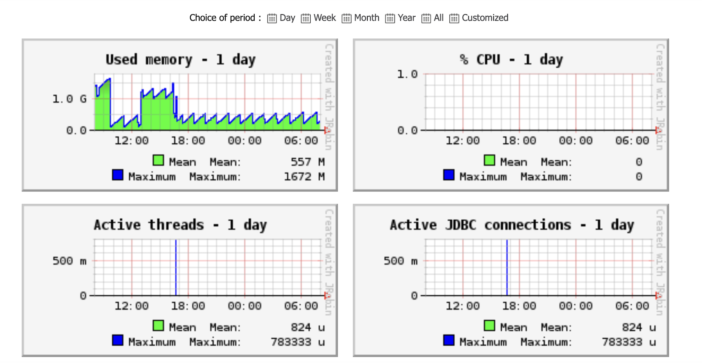
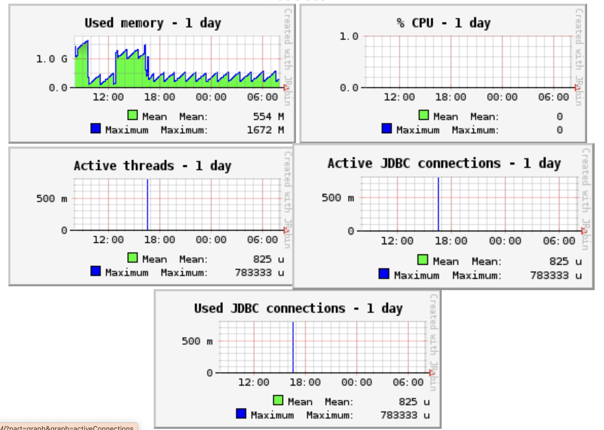
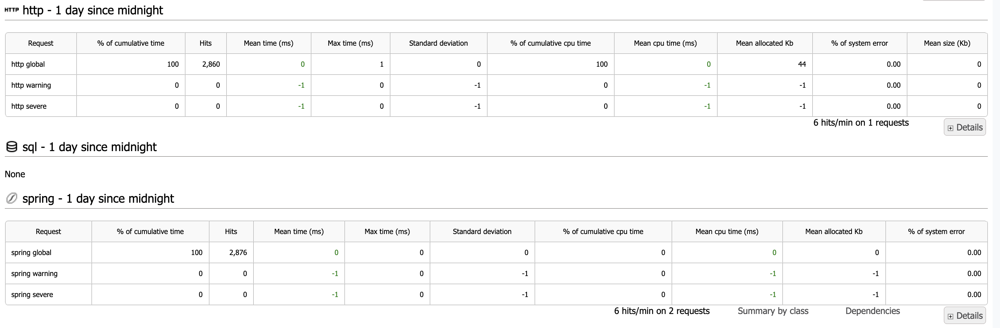
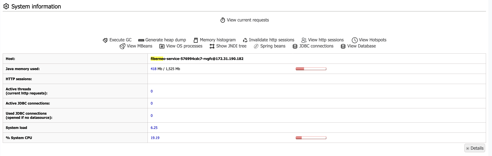

# Fiberneo Application Operations Guide

## Introduction

This document provides operations guidelines for monitoring and debugging the FIBERNEO Application. It is primarily intended for developers, DevOps, and support engineers working on application stability, issue resolution, and performance optimization.

The system is instrumented with Java Melody for performance monitoring and provides chat history logs for debugging agent responses and errors.

## Monitoring Guide

### Accessing Java Melody Dashboard

- **URL**: `https://demo.visionwaves.com/APM/`
- **Alternative**: Login to Netsingularity and go to Service Ops Module, then navigate to application monitoring.

**Steps to access:**
1. **Login** with valid credentials
2. **Navigate** to the FIBERNEO application
3. **Verify** the dashboard loads with multiple performance and health metrics

### Key Metrics to Monitor

- **Application Pods**
  - View the name of active pods running for the selected service. Useful for scaling or diagnosing pod restarts/crashes.

- **System Metrics**
  - CPU Usage (% System CPU) → Identifies high CPU load
  - Used Memory (MB) → Monitors heap memory utilization
  - System Load → Checks overall load on the host

- **Threads**
  - Active Threads → Number of running threads handling HTTP requests
  - Thread Info → Maximum, current, and total started threads over time
  - Useful for detecting thread leaks or blocked threads

- **JDBC (Database)**
  - Active JDBC Connections → Current live DB connections
  - Used JDBC Connections → Connections opened if no datasource
  - Helps detect connection leaks or excessive DB usage

- **HTTP Metrics**
  - HTTP Hits per Minute → Incoming request load
  - HTTP Mean Time (ms) → Average request response time
  - % of HTTP Errors → Ratio of failed HTTP calls (e.g., 500 errors)

- **SQL Metrics**
  - SQL Hits per Minute → Number of DB queries executed
  - SQL Mean Time (ms) → Average query execution time
  - % of SQL Errors → Frequency of DB-related errors

- **Spring Metrics**
  - Spring Hits per Minute → Number of Spring-managed method calls
  - Spring Mean Time (ms) → Execution time of Spring operations
  - % of Spring Errors → Failures in Spring services

- **Error Monitoring**
  - System Error Logs → View stack traces, warnings, and exceptions
  - HTTP System Errors → Breakdown of error types (e.g., Error 500)

### Screenshots Reference

**CPU/Memory Utilization**  
  

**Active Threads**  
  

**HTTP / SQL / Spring Monitoring**  
  

**Error Logs and System Status**  


## Debugging Guide

### Initial Setup

- Log in or access the jump server using the credentials provided by the DevOps team
- Gather information regarding your application, such as the installation namespace and port

### Service Status Check

Use the following command to check the status of your service:

```bash
kubectl get pods -n <namespace> | grep <service-name>
# Example: kubectl get pods -n ansible | grep fiberneo
```

The above command should yield output similar to:

```bash
fiberneo-service-79bfd9df58-5262f   3/3   Running   0   7d23h
```

Important: Verify that the running pod status shows 3/3 to ensure all containers are operational. Check the related services to ensure they are in a running state.

```bash
kubectl get pods -n <namespace> | grep <related-service-name>
# Example: kubectl get pods -n ansible | grep base-utility-service
```

### Log Analysis

To check the logs of the service, use the following command:

```bash
kubectl logs -f -n <namespace> <pod-name> --tail=100
# Example: kubectl logs -f fiberneo-service-79bfd9df58-5262f -n ansible --tail=100
```

Note: Ensure to replace `<pod-name>` with the actual name of the pod obtained from the previous command.

### Pod Troubleshooting

If the pod is not running as expected, check the events associated with the pod for any errors:

```bash
kubectl describe pod <pod-name> -n <namespace>
```

### Service Dependencies Check

Verify the health of dependent services and ensure they are running:

```bash
kubectl get services -n <namespace>
```

### Database Connectivity

- Check the database connection status by running a simple query or using a database client to ensure connectivity.

### Important Debugging Points

- Check related services to ensure they are in a running state
- Verify the database connection status
- Monitor resource usage (CPU, memory) of the pods to identify potential bottlenecks

### Common HTTP Status Codes

- **200 OK**: The request has succeeded. Standard response for successful HTTP requests
- **201 Created**: The request has been fulfilled and has resulted in the creation of a new resource. Resource creation successful
- **204 No Content**: The server successfully processed the request but is not returning any content. Request processed successfully
- **400 Bad Request**: The server could not understand the request due to invalid syntax. Check request format and parameters
- **401 Unauthorized**: The request requires user authentication. Verify authentication credentials
- **403 Forbidden**: The server understood the request, but it refuses to authorize it. Check API permissions from the API gateway
- **404 Not Found**: The server cannot find the requested resource. Verify resource exists and URL is correct
- **500 Internal Server Error**: The server has encountered a situation it doesn't know how to handle. Check server logs for detailed error information
- **503 Service Unavailable**: The server is not ready to handle the request. Service is not in a running state - check pod status

These status codes help in understanding the outcome of HTTP requests and can assist in debugging issues related to API interactions.

### Debugging Workflow

1. Check Monitoring Dashboard → Identify anomalies in CPU, memory, DB, or errors
2. Check Error Logs → Look into system logs for stack traces or warnings
3. Validate DB Queries → Use SQL monitoring to check if queries are slow or failing
4. Thread & Connection Checks → Ensure no thread leaks or excessive JDBC connections

## Best Practices

### Monitoring Best Practices

- Regularly review Java Melody reports to catch performance degradation early
- Set up alerts on CPU, memory, and error percentage thresholds
- Use chat history logs for faster debugging of agent issues
- Check HTTP/Spring severe warnings (long mean times) as they indicate bottlenecks
- Restart pods if persistent thread leaks or memory leaks are detected

### Operational Best Practices

- **Proactive Monitoring**: Set up automated alerts for critical metrics
- **Regular Health Checks**: Perform daily checks on service status and resource usage
- **Log Management**: Maintain proper log rotation and retention policies
- **Documentation**: Keep troubleshooting procedures updated and accessible
- **Team Communication**: Establish clear escalation procedures for critical issues

## Troubleshooting Quick Reference

### Common Issues and Solutions

- **High CPU Usage**
  - Symptoms: Slow response times, high CPU metrics
  - Solution: Check for infinite loops, optimize queries, scale pods

- **Memory Leaks**
  - Symptoms: Increasing memory usage over time
  - Solution: Restart pods, check for memory leaks in code

- **Database Connection Issues**
  - Symptoms: JDBC connection errors
  - Solution: Check database connectivity, connection pool settings

- **Pod Crashes**
  - Symptoms: Pod status not 3/3
  - Solution: Check pod logs, describe pod for events

- **Thread Leaks**
  - Symptoms: Increasing thread count
  - Solution: Restart application, check for blocked threads

### Emergency Procedures

- **Service Down**: Check pod status → Check logs → Restart if necessary
- **High Error Rate**: Check error logs → Identify root cause → Apply fix
- **Performance Issues**: Check resource usage → Optimize queries → Scale if needed

## Conclusion

By following this monitoring and debugging guide, developers and operations teams can proactively detect issues, resolve errors quickly, and ensure the FIBERNEO application performs reliably in production.

### Key Takeaways

- Use Java Melody dashboard for comprehensive monitoring
- Follow systematic debugging workflow for issue resolution
- Implement best practices for proactive maintenance
- Maintain clear documentation and communication channels

Note: This guide should be regularly updated as new monitoring tools and debugging procedures are introduced to the system. 

 
