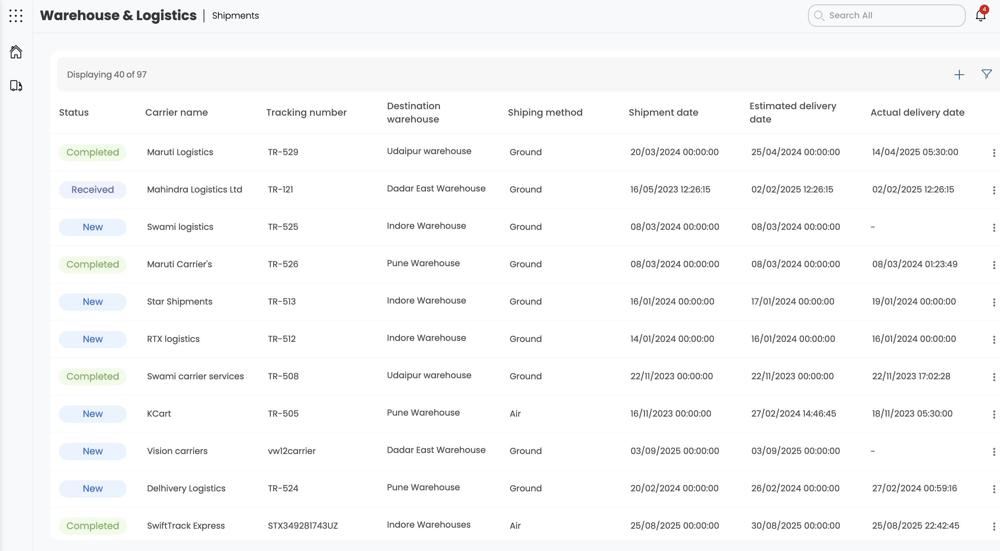

# Supply Chain Management (SCM) - Low Level Design (LLD)

## Table of Contents

1. [Introduction](#1-introduction)
   - 1.1 [Objective and Scope](#11-objective-and-scope)

2. [Solution Design](#2-solution-design)
   - 2.1 [Architecture Diagram](#21-architecture-diagram)
   - 2.2 [Component Diagram](#22-component-diagram)
   - 2.3 [Application Flow - Sequence Diagrams](#23-application-flow---sequence-diagrams)
     - 2.3.1 [Material Creation Flow](#231-material-creation-flow)
     - 2.3.2 [Purchase Request to Purchase Order Flow](#232-purchase-request-to-purchase-order-flow)
     - 2.3.3 [ Warehouse Management Flow](#233-warehouse-management-flow)
     - 2.3.4 [Shipment Tracking Flow](#234-shipment-tracking-flow)

3. [Solution Features and User Interface](#3-solution-features-and-user-interface)
   - 3.1 [Material Management Features](#31-material-management-features)
   - 3.2 [Procurement Management Features](#32-procurement-management-features)
   - 3.3 [Warehouse Management Features](#33-warehouse-management-features)
   - 3.4 [Logistics Management Features](#34-logistics-management-features)

4. [Integration Details](#4-integration-details)

5. [Database Schema Design](#5-database-schema-design)
   - 5.1 [ER Diagram - Module-wise](#51-er-diagram---module-wise)
     - 5.1.1 [Material Management Module](#511-material-management-module)
     - 5.1.2 [Procurement Management Module](#512-procurement-management-module)
     - 5.1.3 [Warehouse Management Module](#513-warehouse-management-module)
     - 5.1.4 [Logistics Management Module](#514-logistics-management-module)
   - 5.2 [CDC Configuration](#52-cdc-configuration)

6. [API Details](#6-api-details)
   - 6.1 [Material Management APIs](#61-material-management-apis)
   - 6.2 [Procurement Management APIs](#62-procurement-management-apis)
   - 6.3 [Warehouse Management APIs](#63-warehouse-management-apis)
   - 6.4 [Logistics Management APIs](#64-logistics-management-apis)

7. [RBAC & ABAC](#7-rbac--abac)
   - 7.1 [Permission Groups](#71-permission-groups)
   - 7.2 [Profile Template](#72-profile-template)

8. [Monitoring & Alerting](#8-monitoring--alerting)

9. [Performance and Scaling](#9-performance-and-scaling)

10. [Operation Runbook](#10-operation-runbook)
    - 10.1 [Common Issues & Debugging](#101-common-issues--debugging)
    - 10.2 [Performance Tuning Guide](#102-performance-tuning-guide)

11. [Appendices](#11-appendices)
    - 11.1 [Technology Stack](#111-technology-stack)
    - 11.2 [Database Schema Statistics](#112-database-schema-statistics)
    - 11.3 [API Statistics](#113-api-statistics)
    - 11.4 [Security Features](#114-security-features)

---

## 1. Introduction

### 1.1 Objective and Scope

The Supply Chain Management (SCM) system is a comprehensive microservices-based application designed to manage the complete supply chain lifecycle from material management to logistics and delivery. The system provides end-to-end visibility and control over procurement, warehouse operations, and shipment tracking.

**Scope:**
- Material Master Data Management
- Bill of Materials (BOM) Template Management
- Procurement Process Management (RFI, RFQ, RFP)
- Purchase Request and Order Processing
- Warehouse Management
- Logistics and Shipment Tracking
- Multi-tenant SaaS Architecture
- Role-based Access Control (RBAC)
- Workflow Integration with BPMN

## 2. Solution Design

### 2.1 Architecture Diagram


### 2.2 Component Diagram


### 2.3 Application Flow - Sequence Diagrams

#### 2.3.1 Material Creation Flow


#### 2.3.2 Purchase Request to Purchase Order Flow


#### 2.3.3 Warehouse Management Flow


#### 2.3.4 Shipment Tracking Flow


## 3. Solution Features and User Interface

### 3.1 Material Management Features
- **Material Master Management**: Create, update, and manage material master data
- **BOM Template Management**: Create and manage Bill of Materials templates
- **Material Categorization**: Organize materials by categories and sub-categories
- **Vendor Material Management**: Manage vendor-specific material information
- **Unit of Measure Management**: Handle different units and conversions

<div align="center">

</div>

### 3.2 Procurement Management Features
- **Purchase Request Management**: Create and manage purchase requests
- **Purchase Order Management**: Process purchase orders from approved requests
- **RFI/RFQ/RFP Management**: Handle different types of procurement inquiries
- **Vendor Quotation Management**: Manage vendor responses and quotations
- **Approval Workflow**: Integrated BPMN workflow for approvals

<div align="center">

</div>

### 3.3 Warehouse Management Features
- **Warehouse Configuration**: Manage warehouse locations and structure
- **Inventory Tracking**: Real-time inventory level monitoring
- **Bin Management**: Organize storage locations (Floor → Rack → Bin)
- **Material Availability**: Track material availability across warehouses
- **Audit Management**: Conduct and manage inventory audits

<div align="center">

</div>

### 3.4 Logistics Management Features
- **Shipment Management**: Create and track shipments
- **Carrier Integration**: Integrate with external shipping carriers
- **Return Management**: Handle return requests and processing
- **Delivery Tracking**: Real-time shipment status updates
- **Goods Received Note**: Process received goods

<div align="center">

</div>

## 4. Integration Details

### 4.1 Internal Service Integrations
- **Material Management ↔ Procurement**: Material data sharing for purchase requests
- **Procurement ↔ Warehouse**: Purchase order fulfillment and inventory updates
- **Warehouse ↔ Logistics**: Inventory allocation for shipments
- **All Services ↔ BPMN Engine**: Workflow orchestration
- **All Services ↔ Notification Service**: Event-driven notifications

### 4.2 External Service Integrations
- **Carrier APIs**: Real-time shipment tracking and status updates
- **Payment Gateways**: Payment processing for purchase orders
- **Email/SMS Services**: Notification delivery
- **File Storage Services**: Document and attachment management
- **Analytics Services**: Business intelligence and reporting

### 4.3 Data Synchronization
- **Event-Driven Architecture**: Asynchronous communication between services
- **Database Replication**: Multi-region data synchronization
- **Cache Invalidation**: Redis cache management across services
- **Search Index Updates**: Elasticsearch synchronization

## 5. Database Schema Design

### 5.1 ER Diagram 
<div align="left">

</div>


### 5.2 CDC Configuration

*[Placeholder for CDC Configuration Details]*

**Source Tables:**
- MATERIAL_MASTER
- PURCHASE_REQUEST
- PURCHASE_ORDER
- WAREHOUSE_INVENTORY
- SHIPMENT

**Target Tables:**
- Analytics tables for reporting
- Data warehouse tables
- External system synchronization tables

**CDC Template:**
```sql
-- Example CDC trigger for MATERIAL_MASTER
DELIMITER $$
CREATE TRIGGER material_master_cdc_insert
AFTER INSERT ON MATERIAL_MASTER
FOR EACH ROW
BEGIN
    INSERT INTO cdc_log (table_name, operation, record_id, timestamp)
    VALUES ('MATERIAL_MASTER', 'INSERT', NEW.ID, NOW());
END$$
DELIMITER ;
```

## 6. API Details

API Documentation
Swagger JSON Reference:
- [SCM  API Documentation](./SCM_Swagger/)

Java Docs
- [SCM  JAVA Documentation](./SCM_JAVA_DOC/)

### 6.1 Material Management APIs

| Endpoint | Method | Description | Security Scope |
|----------|--------|-------------|----------------|
| `/MaterialMaster/create` | POST | Create new material master | MATERIAL_MANAGEMENT_MATERIAL_MASTER_WRITE |
| `/MaterialMaster/search` | GET | Search materials with filters | MATERIAL_MANAGEMENT_MATERIAL_MASTER_READ |
| `/MaterialMaster/update` | PUT | Update material master | MATERIAL_MANAGEMENT_MATERIAL_MASTER_WRITE |
| `/MaterialMaster/delete` | DELETE | Soft delete material | MATERIAL_MANAGEMENT_MATERIAL_MASTER_WRITE |
| `/BOM/create` | POST | Create BOM template | MATERIAL_MANAGEMENT_BOM_WRITE |
| `/BOM/search` | GET | Search BOM templates | MATERIAL_MANAGEMENT_BOM_READ |
| `/MaterialCategory/create` | POST | Create material category | MATERIAL_MANAGEMENT_CATEGORY_WRITE |
| `/MaterialCategory/search` | GET | Search categories | MATERIAL_MANAGEMENT_CATEGORY_READ |

### 6.2 Procurement Management APIs

| Endpoint | Method | Description | Security Scope |
|----------|--------|-------------|----------------|
| `/PurchaseRequest/create` | POST | Create purchase request | PROCUREMENT_MANAGEMENT_PURCHASE_REQUEST_WRITE |
| `/PurchaseRequest/search` | GET | Search purchase requests | PROCUREMENT_MANAGEMENT_PURCHASE_REQUEST_READ |
| `/PurchaseOrder/create` | POST | Create purchase order | PROCUREMENT_MANAGEMENT_PURCHASE_ORDER_WRITE |
| `/PurchaseOrder/search` | GET | Search purchase orders | PROCUREMENT_MANAGEMENT_PURCHASE_ORDER_READ |
| `/ProcurementRequests/create` | POST | Create procurement request (RFI/RFQ/RFP) | PROCUREMENT_MANAGEMENT_PROCUREMENT_REQUESTS_WRITE |
| `/ProcurementRequests/search` | GET | Search procurement requests | PROCUREMENT_MANAGEMENT_PROCUREMENT_REQUESTS_READ |
| `/VendorQuotations/create` | POST | Submit vendor quotation | PROCUREMENT_MANAGEMENT_VENDOR_QUOTATIONS_WRITE |
| `/VendorQuotations/search` | GET | Search vendor quotations | PROCUREMENT_MANAGEMENT_VENDOR_QUOTATIONS_READ |

### 6.3 Warehouse Management APIs

| Endpoint | Method | Description | Security Scope |
|----------|--------|-------------|----------------|
| `/Warehouse/create` | POST | Create warehouse | WAREHOUSE_MANAGEMENT_WAREHOUSE_WRITE |
| `/Warehouse/search` | GET | Search warehouses | WAREHOUSE_MANAGEMENT_WAREHOUSE_READ |
| `/WarehouseInventory/create` | POST | Create inventory record | WAREHOUSE_MANAGEMENT_INVENTORY_WRITE |
| `/WarehouseInventory/search` | GET | Search inventory | WAREHOUSE_MANAGEMENT_INVENTORY_READ |
| `/WarehouseMaterialAvailability/search` | GET | Get material availability | WAREHOUSE_MANAGEMENT_AVAILABILITY_READ |
| `/WarehouseInventoryAudit/create` | POST | Create audit record | WAREHOUSE_MANAGEMENT_AUDIT_WRITE |
| `/Bin/create` | POST | Create bin location | WAREHOUSE_MANAGEMENT_BIN_WRITE |
| `/Bin/search` | GET | Search bin locations | WAREHOUSE_MANAGEMENT_BIN_READ |

### 6.4 Logistics Management APIs

| Endpoint | Method | Description | Security Scope |
|----------|--------|-------------|----------------|
| `/Shipment/create` | POST | Create shipment | LOGISTICS_SHIPMENT_WRITE |
| `/Shipment/search` | GET | Search shipments | LOGISTICS_SHIPMENT_READ |
| `/Shipment/track` | GET | Track shipment status | LOGISTICS_SHIPMENT_READ |
| `/ReturnRequest/create` | POST | Create return request | LOGISTICS_RETURN_WRITE |
| `/ReturnRequest/search` | GET | Search return requests | LOGISTICS_RETURN_READ |
| `/ActiveInventory/search` | GET | Search active inventory | LOGISTICS_INVENTORY_READ |
| `/GoodsReceivedNote/create` | POST | Create GRN | LOGISTICS_GRN_WRITE |
| `/GoodsReceivedNote/search` | GET | Search GRNs | LOGISTICS_GRN_READ |

*[Placeholder for Swagger JSON Link]*

## 7. RBAC & ABAC

### 7.1 Permission Groups

**Permission group Reference**:
- [SCM Permission group](./SCM_Permission_Group/)
### 7.2 Profile Template
- [SCM Profile template](./SCM_Profile_Template/)

**Material Management Permissions:**
- `MATERIAL_MANAGEMENT_MATERIAL_MASTER_READ` - Read material master data
- `MATERIAL_MANAGEMENT_MATERIAL_MASTER_WRITE` - Create/update material master
- `MATERIAL_MANAGEMENT_BOM_READ` - Read BOM templates
- `MATERIAL_MANAGEMENT_BOM_WRITE` - Create/update BOM templates
- `MATERIAL_MANAGEMENT_CATEGORY_READ` - Read material categories
- `MATERIAL_MANAGEMENT_CATEGORY_WRITE` - Create/update categories

**Procurement Management Permissions:**
- `PROCUREMENT_MANAGEMENT_PURCHASE_REQUEST_READ` - Read purchase requests
- `PROCUREMENT_MANAGEMENT_PURCHASE_REQUEST_WRITE` - Create/update purchase requests
- `PROCUREMENT_MANAGEMENT_PURCHASE_ORDER_READ` - Read purchase orders
- `PROCUREMENT_MANAGEMENT_PURCHASE_ORDER_WRITE` - Create/update purchase orders
- `PROCUREMENT_MANAGEMENT_PROCUREMENT_REQUESTS_READ` - Read procurement requests
- `PROCUREMENT_MANAGEMENT_PROCUREMENT_REQUESTS_WRITE` - Create/update procurement requests

**Warehouse Management Permissions:**
- `WAREHOUSE_MANAGEMENT_WAREHOUSE_READ` - Read warehouse data
- `WAREHOUSE_MANAGEMENT_WAREHOUSE_WRITE` - Create/update warehouses
- `WAREHOUSE_MANAGEMENT_INVENTORY_READ` - Read inventory data
- `WAREHOUSE_MANAGEMENT_INVENTORY_WRITE` - Create/update inventory
- `WAREHOUSE_MANAGEMENT_AUDIT_READ` - Read audit data
- `WAREHOUSE_MANAGEMENT_AUDIT_WRITE` - Create/update audits

**Logistics Management Permissions:**
- `LOGISTICS_SHIPMENT_READ` - Read shipment data
- `LOGISTICS_SHIPMENT_WRITE` - Create/update shipments
- `LOGISTICS_RETURN_READ` - Read return requests
- `LOGISTICS_RETURN_WRITE` - Create/update return requests
- `LOGISTICS_INVENTORY_READ` - Read active inventory
- `LOGISTICS_GRN_READ` - Read goods received notes
- `LOGISTICS_GRN_WRITE` - Create/update GRNs

### 7.2 Profile Template

*[Placeholder for Permission Group and Profile Template Files]*

**Role Templates:**
- **Material Manager**: Full material management permissions
- **Procurement Manager**: Full procurement permissions
- **Warehouse Manager**: Full warehouse management permissions
- **Logistics Manager**: Full logistics permissions
- **Viewer**: Read-only access to all modules
- **Approver**: Approval permissions for workflows

## 8. Monitoring & Alerting

**Monitoring tool URL**:

- [Monitoring URL](https://demo.visionwaves.com/netsingularity/of-monitoring-app/metrices)
- [Logs URL](https://demo.visionwaves.com/netsingularity/of-monitoring-app/logs)
- [APM URL](https://demo.visionwaves.com/APM/)

    *Note* - Above url will be open by respective user credentials

- **Metrics Monitoring**:
<div align="center">

</div>

- **Logs Monitoring**:
<div align="center">

</div>

- **APM Monitoring**:
<div align="center">

</div>


### 8.1 Key Metrics
- **API Response Times**: Track endpoint performance
- **Database Performance**: Query execution times and connection pools
- **Service Health**: Uptime and availability metrics
- **Business Metrics**: Order processing times, inventory levels
- **Error Rates**: Track and alert on error thresholds

### 8.2 Alerting Rules
- **High Error Rate**: Alert when error rate exceeds 5%
- **Slow Response**: Alert when API response time exceeds 2 seconds
- **Database Issues**: Alert on connection pool exhaustion
- **Low Inventory**: Alert when inventory levels fall below threshold
- **Failed Workflows**: Alert on BPMN workflow failures

## 9. Performance and Scaling

*[Placeholder for Performance Screenshots and Documentation]*

### 9.1 Performance Optimizations
- **Database Indexing**: Optimized indexes for frequently queried columns
- **Caching Strategy**: Redis caching for frequently accessed data
- **Connection Pooling**: Optimized database connection management
- **Query Optimization**: RSQL-based filtering and pagination
- **Async Processing**: Background processing for heavy operations

### 9.2 Scaling Strategy
- **Horizontal Scaling**: Microservices can be scaled independently
- **Database Sharding**: Customer-based data partitioning
- **Load Balancing**: API Gateway with load balancing
- **CDN Integration**: Static content delivery optimization
- **Auto-scaling**: Kubernetes-based auto-scaling policies

## 10. Operation Runbook

### 10.1 Common Issues & Debugging

*[Placeholder for Common Issues Screenshots and Documentation]*

**Common Issues:**
1. **Database Connection Issues**: Check connection pool configuration
2. **Workflow Failures**: Verify BPMN engine connectivity
3. **Cache Misses**: Check Redis connectivity and configuration
4. **Permission Errors**: Verify RBAC configuration and user roles
5. **Data Synchronization**: Check CDC configuration and event processing

**Debugging Steps:**
1. Check application logs for error details
2. Verify service health endpoints
3. Check database connectivity and performance
4. Validate configuration parameters
5. Review monitoring dashboards for anomalies

### 10.2 Performance Tuning Guide

*[Placeholder for Performance Tuning Screenshots and Documentation]*

**Database Tuning:**
- Monitor slow query logs
- Optimize indexes based on query patterns
- Tune connection pool settings
- Configure appropriate buffer sizes

**Application Tuning:**
- Monitor JVM heap usage
- Tune garbage collection settings
- Optimize cache configurations
- Review and optimize API response times

## 11. Appendices

### 11.1 Technology Stack
- **Backend**: Java 17, Spring Boot 3.x, Spring Cloud
- **Database**: MySQL 8.1
- **Cache**: Redis
- **Search**: Elasticsearch
- **Message Queue**: Apache Kafka
- **Container**: Docker, Kubernetes
- **API Gateway**: Spring Cloud Gateway
- **Security**: OAuth2, JWT
- **Monitoring**: Prometheus, Grafana
- **Logging**: ELK Stack

### 11.2 Database Schema Statistics
- **Total Tables**: 40+ tables across all modules
- **Material Management**: 15+ tables
- **Procurement Management**: 10+ tables
- **Warehouse Management**: 8+ tables
- **Logistics Management**: 7+ tables

### 11.3 API Statistics
- **Total Endpoints**: 50+ REST endpoints
- **Material Management**: 15+ endpoints
- **Procurement Management**: 15+ endpoints
- **Warehouse Management**: 12+ endpoints
- **Logistics Management**: 8+ endpoints

### 11.4 Security Features
- **Authentication**: OAuth2 with JWT tokens
- **Authorization**: Role-based access control (RBAC)
- **Data Encryption**: At-rest and in-transit encryption
- **Audit Logging**: Comprehensive audit trail
- **Input Validation**: Comprehensive input validation and sanitization
- **Rate Limiting**: API rate limiting and throttling

---

*This document serves as the comprehensive Low-Level Design for the Supply Chain Management system, providing detailed technical specifications for implementation and maintenance.*
